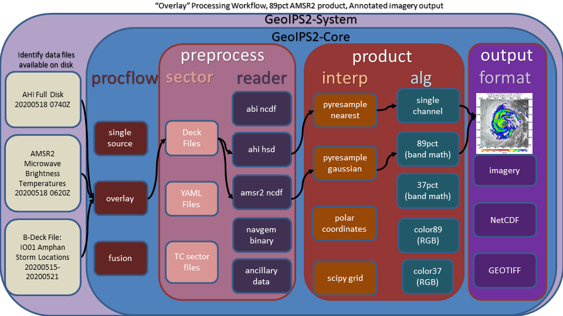

.. dropdown:: Distribution Statement

 | # # # This source code is protected under the license referenced at
 | # # # https://github.com/NRLMMD-GEOIPS.

GeoIPS Overview
===================

The Geolocated Information Processing System (GeoIPS) is a generalized processing system, providing a collection
of algorithm and product implementations facilitating consistent and reliable application of specific products
across a variety of sensors and data types.

.. image:: ../images/geoips_overview/GeoIPS_Functionality_Overview.png
   :width: 800

GeoIPS acts as a toolbox for internal GeoIPS-based product development - all modules are expected to
have simple inputs and outputs (Python numpy or dask arrays or xarrays, dictionaries, strings, lists), to enable
portability and simplified interfacing between modules.

Some of the primary benefits / requirements of GeoIPS include:
    * Seamless application to proprietary data types and products (no reference to external functionality within the main code base)
    * Consistent product application across multiple sensors (both open source and proprietary)
    * Flexible workflow to allow efficient real-time processing as well as interactive processing
    * Modular interfaces to facilitate product development
    * Consistent code base for research and development through operational transitions
    * Ability to generate log outputs
    * Ability to interface with workflow management tools (cylc)
    * Ability to interface with databases (postgres)

.. image:: ../images/geoips_overview/GeoIPS_Structure_Overview.png
   :width: 800

GeoIPS Scope
================

The GeoIPS® "core" package is responsible for data processing from reading and reformatting the data into the
common internal GeoIPS® internal format, through algorithm and product application, to outputting user
configurable data formats (imagery, NetCDF, etc).

.. image:: ../images/geoips_overview/GeoIPS_Processing_Chain.png
   :width: 800

Data collection, data transfers, and product dissemination are all site specific implementations for driving
GeoIPS® processing, and fall outside the scope of the GeoIPS® "core" processing system.

GeoIPS Modular Interface
============================

GeoIPS is made up of a collection of functionality modules of different types.

The primary module types include
    * **processing workflows (procflows)** - drive a specific collection of steps for a particular type of processing
    * **sector** - specifications of domains of interest
    * **reader** - specifications for ingesting a specific data type, and storing in the GeoIPS xarray-based internal format
    * **product** - overall product specification, including interpolation routine, algorithm, colormaps, etc
        * **interpolation** - interpolation routine to apply when reprojecting data
        * **algorithm** - data manipulations to apply to dataset
        * **user_colormaps** - colormap to apply to resulting product
    * **output_format** - data format for the resulting output product (ie, netCDF, png, etc)
    * **filename_format** - full path and file name formatting specification, using attributes within the xarray objects

The primary processing workflows available at this time include:
    * **single_source** - single input type and single output type
    * **overlay** - two input types (one for foreground and one for background), with a single output type
    * **config_based** - efficient method for producing all possible outputs for a given set of data files.

Example single_source processing workflow:

.. image:: ../images/geoips_overview/Example_89pct_GEOTIFF_Processing_Workflow.png
   :width: 800

Example overlay processing workflow:

Potential example of future config based processing workflow

.. image:: ../images/geoips_overview/Example_config_Processing_Workflow.png
   :width: 800

GeoIPS Plugin Interface
===========================

A primary goal of GeoIPS is to provide seamless integration of external functionality,
with no reference to proprietary algorithms and readers from the base open source geoips code base.

Example external plugin functionality:

.. image:: ../images/geoips_overview/Example_DEBRA_Processing_Workflow.png
   :width: 800

GeoIPS makes use of Python entry points to install external packages within the geoips namespace,
then an internal Application Programming Interface to access specific modules.

There are currently both a "stable" interface and "dev" interface within geoips.
    * "stable" packages have been fully vetted and will remain stable with subsequent releases of geoips.
    * "dev" packages are under active development

The current division of dev and stable packages are as follows:
    * stable
        * **reader**
    * dev
        * **filename** - output filename specifications
        * **output** - output data/imagery format
        * **procflow** - processing workflow to follow
        * **product** - overall product specification, including the following sub-modules:
            * **interp** - interpolation routines
            * **cmap** - colormap to apply to final product
            * **alg** - algorithm specifications
            * **boundaries** - coastlines and country border specifications for cartopy plotting
            * **gridlines** - gridline specifications for cartopy/matplotlib plotting

Each interface has a standard set of commands for interrogating the available functionality.
These standard commands are used within the processing workflows in order to abstract access
to these modules.

    * get_<interface>               (ie, get_reader)
    * get_<interface>_type          (ie, get_reader_type)
    * is_valid_<interface>          (ie, is_valid_reader)
    * list_<interface>s_by_type     (ie, list_readers_by_type)
    * test_<interface>_interface    (ie, test_reader_interface)

.. code-block:: python

    In [1]: import geoips.stable.reader as reader

    In [2]: reader.list_readers_by_type()
    Out[2]:
    defaultdict(list,
                {'standard': ['abi_l2_netcdf',
                  'abi_netcdf',
                  'ahi_hsd',
                  'amsr2_netcdf',
                  'amsr2_remss_winds_netcdf',
                  'amsub_hdf',
                  'amsub_mirs',
                  'ascat_uhr_netcdf',
                  'ewsg_netcdf',
                  'geoips_netcdf',
                  'gmi_hdf5',
                  'imerg_hdf5',
                  'mimic_netcdf',
                  'modis_hdf4',
                  'saphir_hdf5',
                  'sar_winds_netcdf',
                  'scat_knmi_winds_netcdf',
                  'seviri_hrit',
                  'sfc_winds_text',
                  'smap_remss_winds_netcdf',
                  'smos_winds_netcdf',
                  'ssmi_binary',
                  'ssmis_binary',
                  'viirs_netcdf',
                  'wfabba_ascii',
                  'windsat_idr37_binary',
                  'windsat_remss_winds_netcdf']})

    In [3]: reader.get_reader('abi_netcdf')
    Out[3]: <function geoips.interface_modules.readers.abi_netcdf.abi_netcdf(fnames, metadata_only=False, chans=None, area_def=None, self_register=False)>

    In [4]: reader.get_reader_type('abi_netcdf')
	Out[4]: 'standard'

    In [5]: reader.is_valid_reader('abi_netcdf')
    Out[5]: True

In order for the interface functions to access new capabilities, modules must be installed into
the geoips namespace from within a package's setup.py (pseudo-code for external repository called "template_plugin"):

.. code-block:: python

    setup(
          name='template_plugin',
          version=version,
          packages=find_packages(),
          python_requires='>=3.6',
          build_requires=['numpy'],
          install_requires=['numpy'],
          ext_modules=[ext1],
          entry_points={
              'geoips.filename_formats': [
                  'test_fname=template_plugin.interface_modules.filename_formats.test_fname:test_fname',
              ],
              'geoips.output_formats': [
                  'imagery_test=template_plugin.interface_modules.output_formats.imagery_test:imagery_test',
              ],
              'geoips.algorithms': [
                  'single_channel_test=template_plugin.interface_modules.algorithms.single_channel_test:' +
                  'single_channel_test',
              ],
              'geoips.interpolation': [
                  'pyresample_wrappers.interp_gauss_test=template_plugin.interface_modules.interpolation.' +
                  'pyresample_wrappers.interp_gauss_test:interp_gauss_test',
              ],
              'geoips.user_colormaps': [
                  'visir.Infrared_Test=template_plugin.interface_modules.user_colormaps.' +
                  'visir.Infrared_Test:Infrared_Test',
              ],
          }
      )
