.. dropdown:: Distribution Statement

 | # # # This source code is protected under the license referenced at
 | # # # https://github.com/NRLMMD-GEOIPS.

.. _available_functionality:

###################################
Available Functionality
###################################

Overview of functinality available within the geoips project.
This includes module names and sample output.

###################################
Table of Contents
###################################

:ref:`release_notes`

* `v1.4.2`_

  * `v1.4.2 Output Formats`_

    * `Imagery Outputs`_

      * `unprojected_image`
* `v1.3.3`_

  * `v1.3.3 Products`_

    * `Text Surface Winds Products`_

      * `sectored`
      * `unsectored`
* `v1.3.1`_

  * `v1.3.1 Data Readers`_

    * `KNMI HY2-B and HY2-C Winds NetCDF`_
* `v1.3.0`_

  * `Initial Data Readers`_

    * `Geostationary Readers`_

      * `ABI Level 2 NetCDF`_
      * `ABI Level 1B NetCDF`_
      * `AHI HSD`_
      * `EWS-G NetCDF`_
      * `SEVIRI HRIT`_
      * `WFABBA ASCII ABI Fire Product`_
    * `Vis/IR Polar Orbiter Readers`_

      * `MODIS HDF4`_
      * `VIIRS NetCDF`_
    * `Passive Microwave Readers`_

      * `AMSR2 NetCDF`_
      * `AMSR2 REMSS Winds NetCDF`_
      * `AMSU-A / AMSU-B / MHS HDF`_
      * `AMSU-A / AMSU-B / MHS MIRS`_
      * `GMI NetCDF`_
      * `SAPHIR HDF5`_
      * `SSMI Binary`_
      * `SSMI/S Binary`_
      * `Windsat IDR37 Binary`_
      * `Windsat REMSS Winds NetCDF`_
    * `Surface Winds Readers`_

      * `ASCAT Ultra High Resolution NetCDF`_
      * `SAR Winds NetCDF`_
      * `KNMI ASCAT Winds NetCDF`_
      * `KNMI OSCAT Winds NetCDF`_
      * `Surface Winds Text`_
      * `SMAP REMSS Winds NetCDF`_
      * `SMOS Winds NetCDF`_
    * `Precipitation Readers`_

      * `IMERG HDF5`_
      * `MIMIC NetCDF`_
    * `General Readers`_

      * `GeoIPS NetCDF`_
  * `Initial Products`_

    * `37 GHz based Products`_

      * `19H`_
      * `19V`_
      * `37H`_
      * `37H-Physical`_
      * `37pct`_
      * `37V`_
      * `color37`_
    * `89 GHz based Products`_

      * `89H`_
      * `89V`_
      * `89HW`_
      * `89H-Legacy`_
      * `89H-Physical`_
      * `89pct`_
      * `color89`_
    * `150 GHz based Products`_

      * `150H`_
      * `150V`_
      * `157V`_
      * `165H`_
      * `166H`_
      * `166V`_
      * `183-1H`_
      * `183-3H`_
      * `183-7H`_
      * `183H`_
      * `190V`_
    * `Vis/IR Products`_

      * `Infrared-Gray`_
      * `Infrared`_
      * `IR-BD`_
      * `Night-Vis-IR`_
      * `Night-Vis`_
      * `Visible`_
      * `WV-Lower`_
      * `WV-Upper`_
      * `WV`_
    * `Precipitation Products`_

      * `Rain`_
      * `TPW CIMSS`_
      * `TPW Purple`_
      * `TPW PWAT`_
    * `Surface Winds Products`_

      * `NRCS`_
      * `wind-ambiguities`_
      * `windbarbs`_
      * `windspeed`_
  * `Initial Output Formats`_

    * `Imagery Formats`_

      * `Annotated Imagery`_
      * `Clean Imagery`_
      * `Windbarb Imagery`_
      * `Clean Windbarb Imagery`_
      * `GEOTIFF`_
    * `Data Formats`_

      * `GeoIPS NetCDF`_
      * `Standard xarray NetCDF`_
      * `Text Winds`_
    * `Metadata Formats`_

      * `Default Metadata`_

###################################
v1.4.2
###################################

***********************************
v1.4.2 Output Formats
***********************************

***********************************
Imagery Outputs
***********************************

unprojected_image
===================================

Imagery output without resampling the datasets to a specific region.
Allows simple full disk output
imagery for geostationary data, or full swath output for polar orbiters.

unprojected_image interface module:

.. code:: python
    :number-lines:

    In [3]: geoips.dev.output.get_outputter("unprojected_image")
    Out[3]: <function geoips.interface_modules.output_formats.unprojected_image.unprojected_image(xarray_obj,
                product_name, output_fnames, product_name_title=None, mpl_colors_info=None, x_size=None, y_size=None)>

**Example unprojected_image output formats, seviri full disk, MODIS granules:**

.. code:: bash
    :number-lines:

    run_procflow $GEOIPS_TESTDATA_DIR/test_data_seviri/data/20200404.0800_meteoIO_tc2020sh24irondro/H-000-MSG1__-MSG1_IODC___-_________-EPI______-202004040800-__ \
                 $GEOIPS_TESTDATA_DIR/test_data_seviri/data/20200404.0800_meteoIO_tc2020sh24irondro/H-000-MSG1__-MSG1_IODC___-_________-PRO______-202004040800-__ \
                 $GEOIPS_TESTDATA_DIR/test_data_seviri/data/20200404.0800_meteoIO_tc2020sh24irondro/H-000-MSG1__-MSG1_IODC___-WV_062___-000001___-202004040800-C_ \
                 $GEOIPS_TESTDATA_DIR/test_data_seviri/data/20200404.0800_meteoIO_tc2020sh24irondro/H-000-MSG1__-MSG1_IODC___-WV_062___-000002___-202004040800-C_ \
                 $GEOIPS_TESTDATA_DIR/test_data_seviri/data/20200404.0800_meteoIO_tc2020sh24irondro/H-000-MSG1__-MSG1_IODC___-WV_062___-000003___-202004040800-C_ \
                 $GEOIPS_TESTDATA_DIR/test_data_seviri/data/20200404.0800_meteoIO_tc2020sh24irondro/H-000-MSG1__-MSG1_IODC___-WV_062___-000004___-202004040800-C_ \
                 $GEOIPS_TESTDATA_DIR/test_data_seviri/data/20200404.0800_meteoIO_tc2020sh24irondro/H-000-MSG1__-MSG1_IODC___-WV_062___-000005___-202004040800-C_ \
                 $GEOIPS_TESTDATA_DIR/test_data_seviri/data/20200404.0800_meteoIO_tc2020sh24irondro/H-000-MSG1__-MSG1_IODC___-WV_062___-000006___-202004040800-C_ \
                 $GEOIPS_TESTDATA_DIR/test_data_seviri/data/20200404.0800_meteoIO_tc2020sh24irondro/H-000-MSG1__-MSG1_IODC___-WV_062___-000007___-202004040800-C_ \
                 $GEOIPS_TESTDATA_DIR/test_data_seviri/data/20200404.0800_meteoIO_tc2020sh24irondro/H-000-MSG1__-MSG1_IODC___-WV_062___-000008___-202004040800-C_ \
                 --procflow single_source \
                 --reader_name seviri_hrit \
                 --product_name WV-Upper \
                 --output_format unprojected_image \
                 --output_format_kwargs '{"x_size": "1000", "y_size": "1000"}' \
                 --filename_format geoips_fname \
                 --compare_path "$GEOIPS/tests/outputs/seviri_<product>" \
                 --self_register_dataset 'FULL_DISK' \
                 --self_register_source seviri

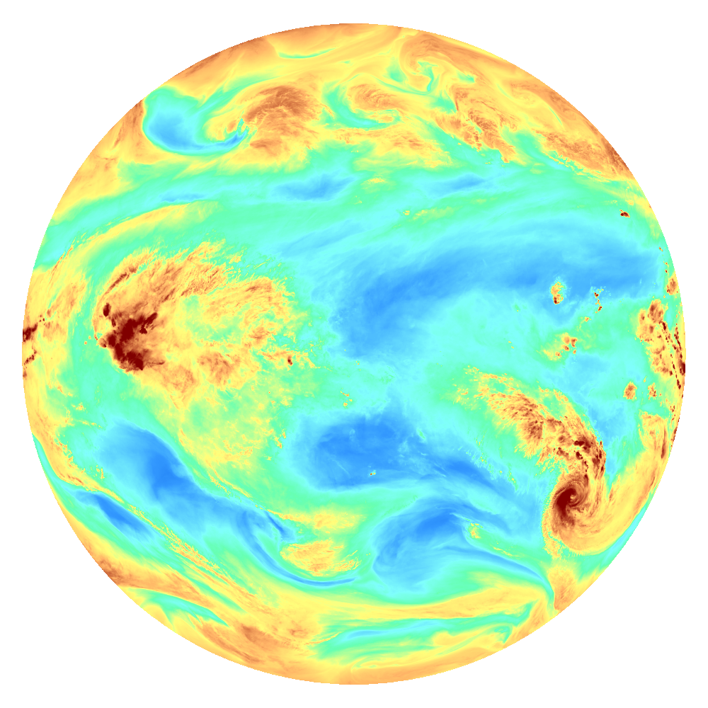

.. code:: bash
    :number-lines:

    run_procflow $GEOIPS_TESTDATA_DIR/test_data_modis/data/aqua/20210104/200500/MYD021KM.A2021004.2005.061.NRT.hdf \
                 $GEOIPS_TESTDATA_DIR/test_data_modis/data/aqua/20210104/200500/MYD03.A2021004.2005.061.NRT.hdf \
                 $GEOIPS_TESTDATA_DIR/test_data_modis/data/aqua/20210104/201000/MYD021KM.A2021004.2010.061.NRT.hdf \
                 $GEOIPS_TESTDATA_DIR/test_data_modis/data/aqua/20210104/201000/MYD03.A2021004.2010.061.NRT.hdf \
                 $GEOIPS_TESTDATA_DIR/test_data_modis/data/aqua/20210104/201500/MYD021KM.A2021004.2015.061.NRT.hdf \
                 $GEOIPS_TESTDATA_DIR/test_data_modis/data/aqua/20210104/201500/MYD03.A2021004.2015.061.NRT.hdf \
                 --procflow single_source \
                 --reader_name modis_hdf4 \
                 --product_name Infrared \
                 --output_format unprojected_image \
                 --output_format_kwargs '{"x_size": "250"}' \
                 --filename_format geoips_fname \
                 --self_register_dataset '1KM' \
                 --self_register_source modis

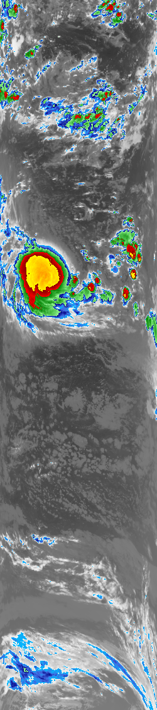

###################################
v1.3.3
###################################

***********************************
v1.3.3 Products
***********************************

***********************************
Text Surface Winds Products
***********************************

sectored
===================================

Text wind vectors sectored to a given region

**Available sources for sectored product:**

.. code:: python
    :number-lines:

    geoips.dev.product.get_product('sectored', 'hscat')
    geoips.dev.product.get_product('sectored', 'sar-spd')
    geoips.dev.product.get_product('sectored', 'smap-spd')
    geoips.dev.product.get_product('sectored', 'smos-spd')

**Example partial output, shown for SMOS dataset:**

.. code:: bash
    :number-lines:

    run_procflow ${GEOIPS_TESTDATA_DIR}/test_data_smos/data/SM_OPER_MIR_SCNFSW_20200216T120839_20200216T135041_110_001_7.nc \
                 --procflow single_source \
                 --reader_name smos_winds_netcdf \
                 --product_name sectored \
                 --filename_format text_winds_tc_fname \
                 --output_format text_winds \
                 --trackfile_parser bdeck_parser \
                 --trackfiles $GEOIPS/tests/sectors/tc_bdecks/bsh162020.dat

.. code:: bash
    :number-lines:

    SMOS   -11.0  75.5  18 202002161242
    SMOS   -11.0  75.8  13 202002161242
    SMOS   -11.0  76.0  12 202002161242
    SMOS   -11.0  76.2  13 202002161242
    SMOS   -11.0  76.5  13 202002161242
    SMOS   -11.0  76.8  13 202002161242
    SMOS   -11.0  77.0  14 202002161242
    SMOS   -11.0  77.2  15 202002161242

unsectored
===================================

Text wind vector output. No sectoring applied, full dataset converted to
text winds

**Available sources for unsectored product:**

..  code:: python
    :number-lines:

    geoips.dev.product.get_product('unsectored', 'hscat')
    geoips.dev.product.get_product('unsectored', 'sar-spd')
    geoips.dev.product.get_product('unsectored', 'smap-spd')
    geoips.dev.product.get_product('unsectored', 'smos-spd')

**Example partial output, shown for SMAP dataset:**

.. code:: bash
    :number-lines:

    run_procflow ${GEOIPS_TESTDATA_DIR}/test_data_smap/data/RSS_smap_wind_daily_2021_09_26_NRT_v01.0.nc \
                 --procflow single_source \
                 --reader_name smap_remss_winds_netcdf \
                 --product_name unsectored \
                 --filename_format text_winds_full_fname \
                 --output_format text_winds

.. code:: bash
    :number-lines:

    SMAP    76.9  11.4  10 202109261549
    SMAP    76.9  11.6  11 202109261549
    SMAP    76.9  11.9  12 202109261549
    SMAP    76.9  12.4  10 202109261549
    SMAP    76.6  11.1   7 202109261549

###################################
v1.3.1
###################################

***********************************
v1.3.1 Data Readers
***********************************

KNMI HY2-B and HY2-C Winds NetCDF
===================================

Koninklijk Nederlands Meteorologisch Instituut
(Royal Netherlands Meteorological Institute) public datasets from
the HaiYang 2-B and 2-C scatterometer instruments.

**Available products for hy2b source:**

.. code:: python
    :number-lines:

    geoips.stable.reader.get_reader('scat_knmi_winds_netcdf')
    geoips.dev.product.get_product('windbarbs', 'hscat')
    geoips.dev.product.get_product('windspeed', 'hscat')

**Example HY-2B output image, windspeed product:**

.. code:: bash
    :number-lines:

    run_procflow $GEOIPS_TESTDATA_DIR/test_data_hy2/data/hscat_20211202_080644_hy_2b__15571_o_250_2204_ovw_l2.nc \
                 --procflow single_source \
                 --reader_name scat_knmi_winds_netcdf \
                 --product_name windspeed \
                 --minimum_coverage 0 \
                 --output_format imagery_annotated \
                 --filename_format geoips_fname \
                 --resampled_read \
                 --sector_list global \
                 --sectorfiles $GEOIPS/tests/sectors/static/global.yaml

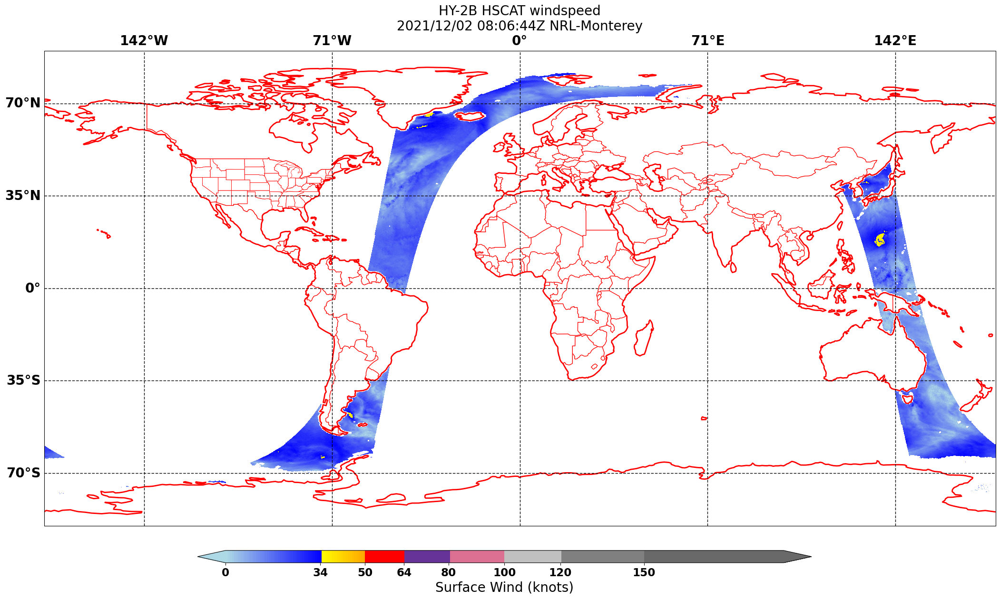

###################################
v1.3.0
###################################

***********************************
Initial Data Readers
***********************************

***********************************
Geostationary Readers
***********************************

ABI Level 2 NetCDF
===================================

ABI Level 1B NetCDF
===================================

Advanced Baseline Imager (ABI) on board Geostationary Operational
Environmental Satellites, GOES-16 and GOES-17.
This reader handles Level 1B data files containing channel data,
as radiances, reflectances,
and/or brightness temperatures.

Each full disk scene contains 16 NetCDF files - 1 file per channel.

**Available products for ABI source:**

.. code:: python
   :number-lines:

   In [3]: geoips.stable.reader.get_reader("abi_netcdf")
   Out[3]: <function geoips.interface_modules.readers.abi_netcdf.abi_netcdf(fnames,
               metadata_only=False, chans=None, area_def=None, self_register=False)>

   geoips.dev.product.get_product('IR-BD', 'abi')
   geoips.dev.product.get_product('Infrared', 'abi')
   geoips.dev.product.get_product('Infrared-Gray', 'abi')
   geoips.dev.product.get_product('Visible', 'abi')
   geoips.dev.product.get_product('WV', 'abi')
   geoips.dev.product.get_product('WV-Lower', 'abi')
   geoips.dev.product.get_product('WV-Upper', 'abi')

**Example ABI output ../images, GOES-16 and GOES-17 global**
**registered Infrared-Gray product:**

.. code:: bash
    :number-lines:

    run_procflow $GEOIPS/tests/data/goes16_20200918_1950/OR_ABI-L1b-RadF-M6C14_G16_s20202621950205_e20202621959513_c20202622000009.nc \
                 --procflow single_source \
                 --reader_name abi_netcdf \
                 --product_name Infrared-Gray \
                 --output_format imagery_annotated \
                 --minimum_coverage 0 \
                 --filename_format geoips_fname \
                 --resampled_read \
                 --sector_list global \
                 --sectorfiles $GEOIPS/tests/sectors/static/global.yaml

    run_procflow $GEOIPS_TESTDATA_DIR/test_data_abi_day/data/goes17_20210718_0150/
                 --procflow single_source \
                 --reader_name abi_netcdf \
                 --product_name Infrared-Gray \
                 --output_format imagery_annotated \
                 --minimum_coverage 0 \
                 --filename_format geoips_fname \
                 --resampled_read \
                 --sector_list global \
                 --sectorfiles $GEOIPS/tests/sectors/static/global.yaml

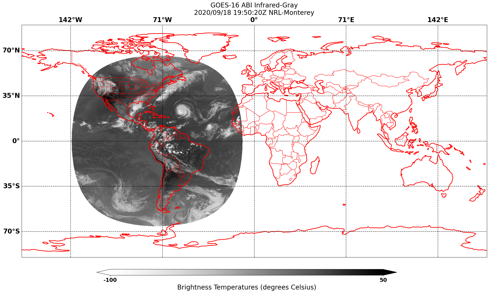

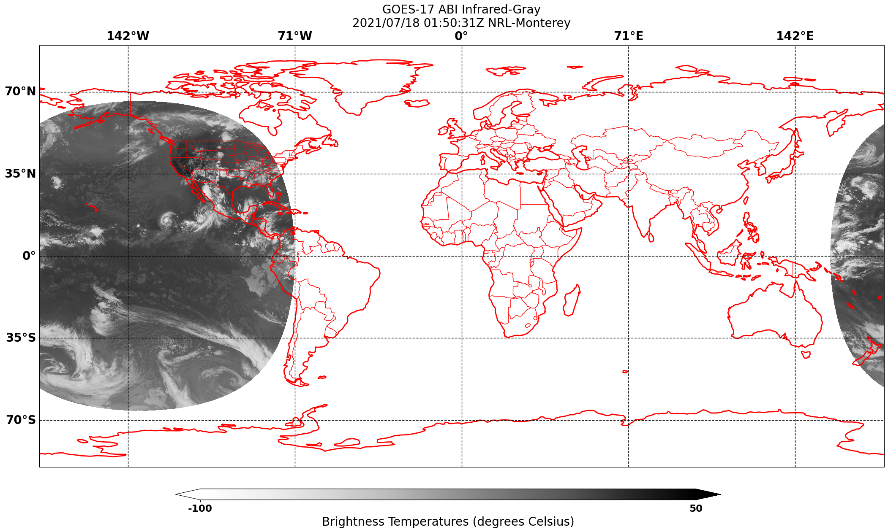

AHI HSD
===================================

Advanced Himawari Imager (AHI) on board the Japan Meteorological
Agency (JMA) Himawari-8 geostationary satellite.

This reader handles Himawari Standard Data (HSD) format files,
which is the standard data format from JMA.

Each full disk scene contains 160 HSD files - 10 slices per band,
with 16 bands total.

**Available products for AHI source:**

.. code:: python
    :number-lines:

    In [4]: geoips.stable.reader.get_reader("ahi_hsd")
    Out[4]: <function geoips.interface_modules.readers.ahi_hsd.ahi_hsd(fnames,
        metadata_only=False, chans=None, area_def=None, self_register=False)>

    geoips.dev.product.get_product('IR-BD', 'ahi')
    geoips.dev.product.get_product('Infrared', 'ahi')
    geoips.dev.product.get_product('Infrared-Gray', 'ahi')
    geoips.dev.product.get_product('Visible', 'ahi')
    geoips.dev.product.get_product('WV', 'ahi')
    geoips.dev.product.get_product('WV-Lower', 'ahi')
    geoips.dev.product.get_product('WV-Upper', 'ahi')

**Example AHI output image, Infrared-Gray product:**

.. code:: bash
    :number-lines:

    run_procflow $GEOIPS_TESTDATA_DIR/test_data_ahi_day/data/20200405_0000/HS_H08_20200405_0000_B13_FLDK_R20_S0110.DAT \
                 $GEOIPS_TESTDATA_DIR/test_data_ahi_day/data/20200405_0000/HS_H08_20200405_0000_B13_FLDK_R20_S0210.DAT \
                 $GEOIPS_TESTDATA_DIR/test_data_ahi_day/data/20200405_0000/HS_H08_20200405_0000_B13_FLDK_R20_S0310.DAT \
                 $GEOIPS_TESTDATA_DIR/test_data_ahi_day/data/20200405_0000/HS_H08_20200405_0000_B13_FLDK_R20_S0410.DAT \
                 $GEOIPS_TESTDATA_DIR/test_data_ahi_day/data/20200405_0000/HS_H08_20200405_0000_B13_FLDK_R20_S0510.DAT \
                 $GEOIPS_TESTDATA_DIR/test_data_ahi_day/data/20200405_0000/HS_H08_20200405_0000_B13_FLDK_R20_S0610.DAT \
                 $GEOIPS_TESTDATA_DIR/test_data_ahi_day/data/20200405_0000/HS_H08_20200405_0000_B13_FLDK_R20_S0710.DAT \
                 $GEOIPS_TESTDATA_DIR/test_data_ahi_day/data/20200405_0000/HS_H08_20200405_0000_B13_FLDK_R20_S0810.DAT \
                 $GEOIPS_TESTDATA_DIR/test_data_ahi_day/data/20200405_0000/HS_H08_20200405_0000_B13_FLDK_R20_S0910.DAT \
                 $GEOIPS_TESTDATA_DIR/test_data_ahi_day/data/20200405_0000/HS_H08_20200405_0000_B13_FLDK_R20_S1010.DAT \
                 --procflow single_source \
                 --reader_name ahi_hsd \
                 --product_name Infrared-Gray \
                 --output_format imagery_annotated \
                 --minimum_coverage 0 \
                 --filename_format geoips_fname \
                 --resampled_read \
                 --sector_list global \
                 --sectorfiles $GEOIPS/tests/sectors/static/global.yaml

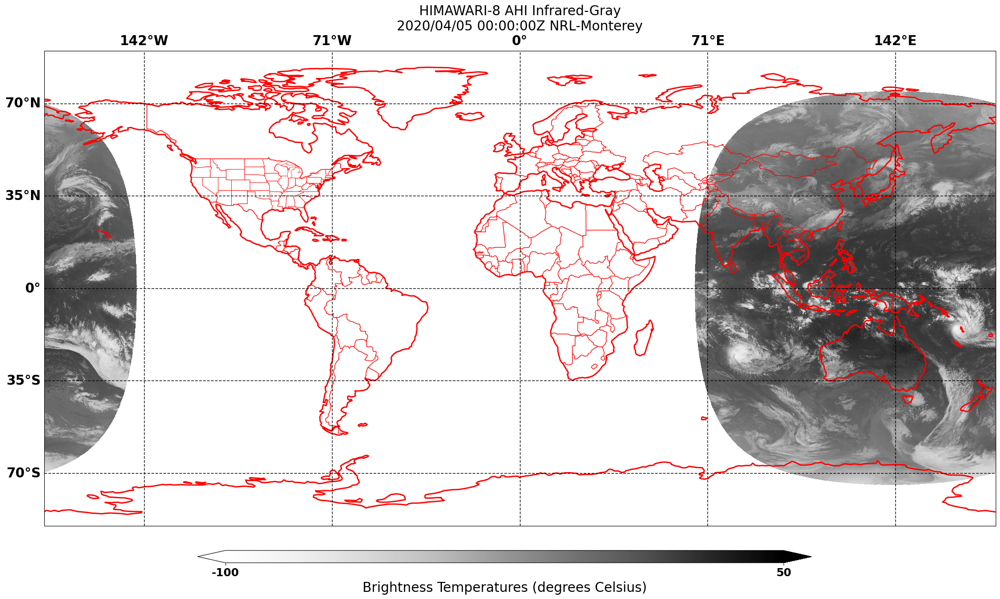

EWS-G NetCDF
===================================
Electro-Optical Infrared Weather System – Geostationary
(EWS-G) is a United States Space Force platform, formerly
GOES-13 and part of the National Oceanic and Atmospheric Administration's
Geostationary Operational Environmental Satellite (GOES) system.

This reader handles reader Goes VARiable (gvar) data in netcdf format.

**Available products for GVAR source:**

.. code:: python
    :number-lines:

    In [1]: geoips.stable.reader.get_reader("ewsg_netcdf")
    Out[1]: <function geoips.interface_modules.readers.ewsg_netcdf.ewsg_netcdf(fnames,
                metadata_only=False, chans=None, area_def=None, self_register=False)>

    geoips.dev.product.get_product('IR-BD', 'gvar')
    geoips.dev.product.get_product('Infrared', 'gvar')
    geoips.dev.product.get_product('Infrared-Gray', 'gvar')
    geoips.dev.product.get_product('Visible', 'gvar')

**Example EWS-G output image, Infrared-Gray product:**

.. code:: bash
    :number-lines:

    run_procflow $GEOIPS_TESTDATA_DIR/test_data_ewsg/data/2020.1211.2312.goes-13.gvar.nc \
                 --procflow single_source \
                 --reader_name ewsg_netcdf \
                 --product_name Infrared-Gray \
                 --output_format imagery_annotated \
                 --minimum_coverage 0 \
                 --filename_format geoips_fname \
                 --resampled_read \
                 --sector_list global \
                 --sectorfiles $GEOIPS/tests/sectors/static/global.yaml

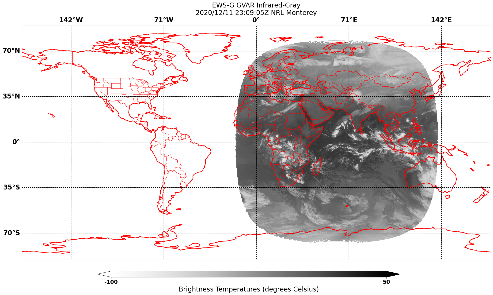

SEVIRI HRIT
===================================
Spinning Enhanced Visible and InfraRed Imager (SEVIRI)
on board Meteosat Second Generation 1 (MSG-1, also known as
METEOSAT-8), and MSG-4 (also known as METEOSAT-11),
owned and operated by the European Space Agency (ESA).

SEVIRI HRIT format data comes in 114 High Rate Information
Transmission (HRIT) format files.

* *PRO*: 1 required prologue file
* *EPI*: 1 required epilogue file
* *VIS006*: 8 files, 0.6um Visible channel
* *VIS008*: 8 files, 0.8um Visible channel
* *IR_016*: 8 files, 1.6um Near Infrared channel
* *IR_039*: 8 files, 3.9um Infrared Infrared channel
* *IR_087*: 8 files, 8.7um Infrared channel
* *IR_097*: 8 files, 9.7um Infrared channel
* *IR_108*: 8 files, 10.8um Infrared channel
* *IR_120*: 8 files, 12.0um Infrared channel
* *IR_134*: 8 files, 13.4um Infrared channel
* *WV_062*: 8 files, 6.2um Water Vapor channel
* *WV_073*: 8 files, 7.2um Water Vapor channel
* *HRV*: 24 files, High Resolution Visible

HRIT Decompression software from the European Organisation
for the Exploitation of Meteorological Satellites (EUMETSAT)
is required to read SEVIRI data:

* https://gitlab.eumetsat.int/open-source/PublicDecompWT.git

The GeoIPS installation and test script will prompt for
PublicDecompWT download and installation, if desired.

**Available products for SEVIRI source:**

.. code:: python
    :number-lines:

    In [1]: geoips.stable.reader.get_reader("seviri_hrit")
    Out[1]: <function geoips.interface_modules.readers.seviri_hrit.seviri_hrit(fnames,
                metadata_only=False, chans=None, area_def=None, self_register=False)>

    geoips.dev.product.get_product('IR-BD', 'seviri')
    geoips.dev.product.get_product('Infrared', 'seviri')
    geoips.dev.product.get_product('Infrared-Gray', 'seviri')
    geoips.dev.product.get_product('Visible', 'seviri')
    geoips.dev.product.get_product('WV-Lower', 'seviri')
    geoips.dev.product.get_product('WV-Upper', 'seviri')

**Example SEVIRI output ../images, Infrared-Gray product:**

.. code:: bash
    :number-lines:

    run_procflow $GEOIPS_TESTDATA_DIR/test_data_seviri/data/20200404.0800_meteoIO_tc2020sh24irondro/H-000-MSG1__-MSG1_IODC___-_________-EPI______-202004040800-__ \
                 $GEOIPS_TESTDATA_DIR/test_data_seviri/data/20200404.0800_meteoIO_tc2020sh24irondro/H-000-MSG1__-MSG1_IODC___-_________-PRO______-202004040800-__ \
                 $GEOIPS_TESTDATA_DIR/test_data_seviri/data/20200404.0800_meteoIO_tc2020sh24irondro/H-000-MSG1__-MSG1_IODC___-IR_108___-000001___-202004040800-C_ \
                 $GEOIPS_TESTDATA_DIR/test_data_seviri/data/20200404.0800_meteoIO_tc2020sh24irondro/H-000-MSG1__-MSG1_IODC___-IR_108___-000002___-202004040800-C_ \
                 $GEOIPS_TESTDATA_DIR/test_data_seviri/data/20200404.0800_meteoIO_tc2020sh24irondro/H-000-MSG1__-MSG1_IODC___-IR_108___-000003___-202004040800-C_ \
                 $GEOIPS_TESTDATA_DIR/test_data_seviri/data/20200404.0800_meteoIO_tc2020sh24irondro/H-000-MSG1__-MSG1_IODC___-IR_108___-000004___-202004040800-C_ \
                 $GEOIPS_TESTDATA_DIR/test_data_seviri/data/20200404.0800_meteoIO_tc2020sh24irondro/H-000-MSG1__-MSG1_IODC___-IR_108___-000005___-202004040800-C_ \
                 $GEOIPS_TESTDATA_DIR/test_data_seviri/data/20200404.0800_meteoIO_tc2020sh24irondro/H-000-MSG1__-MSG1_IODC___-IR_108___-000006___-202004040800-C_ \
                 $GEOIPS_TESTDATA_DIR/test_data_seviri/data/20200404.0800_meteoIO_tc2020sh24irondro/H-000-MSG1__-MSG1_IODC___-IR_108___-000007___-202004040800-C_ \
                 $GEOIPS_TESTDATA_DIR/test_data_seviri/data/20200404.0800_meteoIO_tc2020sh24irondro/H-000-MSG1__-MSG1_IODC___-IR_108___-000008___-202004040800-C_ \
                 --procflow single_source \
                 --reader_name seviri_hrit\
                 --product_name Infrared-Gray \
                 --output_format imagery_annotated \
                 --minimum_coverage 0 \
                 --filename_format geoips_fname \
                 --resampled_read \
                 --sector_list global \
                 --sectorfiles $GEOIPS/tests/sectors/static/global.yaml

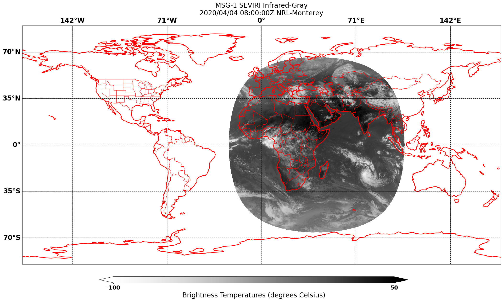

.. code:: bash
    :number-lines:

    run_procflow $GEOIPS_TESTDATA_DIR/test_data_seviri/data/20220209.2200_meteoEU/H-000-MSG4__-MSG4________-_________-EPI______-202202092200-__ \
                 $GEOIPS_TESTDATA_DIR/test_data_seviri/data/20220209.2200_meteoEU/H-000-MSG4__-MSG4________-IR_108___-000001___-202202092200-C_ \
                 $GEOIPS_TESTDATA_DIR/test_data_seviri/data/20220209.2200_meteoEU/H-000-MSG4__-MSG4________-IR_108___-000002___-202202092200-C_ \
                 $GEOIPS_TESTDATA_DIR/test_data_seviri/data/20220209.2200_meteoEU/H-000-MSG4__-MSG4________-IR_108___-000003___-202202092200-C_ \
                 $GEOIPS_TESTDATA_DIR/test_data_seviri/data/20220209.2200_meteoEU/H-000-MSG4__-MSG4________-IR_108___-000004___-202202092200-C_ \
                 $GEOIPS_TESTDATA_DIR/test_data_seviri/data/20220209.2200_meteoEU/H-000-MSG4__-MSG4________-IR_108___-000005___-202202092200-C_ \
                 $GEOIPS_TESTDATA_DIR/test_data_seviri/data/20220209.2200_meteoEU/H-000-MSG4__-MSG4________-IR_108___-000006___-202202092200-C_ \
                 $GEOIPS_TESTDATA_DIR/test_data_seviri/data/20220209.2200_meteoEU/H-000-MSG4__-MSG4________-IR_108___-000007___-202202092200-C_ \
                 $GEOIPS_TESTDATA_DIR/test_data_seviri/data/20220209.2200_meteoEU/H-000-MSG4__-MSG4________-IR_108___-000008___-202202092200-C_ \
                 $GEOIPS_TESTDATA_DIR/test_data_seviri/data/20220209.2200_meteoEU/H-000-MSG4__-MSG4________-_________-PRO______-202202092200-__ \
                 --procflow single_source \
                 --reader_name seviri_hrit\
                 --product_name Infrared-Gray \
                 --output_format imagery_annotated \
                 --minimum_coverage 0 \
                 --filename_format geoips_fname \
                 --resampled_read \
                 --sector_list global \
                 --sectorfiles $GEOIPS/tests/sectors/static/global.yaml

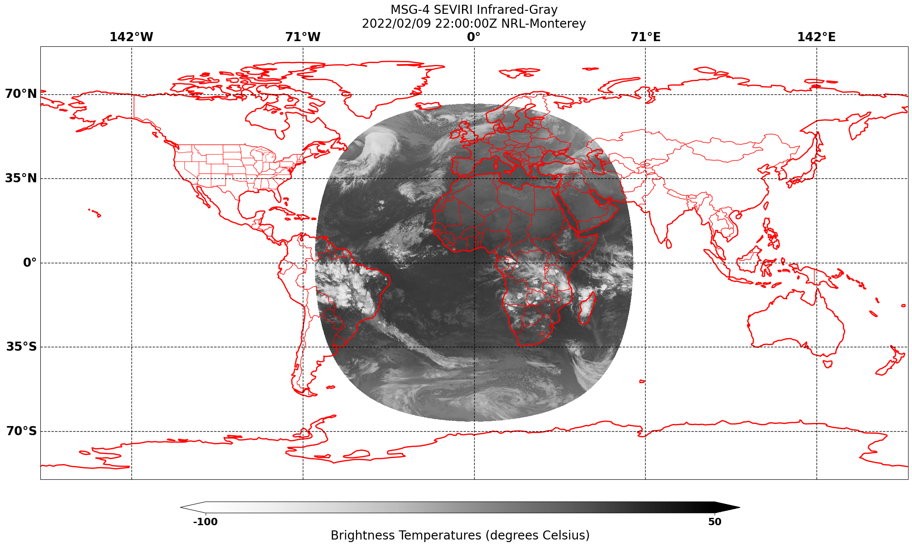

WFABBA ASCII ABI Fire Product
===================================

***********************************
Vis/IR Polar Orbiter Readers
***********************************

MODIS HDF4
===================================
Moderate Resolution Imaging Spectroradiometer (MODIS) sensor, on board:

* Aqua (crossing the equator in the afternoon),
  NASA owned satellite, part of the Earth Observing System (EOS)
* Terra (crossing the equator in the morning),
  NASA owned satellite, part of the EOS

Each MODIS granule contains approximately 5 minutes of data,
and consists of a single geolocation file with
latitudes and longitudes for all resolutions of data,
and a separate data file for each resolution of data.

During the day, a single granule consists of 1km, half-km,
and quarter-km datasets.
At night, a single granule consists of only the 1km dataset.

* Aqua data files are indicated by the prefix "MYD"
* Terra data files are indicated by the prefix "MOD"
* 1km datasets are indicated by the prefix "021KM"
* half-km datasets are indicated by the prefix "02HKM"
* quarter-km datasets are indicated by the prefix "02QKM"
* MODIS Thermal Anomalies and Fire Product is indicated by the prefix "14"
* Geolocation datasets (latitudes, longitudes, satellite and solar angles)
  are indicated by the prefix "03"

**Available Products for MODIS source:**

.. code:: python
    :number-lines:

    In [1]: geoips.stable.reader.get_reader("modis_hdf4")
    Out[1]: <function geoips.interface_modules.readers.modis_hdf4.modis_hdf4(fnames,
                metadata_only=False, chans=None, area_def=None, self_register=False)>

    geoips.dev.product.get_product('Infrared', 'modis')
    geoips.dev.product.get_product('Infrared-Gray', 'modis')
    geoips.dev.product.get_product('IR-BD', 'modis')
    geoips.dev.product.get_product('WV', 'modis')
    geoips.dev.product.get_product('WV-Lower', 'modis')
    geoips.dev.product.get_product('Visible', 'modis')

**Example MODIS output, Aqua and Terra Infrared-Gray global registered output:**

.. code:: bash
    :number-lines:

    run_procflow $GEOIPS_TESTDATA_DIR/test_data_modis/data/aqua/20210104/200500/MYD021KM.A2021004.2005.061.NRT.hdf \
                 $GEOIPS_TESTDATA_DIR/test_data_modis/data/aqua/20210104/200500/MYD03.A2021004.2005.061.NRT.hdf \
                 $GEOIPS_TESTDATA_DIR/test_data_modis/data/aqua/20210104/201000/MYD021KM.A2021004.2010.061.NRT.hdf \
                 $GEOIPS_TESTDATA_DIR/test_data_modis/data/aqua/20210104/201000/MYD03.A2021004.2010.061.NRT.hdf \
                 $GEOIPS_TESTDATA_DIR/test_data_modis/data/aqua/20210104/201500/MYD021KM.A2021004.2015.061.NRT.hdf \
                 $GEOIPS_TESTDATA_DIR/test_data_modis/data/aqua/20210104/201500/MYD03.A2021004.2015.061.NRT.hdf \
                 --procflow single_source \
                 --reader_name modis_hdf4 \
                 --product_name Infrared-Gray \
                 --output_format imagery_annotated \
                 --minimum_coverage 0 \
                 --filename_format geoips_fname \
                 --resampled_read \
                 --sector_list global \
                 --sectorfiles $GEOIPS/tests/sectors/static/global.yaml

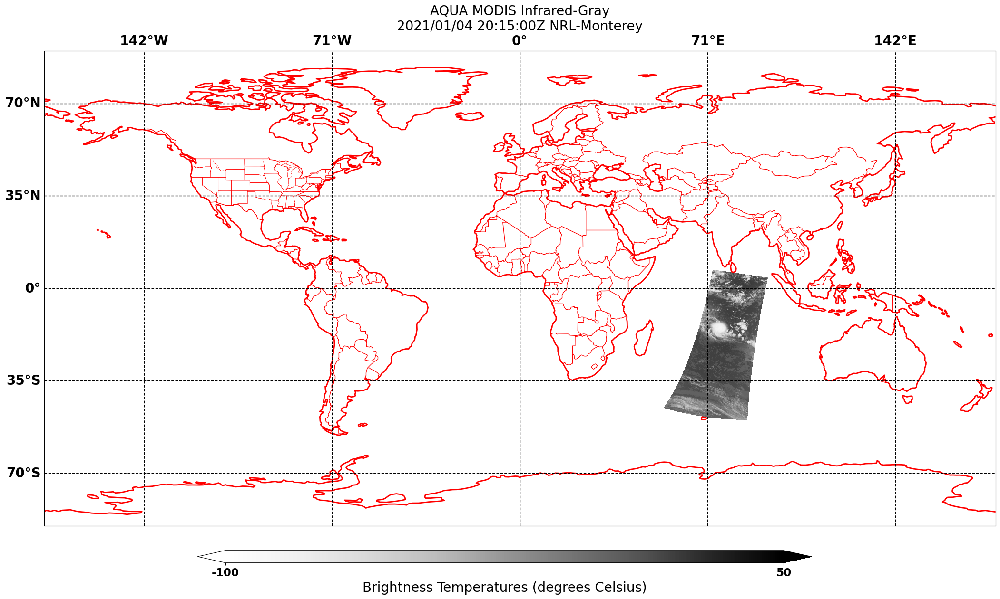

.. code:: bash
    :number-lines:

    run_procflow $GEOIPS_TESTDATA_DIR/test_data_modis/data/terra/170500/MOD021KM.A2021004.1705.061.NRT.hdf \
                 $GEOIPS_TESTDATA_DIR/test_data_modis/data/terra/170500/MOD03.A2021004.1705.061.NRT.hdf \
                 $GEOIPS_TESTDATA_DIR/test_data_modis/data/terra/170500/MOD14.A2021004.1705.006.NRT.hdf \
                 --procflow single_source \
                 --reader_name modis_hdf4 \
                 --product_name Infrared-Gray \
                 --output_format imagery_annotated \
                 --minimum_coverage 0 \
                 --filename_format geoips_fname \
                 --resampled_read \
                 --sector_list global \
                 --sectorfiles $GEOIPS/tests/sectors/static/global.yaml

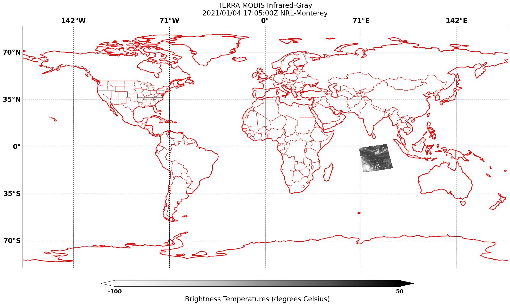

VIIRS NetCDF
===================================

Visible Infrared Imaging Radiometer Suite (VIIRS) sensor, on board:

* the NASA/NOAA Suomi National Polar-Orbiting Partnership (Suomi NPP) satellite and
* the NOAA-20 (formerly Joint Polar Satellite System 1, or JPSS-1) satellite

Each VIIRS granule contains approximately 6 minutes of data,
and consistes of a geolocation file and
data file for each resolution of data - DNB, MOD, and IMG.

See examples below for sample filenames.

* NOAA-20 (JPSS-1) data files are indicated by the prefix "VJ1"
* NPP data files are indicated by the prefix "VNP"
* Geolocation files are indicated by the prefix "03"
* Data files are indicated by the prefix "02".

**Available Products for VIIRS source:**

.. code:: python
    :number-lines:

    geoips.stable.reader.get_reader('viirs_netcdf')
    geoips.dev.product.get_product('Infrared', 'viirs')
    geoips.dev.product.get_product('Infrared-Gray', 'viirs')
    geoips.dev.product.get_product('IR-BD', 'viirs')
    geoips.dev.product.get_product('Night-Vis', 'viirs')
    geoips.dev.product.get_product('Night-Vis-IR', 'viirs')
    geoips.dev.product.get_product('Visible', 'viirs')

**Example VIIRS output, NPP and JPSS Infrared-Gray global registered output:**

.. code:: bash
    :number-lines:

    run_procflow $GEOIPS_TESTDATA_DIR/test_data_viirs/data/jpss/20210209/073600/VJ102MOD.A2021040.0736.002.2021040145245.nc \
                 $GEOIPS_TESTDATA_DIR/test_data_viirs/data/jpss/20210209/073600/VJ103MOD.A2021040.0736.002.2021040142228.nc \
                 $GEOIPS_TESTDATA_DIR/test_data_viirs/data/jpss/20210209/074200/VJ102MOD.A2021040.0742.002.2021040143010.nc \
                 $GEOIPS_TESTDATA_DIR/test_data_viirs/data/jpss/20210209/074200/VJ103MOD.A2021040.0742.002.2021040140938.nc \
                 --procflow single_source \
                 --reader_name viirs_netcdf \
                 --product_name Infrared-Gray \
                 --output_format imagery_annotated \
                 --filename_format geoips_fname \
                 --resampled_read \
                 --sector_list global \
                 --sectorfiles $GEOIPS/tests/sectors/static/global.yaml

    run_procflow $GEOIPS_TESTDATA_DIR/test_data_viirs/data/npp/20210205/080600/VNP02DNB.A2021036.0806.001.2021036140558.nc \
                 $GEOIPS_TESTDATA_DIR/test_data_viirs/data/npp/20210205/080600/VNP02IMG.A2021036.0806.001.2021036140558.nc \
                 $GEOIPS_TESTDATA_DIR/test_data_viirs/data/npp/20210205/080600/VNP02MOD.A2021036.0806.001.2021036140558.nc \
                 $GEOIPS_TESTDATA_DIR/test_data_viirs/data/npp/20210205/080600/VNP03DNB.A2021036.0806.001.2021036135524.nc \
                 $GEOIPS_TESTDATA_DIR/test_data_viirs/data/npp/20210205/080600/VNP03IMG.A2021036.0806.001.2021036135524.nc \
                 $GEOIPS_TESTDATA_DIR/test_data_viirs/data/npp/20210205/080600/VNP03MOD.A2021036.0806.001.2021036135524.nc \
                 --procflow single_source \
                 --reader_name viirs_netcdf \
                 --product_name Infrared-Gray \
                 --output_format imagery_annotated \
                 --minimum_coverage 0 \
                 --filename_format geoips_fname \
                 --resampled_read \
                 --sector_list global \
                 --sectorfiles $GEOIPS/tests/sectors/static/global.yaml

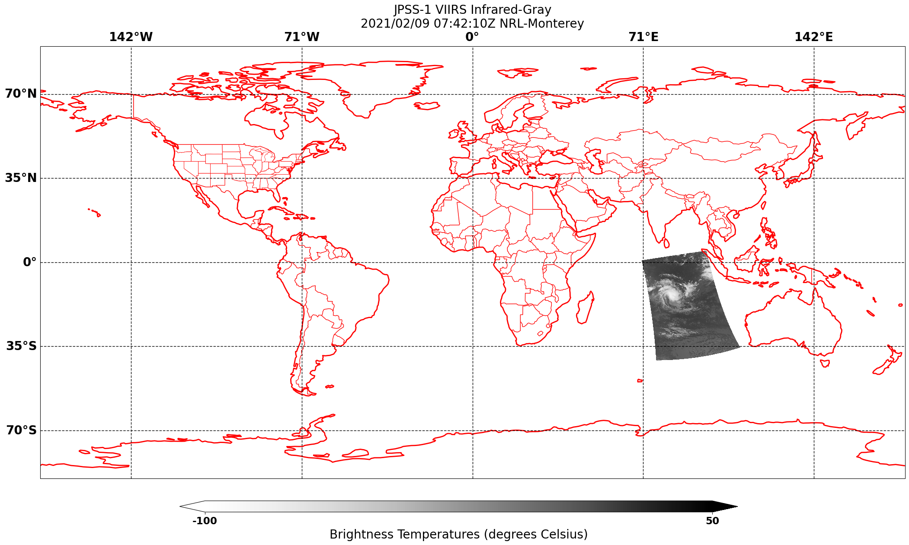
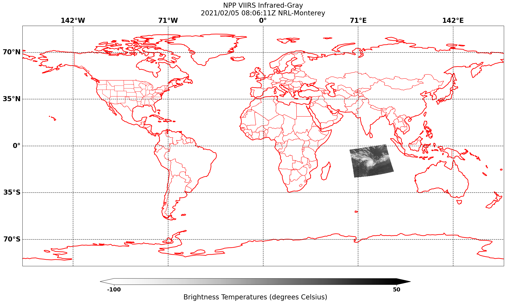

***********************************
Passive Microwave Readers
***********************************

AMSR2 NetCDF
===================================

Advanced Microwave Scanning Radiometer 2 (AMSR2) sensor, on the Global Change
Observation Mission 1st - Water (GCOM-W1) satellite.

**Available Products for AMSR2 source:**

.. code:: python
    :number-lines:

    geoips.stable.reader.get_reader('amsr2_netcdf')
    geoips.dev.product.get_product('37H', 'amsr2')
    geoips.dev.product.get_product('37H-Legacy', 'amsr2')
    geoips.dev.product.get_product('37H-LegacyNearest', 'amsr2')
    geoips.dev.product.get_product('37H-Physical', 'amsr2')
    geoips.dev.product.get_product('37H-PhysicalNearest', 'amsr2')
    geoips.dev.product.get_product('37H-ob-minus-bk', 'amsr2')
    geoips.dev.product.get_product('37HNearest', 'amsr2')
    geoips.dev.product.get_product('37V', 'amsr2')
    geoips.dev.product.get_product('37V-ob-minus-bk', 'amsr2')
    geoips.dev.product.get_product('37VNearest', 'amsr2')
    geoips.dev.product.get_product('37pct', 'amsr2')
    geoips.dev.product.get_product('37pctNearest', 'amsr2')
    geoips.dev.product.get_product('89H', 'amsr2')
    geoips.dev.product.get_product('89H-Legacy', 'amsr2')
    geoips.dev.product.get_product('89H-LegacyNearest', 'amsr2')
    geoips.dev.product.get_product('89H-Physical', 'amsr2')
    geoips.dev.product.get_product('89H-PhysicalNearest', 'amsr2')
    geoips.dev.product.get_product('89HNearest', 'amsr2')
    geoips.dev.product.get_product('89HW', 'amsr2')
    geoips.dev.product.get_product('89HWNearest', 'amsr2')
    geoips.dev.product.get_product('89V', 'amsr2')
    geoips.dev.product.get_product('89VNearest', 'amsr2')
    geoips.dev.product.get_product('89pct', 'amsr2')
    geoips.dev.product.get_product('89pctNearest', 'amsr2')
    geoips.dev.product.get_product('color37', 'amsr2')
    geoips.dev.product.get_product('color37Nearest', 'amsr2')
    geoips.dev.product.get_product('color89', 'amsr2')
    geoips.dev.product.get_product('color89Nearest', 'amsr2')
    geoips.dev.product.get_product('windspeed', 'amsr2')

**Example AMSR2 output, 89pct product:**

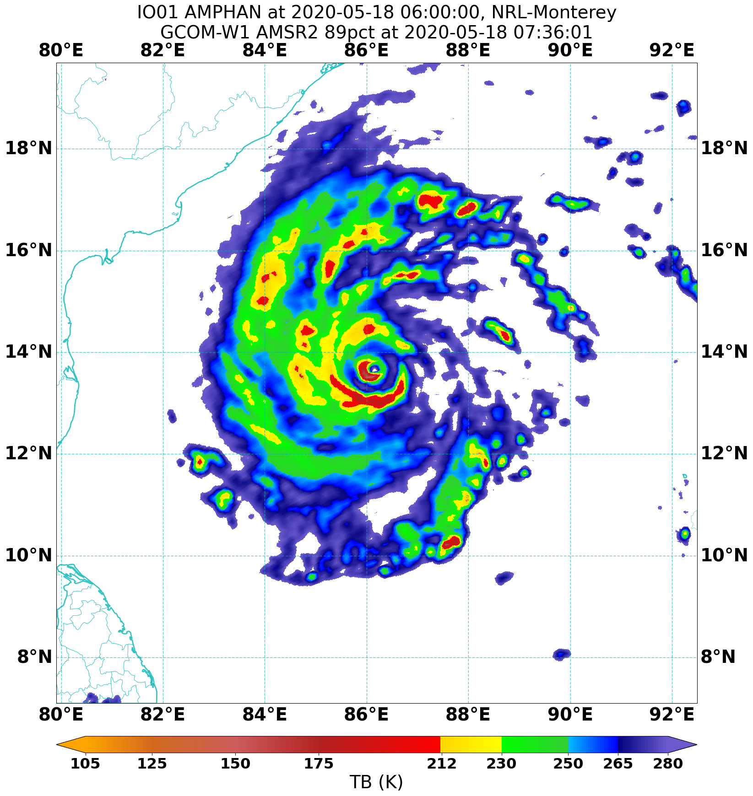

AMSR2 REMSS Winds NetCDF
===================================

AMSU-A / AMSU-B / MHS HDF
===================================

All AMSU-A/AMSU-B/MHS sources currently labeled as 'amsu-b' within
GeoIPS since formatting is identical.

Satellite name differentiates between sensors / frequency range.

* 23-90GHz: Advanced Microwave Sounding Unit - A (AMSU-A) sensor on:

  * METOP-A, METOP-B, METOP-C
  * NOAA-15, NOAA-16, NOAA-17
  * NOAA-18, NOAA-19
* 89-190GHz: Advanced Microwave Sounding Unit - B (AMSU-B) sensor on:

  * NOAA-15, NOAA-16, NOAA-17
* 89-190GHz: Microwave Humidity Sounder (MHS) sensor on:

  * METOP-A, METOP-B, METOP-C
  * NOAA-18, NOAA-19

HDF format data files

**Available Products for AMSU-A / AMSU-B / MHS source:**

.. code:: python
    :number-lines:

    geoips.stable.reader.get_reader('amsub_hdf')
    geoips.dev.product.get_product('157V', 'amsu-b')
    geoips.dev.product.get_product('157VNearest', 'amsu-b')
    geoips.dev.product.get_product('183-1H', 'amsu-b')
    geoips.dev.product.get_product('183-1HNearest', 'amsu-b')
    geoips.dev.product.get_product('183-3H', 'amsu-b')
    geoips.dev.product.get_product('183-3HNearest', 'amsu-b')
    geoips.dev.product.get_product('190V', 'amsu-b')
    geoips.dev.product.get_product('190VNearest', 'amsu-b')
    geoips.dev.product.get_product('89V', 'amsu-b')
    geoips.dev.product.get_product('89VNearest', 'amsu-b')

**Example MHS HDF output, 89V product:**

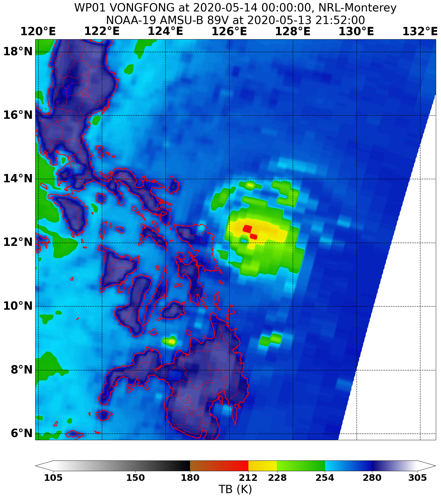

AMSU-A / AMSU-B / MHS MIRS
===================================

All AMSU-A/AMSU-B/MHS sources currently labeled as 'amsu-b' within
GeoIPS since formatting is identical.

Satellite name differentiates between sensors / frequency range.

* 23-90GHz: Advanced Microwave Sounding Unit - A (AMSU-A) sensor on:

  * METOP-A, METOP-B, METOP-C
  * NOAA-15, NOAA-16, NOAA-17
  * NOAA-18, NOAA-19
* 89-190GHz: Advanced Microwave Sounding Unit - B (AMSU-B) sensor on:

  * NOAA-15, NOAA-16, NOAA-17
* 89-190GHz: Microwave Humidity Sounder (MHS) sensor on:

  * METOP-A, METOP-B, METOP-C
  * NOAA-18, NOAA-19

Microwave Integrated Retrieval System (MiRS) format data files

**Available Products for AMSU-A / AMSU-B / MHS source:**

.. code:: python
    :number-lines:

    geoips.stable.reader.get_reader('amsub_mirs')
    geoips.dev.product.get_product('157V', 'amsu-b')
    geoips.dev.product.get_product('157VNearest', 'amsu-b')
    geoips.dev.product.get_product('183-1H', 'amsu-b')
    geoips.dev.product.get_product('183-1HNearest', 'amsu-b')
    geoips.dev.product.get_product('183-3H', 'amsu-b')
    geoips.dev.product.get_product('183-3HNearest', 'amsu-b')
    geoips.dev.product.get_product('190V', 'amsu-b')
    geoips.dev.product.get_product('190VNearest', 'amsu-b')
    geoips.dev.product.get_product('89V', 'amsu-b')
    geoips.dev.product.get_product('89VNearest', 'amsu-b')

**Example AMSU-A MIRS output, 183-1H product:**

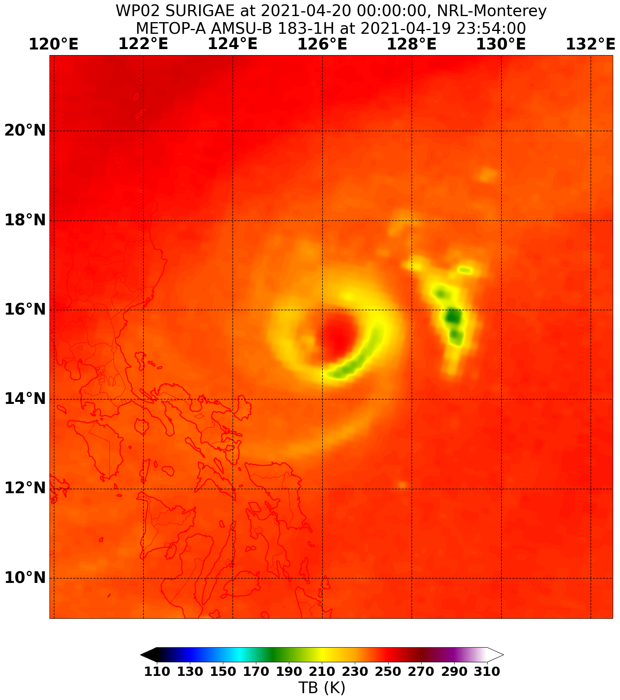

GMI NetCDF
===================================

The GPM Microwave Imager (GMI) instrument is a conical-scanning
microwave radiometer on board the
Global Precipitation Monitor (GPM) satellite.

https://gpm.nasa.gov/missions/GPM/GMI

GMI contains 13 channels between 10 and 183 GHz.

See example call below for sample filenames

**Available Products for GMI source:**

.. code:: python
    :number-lines:

    geoips.stable.reader.get_reader('gmi_netcdf')
    geoips.dev.product.get_product('166H', 'gmi')
    geoips.dev.product.get_product('166HNearest', 'gmi')
    geoips.dev.product.get_product('166V', 'gmi')
    geoips.dev.product.get_product('166VNearest', 'gmi')
    geoips.dev.product.get_product('183-1H', 'gmi')
    geoips.dev.product.get_product('183-1HNearest', 'gmi')
    geoips.dev.product.get_product('183-3H', 'gmi')
    geoips.dev.product.get_product('183-3HNearest', 'gmi')
    geoips.dev.product.get_product('190V', 'gmi')
    geoips.dev.product.get_product('190VNearest', 'gmi')
    geoips.dev.product.get_product('19H', 'gmi')
    geoips.dev.product.get_product('19HNearest', 'gmi')
    geoips.dev.product.get_product('19V', 'gmi')
    geoips.dev.product.get_product('19VNearest', 'gmi')
    geoips.dev.product.get_product('37H', 'gmi')
    geoips.dev.product.get_product('37H-Legacy', 'gmi')
    geoips.dev.product.get_product('37H-LegacyNearest', 'gmi')
    geoips.dev.product.get_product('37H-Physical', 'gmi')
    geoips.dev.product.get_product('37H-PhysicalNearest', 'gmi')
    geoips.dev.product.get_product('37HNearest', 'gmi')
    geoips.dev.product.get_product('37V', 'gmi')
    geoips.dev.product.get_product('37VNearest', 'gmi')
    geoips.dev.product.get_product('37pct', 'gmi')
    geoips.dev.product.get_product('37pctNearest', 'gmi')
    geoips.dev.product.get_product('89H', 'gmi')
    geoips.dev.product.get_product('89H-Legacy', 'gmi')
    geoips.dev.product.get_product('89H-LegacyNearest', 'gmi')
    geoips.dev.product.get_product('89H-Physical', 'gmi')
    geoips.dev.product.get_product('89H-PhysicalNearest', 'gmi')
    geoips.dev.product.get_product('89HNearest', 'gmi')
    geoips.dev.product.get_product('89HW', 'gmi')
    geoips.dev.product.get_product('89HWNearest', 'gmi')
    geoips.dev.product.get_product('89V', 'gmi')
    geoips.dev.product.get_product('89VNearest', 'gmi')
    geoips.dev.product.get_product('89pct', 'gmi')
    geoips.dev.product.get_product('89pctNearest', 'gmi')
    geoips.dev.product.get_product('color37', 'gmi')
    geoips.dev.product.get_product('color37Nearest', 'gmi')
    geoips.dev.product.get_product('color89', 'gmi')
    geoips.dev.product.get_product('color89Nearest'], 'gmi')

**Example GMI output, 89H product, globally registered image:**

.. code:: bash
    :number-lines:

    run_procflow $GEOIPS_TESTDATA_DIR/test_data_gpm/data/1B.GPM.GMI.TB2016.20200917-S171519-E172017.V05A.RT-H5 \
                 $GEOIPS_TESTDATA_DIR/test_data_gpm/data/1B.GPM.GMI.TB2016.20200917-S172019-E172517.V05A.RT-H5 \
                 $GEOIPS_TESTDATA_DIR/test_data_gpm/data/1B.GPM.GMI.TB2016.20200917-S172519-E173017.V05A.RT-H5 \
                 --procflow single_source \
                 --reader_name gmi_hdf5 \
                 --product_name 89H \
                 --output_format imagery_annotated \
                 --minimum_coverage 0 \
                 --filename_format geoips_fname \
                 --sector_list global \
                 --sectorfiles $GEOIPS/tests/sectors/static/global.yaml

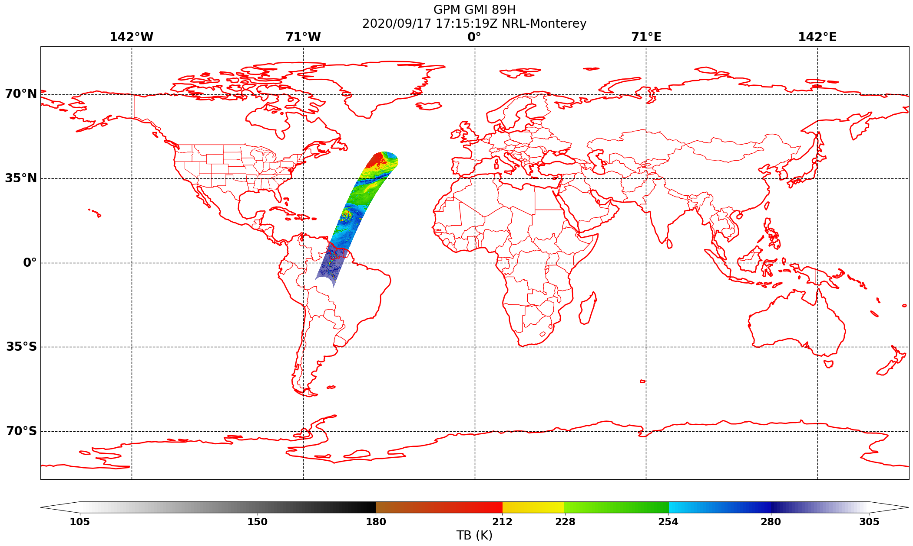

SAPHIR HDF5
===================================

SSMI Binary
===================================

SSMI/S Binary
===================================

Windsat IDR37 Binary
===================================

Windsat REMSS Winds NetCDF
===================================

***********************************
Surface Winds Readers
***********************************

ASCAT Ultra High Resolution NetCDF
===================================

SAR Winds NetCDF
===================================

Synthetic Aperture Radar (SAR) sensors, surface wind speed retrievals.

Satellites:

* Radarsat-2 https://www.asc-csa.gc.ca/eng/satellites/radarsat2/Default.asp
* Sentinel-1 https://sentinel.esa.int/web/sentinel/missions/sentinel-1
* Radarsat Constellation Mission (RCM) https://earth.esa.int/web/eoportal/satellite-missions/r/rcm

**Available Products for SAR source:**

.. code:: python
    :number-lines:

    geoips.stable.reader.get_reader('sar_winds_netcdf')
    geoips.dev.product.get_product('nrcs', 'sar-spd')
    geoips.dev.product.get_product('sectored', 'sar-spd')
    geoips.dev.product.get_product('unsectored', 'sar-spd')
    geoips.dev.product.get_product('windspeed', 'sar-spd')

**Example SAR output, NRCS product:**

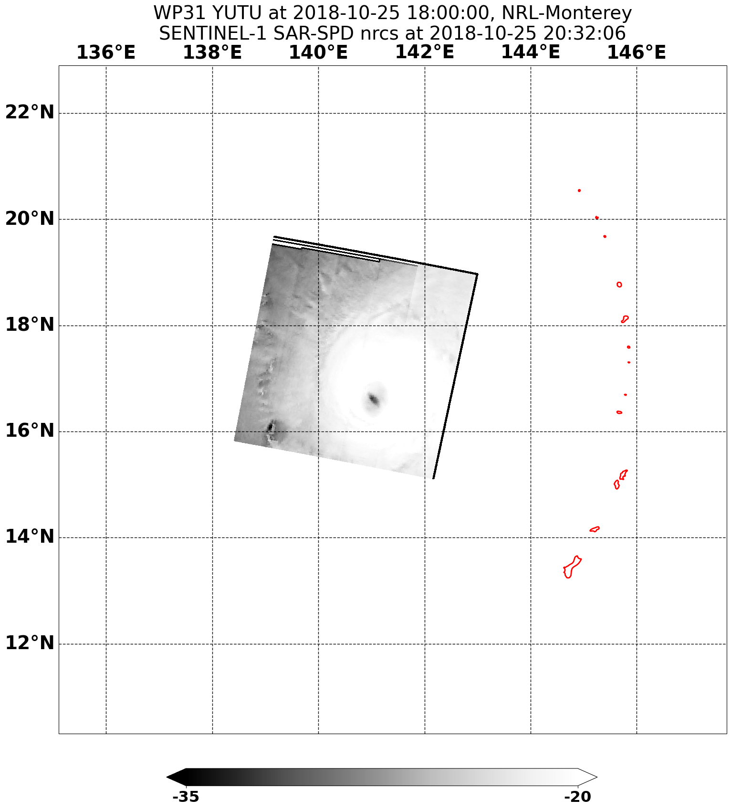

KNMI ASCAT Winds NetCDF
===================================

KNMI OSCAT Winds NetCDF
===================================

Surface Winds Text
===================================

SMAP REMSS Winds NetCDF
===================================

Soil Moisture Active Passive satellite, surface wind speed retrievals

**Available Products for SMAP source:**

.. code:: python
    :number-lines:

    geoips.stable.reader.get_reader('smap_remss_winds_netcdf')
    geoips.dev.product.get_product('sectored', 'smap-spd')
    geoips.dev.product.get_product('unsectored', 'smap-spd')
    geoips.dev.product.get_product('windspeed', 'smap-spd')

**Example SMAP output, windspeed product:**

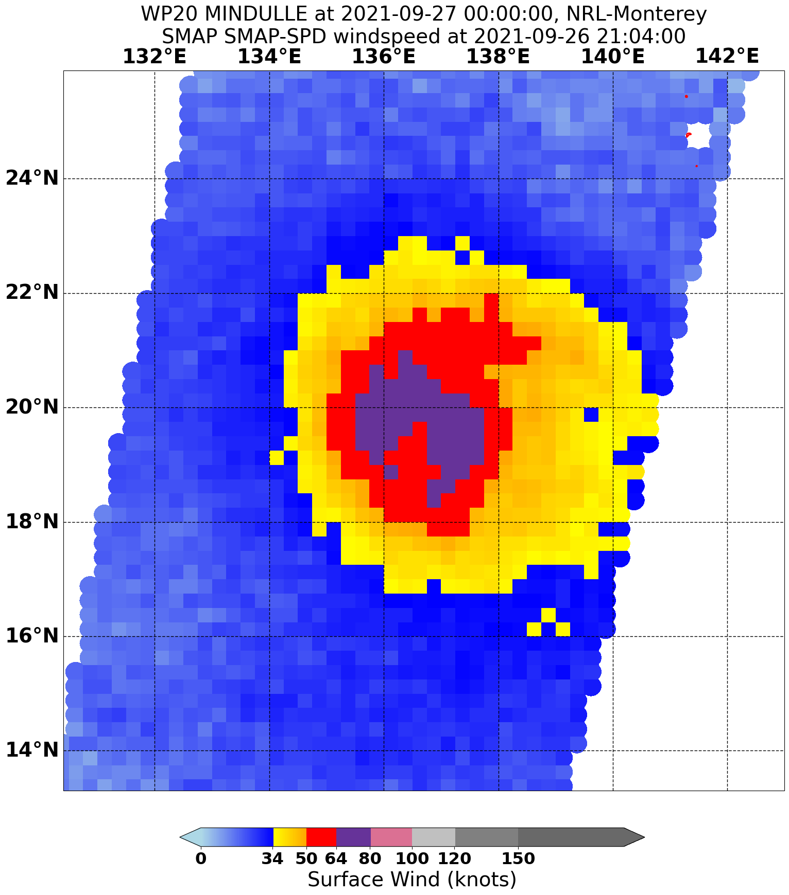

SMOS Winds NetCDF
===================================

European Space Agency (ESA) Soil Moisture and Ocean Salinity (SMOS) satellite,
surface wind speed retrievals.

**Available Products for SMOS source:**

.. code:: python
    :number-lines:

    geoips.stable.reader.get_reader('smos_winds_netcdf')
    geoips.dev.product.get_product('sectored', 'smos-spd')
    geoips.dev.product.get_product('unsectored', 'smos-spd')
    geoips.dev.product.get_product('windspeed', 'smos-spd')

**Example SMOS output, windspeed product:**

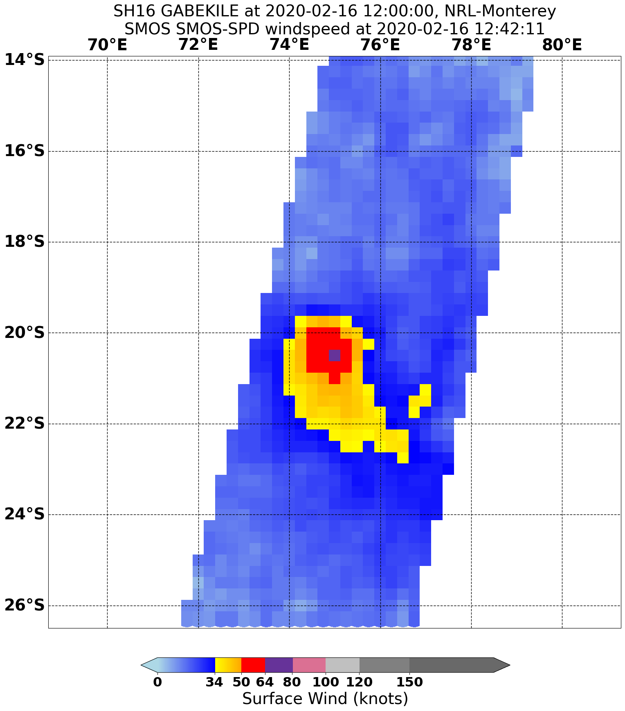

***********************************
Precipitation Readers
***********************************

IMERG HDF5
===================================

MIMIC NetCDF
===================================

***********************************
General Readers
***********************************

GeoIPS NetCDF
===================================

Initial Products
----------------

***********************************
37 GHz based Products
***********************************

19H
===================================

19V
===================================

37H
===================================

37H-Physical
===================================

37pct
===================================

37V
===================================

color37
===================================

***********************************
89 GHz based Products
***********************************

89H
===================================

89V
===================================

89GHz V polarization product, using standard 89GHz passive microwave colormap

**Available sources for 89V product:**

.. code:: python
    :number-lines:

    geoips.dev.cmap.get_cmap('pmw_tb.cmap_89H')

    geoips.dev.product.get_product('89V', 'amsr-e')
    geoips.dev.product.get_product('89V', 'amsr2')
    geoips.dev.product.get_product('89V', 'amsu-b')
    geoips.dev.product.get_product('89V', 'gmi')
    geoips.dev.product.get_product('89V', 'mhs')
    geoips.dev.product.get_product('89V', 'ssmi')
    geoips.dev.product.get_product('89V', 'ssmis')
    geoips.dev.product.get_product('89V', 'tmi')

**Example output, shown for NOAA-19 MHS dataset:**

89HW
===================================

89H-Legacy
===================================

89H-Physical
===================================

89pct
===================================

89pct product, using standard 89pct passive microwave colormap

**Available sources for 89pct product:**

.. code:: python
    :number-lines:

    geoips.dev.cmap.get_cmap('pmw_tb.cmap_89pct')

    geoips.dev.product.get_product('89pct', 'amsr-e')
    geoips.dev.product.get_product('89pct', 'amsr2')
    geoips.dev.product.get_product('89pct', 'gmi')
    geoips.dev.product.get_product('89pct', 'ssmi')
    geoips.dev.product.get_product('89pct', 'ssmis')
    geoips.dev.product.get_product('89pct', 'tmi')

**Example output, shown for AMSR2 dataset:**

color89
===================================

***********************************
150 GHz based Products
***********************************

150H
===================================

150V
===================================

157V
===================================

165H
===================================

166H
===================================

166V
===================================

183-1H
===================================

183 +- 1 GHz H polarization product, using standard 150GHz passive microwave colormap

**Available sources for 183-1H product:**

.. code:: python
    :number-lines:

    geoips.dev.cmap.get_cmap('pmw_tb.cmap_150H')

    geoips.dev.product.get_product('183-1H', 'amsu-b')
    geoips.dev.product.get_product('183-1H', 'gmi')
    geoips.dev.product.get_product('183-1H', 'mhs')
    geoips.dev.product.get_product('183-1H', 'saphir')
    geoips.dev.product.get_product('183-1H', 'ssmis')

**Example output, shown for METOP-A MHS dataset:**

183-3H
===================================

183 +- 3 GHz H polarization product, using standard 150GHz passive microwave colormap

**Available sources for 183-1H product:**

.. code:: python
    :number-lines:

    geoips.dev.cmap.get_cmap('pmw_tb.cmap_150H')

    geoips.dev.product.get_product('183-3H', 'amsu-b')
    geoips.dev.product.get_product('183-3H', 'gmi')
    geoips.dev.product.get_product('183-3H', 'mhs')
    geoips.dev.product.get_product('183-3H', 'saphir')
    geoips.dev.product.get_product('183-3H', 'ssmis')

**Example output, shown for METOP-A MHS dataset:**

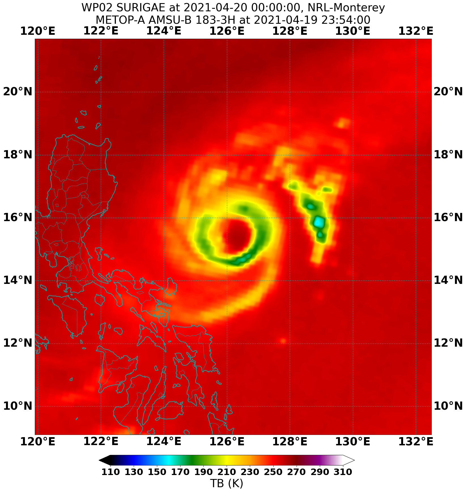

183-7H
===================================

183H
===================================

190V
===================================

***********************************
Vis/IR Products
***********************************

Infrared-Gray
===================================

Infrared
===================================

IR-BD
===================================

Night-Vis-IR
===================================

VIIRS RGB image containing Night Visible Channel (red and green guns) combined with
Channel 16 Brightness Temperatures (blue gun)

**Available sources for Night Visible product:**

.. code:: python
    :number-lines:

    geoips.dev.alg.get_alg('visir.Night_Vis_IR')

    geoips.dev.product.get_product('Night-Vis-IR', 'viirs')

**Example Night-Vis-IR output, shown for VIIRS dataset:**

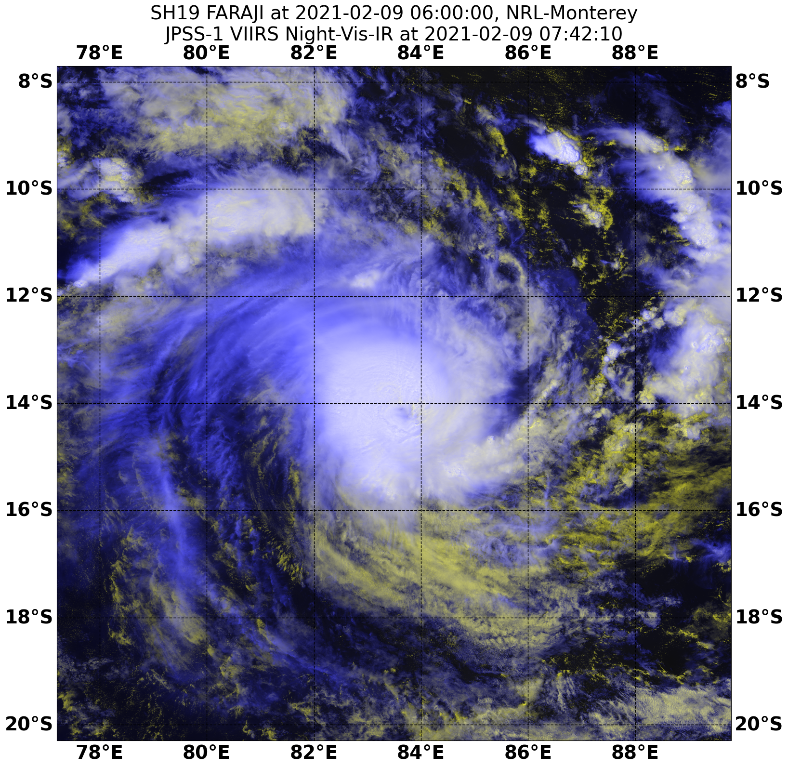

Night-Vis
===================================

Visible
===================================

WV-Lower
===================================

WV-Upper
===================================

WV
===================================

***********************************
Precipitation Products
***********************************

Rain
===================================

TPW CIMSS
===================================

TPW Purple
===================================

TPW PWAT
===================================

***********************************
Surface Winds Products
***********************************

NRCS
===================================

Normalized Radar Cross Section product

**Available sources for NRCS product:**

.. code:: python
    :number-lines:

    geoips.dev.product.get_product('nrcs', 'ascatuhr')
    geoips.dev.product.get_product('nrcs', 'sar-spd')

**Example output, shown for Sentinel-1 SAR dataset:**

wind-ambiguities
===================================

windbarbs
===================================

Output wind barbs, using the TC-specific colormap (with color transitions at
34 kts, 50 kts, 64 kts, 80 kts, 100 kts, 120 kts, and 150 kts)

**Available sources for windbarbs product:**

.. code:: python
    :number-lines:

    geoips.dev.cmap.get_cmap('winds.wind_radii_transitions')

    geoips.dev.product.get_product('windbarbs', 'oscat')
    geoips.dev.product.get_product('windbarbs', 'ascat')
    geoips.dev.product.get_product('windbarbs', 'ascatuhr')

windspeed
===================================

Output shaded windspeeds, using the TC-specific colormap (with color transitions at
34 kts, 50 kts, 64 kts, 80 kts, 100 kts, 120 kts, and 150 kts)

**Available sources for windspeed product:**

.. code:: python
    :number-lines:

    geoips.dev.cmap.get_cmap('winds.wind_radii_transitions')

    geoips.dev.product.get_product('windspeed', 'amsr2')
    geoips.dev.product.get_product('windspeed', 'ascat')
    geoips.dev.product.get_product('windspeed', 'ascatuhr')
    geoips.dev.product.get_product('windspeed', 'oscat')
    geoips.dev.product.get_product('windspeed', 'sar')
    geoips.dev.product.get_product('windspeed', 'smap')
    geoips.dev.product.get_product('windspeed', 'smos')
    geoips.dev.product.get_product('windspeed', 'windsat')

**Example output, shown for SMAP dataset:**

Initial Output Formats
======================

Imagery Formats
===============

Annotated Imagery
=================

Clean Imagery
=================

Windbarb Imagery
=================

Clean Windbarb Imagery
======================

GEOTIFF
=======

Data Formats
============

GeoIPS NetCD
============

Standard xarray NetCDF
======================

Text Winds
==========

Metadata Formats
================

Default Metadata
================

