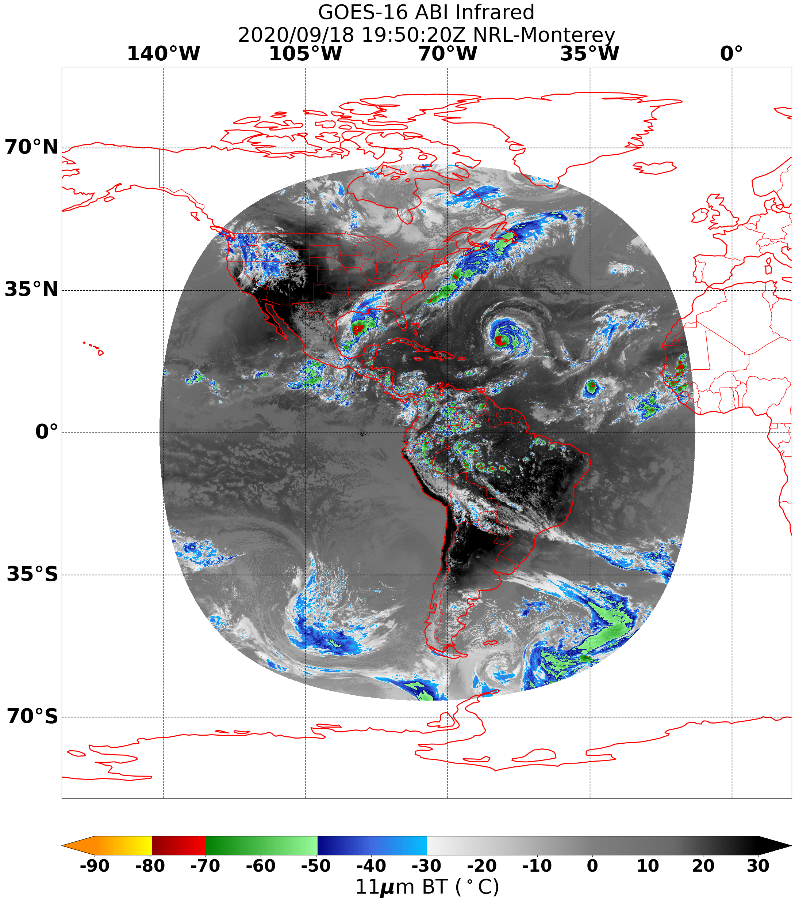
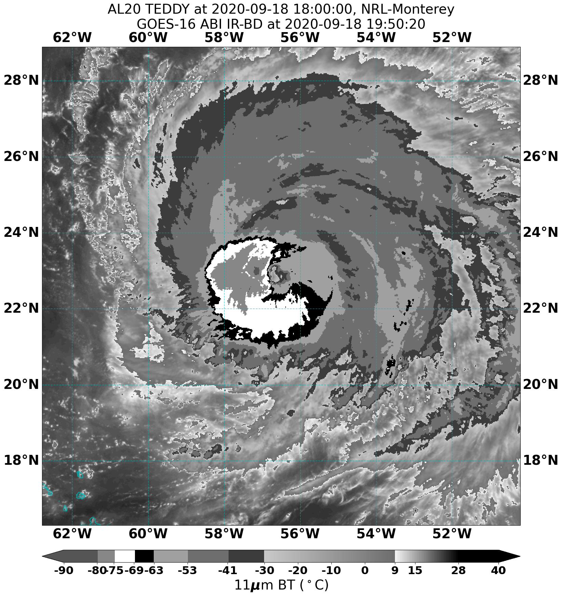
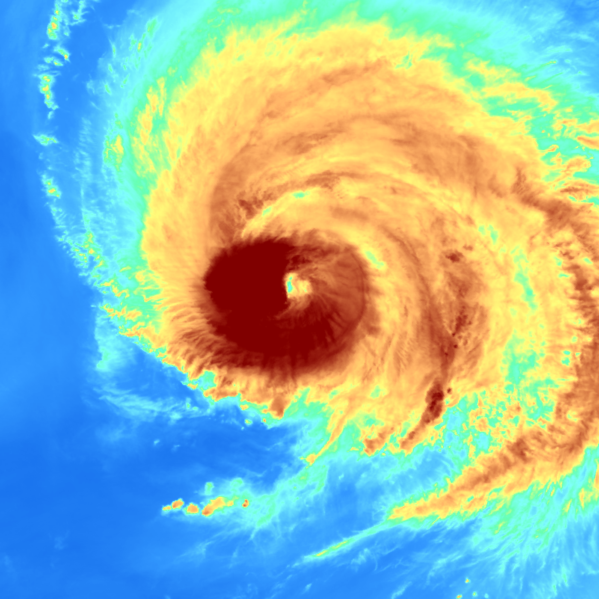

.. dropdown:: Distribution Statement

 | # # # This source code is subject to the license referenced at
 | # # # https://github.com/NRLMMD-GEOIPS.

Example Command Line Calls
==========================

The standard installation steps include download of sample ABI test datasets from the public NOAA AWS
repository.  These sample commands use the pre-downloaded ABI data.

Geostationary Infrared annotated imagery over static sector
-----------------------------------------------------------

Plot ABI Infrared product over static sector, including:
    * annotated png using cartopy and matplotlib

Note the first time processing ABI or AHI data can take several minutes, as it is pre-generating geolocation files
over the given sector to cache for use in subsequent runs.

.. code:: bash
    :number-lines:

    # For reference
    # --procflow single_source            DEFINED: geoips/interface_modules/procflows/single_source.py
    # --readername abi_netcdf             DEFINED: geoips/interface_modules/readers/abi_netcdf.py
    # --output_format imagery_annotated   DEFINED: geoips/interface_modules/output_formats/imagery_annotated.py
    # --filename_format geoips_fname      DEFINED: geoips/interface_modules/filename_formats/geoips_fname.py
    # --product_name Infrared             DEFINED: geoips/yaml_configs/product_params/visir/Infrared.yaml

    run_procflow $GEOIPS/tests/data/goes16_20200918_1950/* \
              --procflow single_source \
              --reader_name abi_netcdf \
              --product_name Infrared \
              --output_format imagery_annotated \
              --filename_format geoips_fname \
              --sector_list goes16 \
              --sectorfiles $GEOIPS/tests/sectors/static/goes16.yaml

Geostationary Visible netCDF output
-----------------------------------

Create ABI Visible netcdf output, over a TC sector

.. code:: bash
    :number-lines:

    # For reference
    # --trackfile_parser bdeck_parser     DEFINED: geoips/interface_modules/trackfile_parsers/bdeck_parser.py

    run_procflow $GEOIPS/tests/data/goes16_20200918_1950/* \
              --procflow single_source \
              --reader_name abi_netcdf \
              --product_name Visible \
              --output_format netcdf_geoips \
              --filename_format geoips_netcdf_fname \
              --tc_template_yaml $GEOIPS/geoips/yaml_configs/sectors_dynamic/tc_web_2km_template.yaml \
              --trackfiles $GEOIPS/tests/sectors/tc_bdecks/bal202020.dat \
              --trackfile_parser bdeck_parser

.. include:: ../yaml/20200918.195020.goes-16.Visible_latitude_longitude.tc2020al20teddy.nc.yaml
   :literal:

Geostationary IR-BD imagery over TC specific sector
---------------------------------------------------

Plot the ABI IR-BD product over TC2020 AL20 Teddy, with
    * annotated png using cartopy and matplotlib
    * associated metadata YAML files

.. code:: bash
    :number-lines:

    # For reference
    # --boundaries_params tc_visir        DEFINED: geoips/yaml_configs/plotting_params/boundaries/tc_visir.yaml
    # --gridlines_params tc_visir         DEFINED: geoips/yaml_configs/plotting_params/gridlines/tc_visir.yaml

    run_procflow $GEOIPS/tests/data/goes16_20200918_1950/* \
              --procflow single_source \
              --reader_name abi_netcdf \
              --product_name IR-BD \
              --output_format imagery_annotated \
              --filename_format tc_fname \
              --gridlines_params tc_pmw \
              --boundaries_params tc_pmw \
              --trackfiles $GEOIPS/tests/sectors/tc_bdecks/bal202020.dat \
              --trackfile_parser bdeck_parser

.. include:: ../yaml/20200918_195020_AL202020_abi_goes-16_IR-BD_110kts_100p00_1p0.png.yaml
   :literal:

Geostationary WV product over TC specific sector
------------------------------------------------

Plot the ABI WV product over TC2020 AL20 Teddy, with
    * "clean" png with no coast lines, borders, gridlines, or title information,
    * associated metadata YAML files

.. code:: bash
    :number-lines:

    run_procflow $GEOIPS/tests/data/goes16_20200918_1950/* \
              --procflow single_source \
              --reader_name abi_netcdf \
              --product_name WV \
              --output_format imagery_clean \
              --filename_format tc_fname \
              --trackfiles $GEOIPS/tests/sectors/tc_bdecks/bal202020.dat \
              --trackfile_parser bdeck_parser

.. include:: ../yaml/20200918_195020_AL202020_abi_goes-16_WV_110kts_100p00_1p0.png.yaml
   :literal:

Config based processing for ABI dataset
---------------------------------------

Efficiently plot ABI annotated imagery over both a static and TC sector with a single call.
    * static Infrared output
    * TC Infrared-Gray, IR-BD, Visible, and WV annotated imagery and YAML metadata outputs

.. code:: bash
    :number-lines:

    run_procflow --output_config $GEOIPS/tests/yaml_configs/abi_test.yaml \
                 --procflow config_based

.. include:: ../yaml/abi_test.yaml
   :literal:
