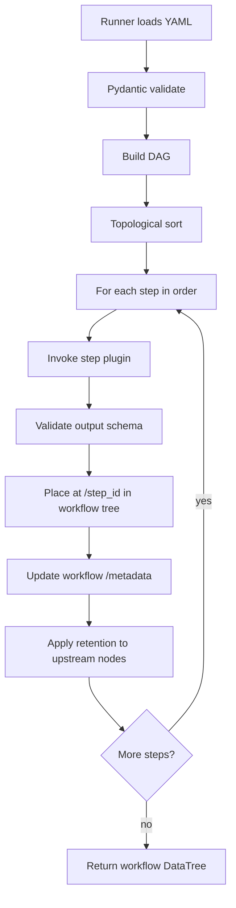
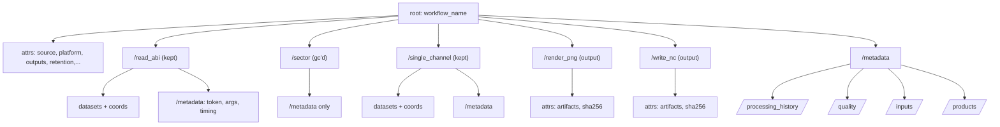
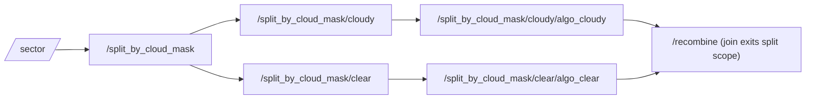
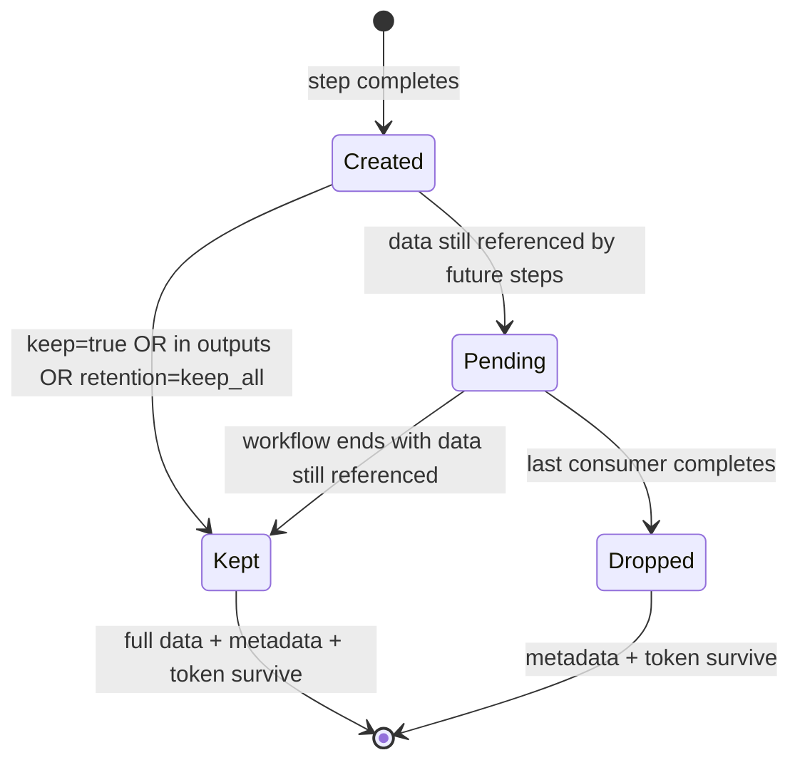
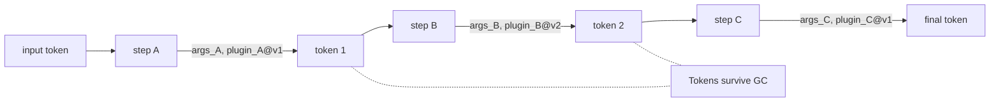

## Abstract

Every step in a workflow takes a `DataTree` and returns a `DataTree`. The workflow itself is a `DataTree` whose children are the per-step DataTrees plus a standardized `/metadata` subtree. Workflows are themselves callable as steps. Steps are required to be deterministic, (ideally) side-effect-free with respect to global state, declaratively composed via YAML, validated by Pydantic schemas, and hashable via `dask.base.tokenize`. Tokenization enables content-addressable caching, fast regression tests, and a straightforward path to auto-parallel execution via `split`/`join` operators and declared `depends_on` edges. In other words..... DataTrees, DataTrees, DataTrees!! All the way down!!!

---

## Table of Contents

[toc]
## 1. Motivation, Goals, and Non-Goals

### 1.1 Problem

Pre-OBP procflows have accumulated two kinds of implicit complexity:

- **Container polymorphism.** Algorithms consume a "family" (numpy arrays, xarray datasets, datatrees, custom dicts) and must branch on the type.
- **Ad-hoc orchestration.** Driver scripts hard-code a plinko-like step order 

### 1.2 Goals

- **G1: One container.** Every step's input and output is an `xarray.DataTree`.
- **G2: Each step is a node.** A workflow is a `DataTree` whose children are the per-step DataTrees. You can drop intermediate data and keep only metadata.
- **G3: Declarative workflows.** Workflows are YAML files, validated by Pydantic, and runnable.
- **G4: Functional steps.** Steps are pure-ish functions `DataTree → DataTree`, with all configuration supplied explicitly via kwargs.
- **G5: Tokenizable.** Inputs, outputs, and step invocations are hashable via `dask.base.tokenize`, enabling content-addressable caching and fast regression tests.
- **G6: Multi-input, multi-output.** Workflows accept multiple input sources and declare multiple outputs; one workflow can produce lots (10+) products.
- **G7: Parallel-ready.** `split`/`join` operators and `depends_on` edges define a DAG that a scheduler can (theoretically, in the future) execute in parallel.
- **G8: Testable first.** Every step should ship with unit tests built on synthetic `DataTree` fixtures and be able to participate in token-based integration tests.
- **G9: Rich, machine-readable provenance.** Every output `DataTree` carries enough metadata to reproduce itself, even if intermediate data has been GC'd.

## 2. Normative Language & Terminology

### 2.1 RFC 2119 Keywords

The words **MUST**, **MUST NOT**, **SHOULD**, **SHOULD NOT**, **MAY**, and **REQUIRED** are used per [RFC 2119](https://www.rfc-editor.org/rfc/rfc2119).

### 2.2 Glossary

| Term                              | Definition                                                                                                                                                        |
| --------------------------------- | ----------------------------------------------------------------------------------------------------------------------------------------------------------------- |
| **DataTree**                      | An `xarray.DataTree` instance; the sole inter-step data container.                                                                                                |
| **Step**                          | A callable `DataTree → DataTree` registered via the GeoIPS plugin system, with a name, version, and Pydantic argument schema.                                     |
| **Workflow**                      | A YAML document defining a DAG of steps; also callable as a step, returning a `DataTree`.                                                                         |
| **Step node**                     | The `DataTree` child at `/<step_id>` containing one step's output.                                                                                                |
| **Operator**                      | A special step kind (`split`, `join`) that changes the _shape_ of the DAG rather than transforming data.                                                          |
| **Branch**                        | A named child `DataTree` inside a `split` step's node.                                                                                                            |
| **Output**                        | A step id named in the workflow's top-level `outputs:` list; survives GC unconditionally.                                                                         |
| **Token**                         | The output of `dask.base.tokenize(obj)` ... a deterministic tokenization (hash-like output) of an object's content.                                               |
| **Provenance**                    | The structured record of what software, steps, arguments, and inputs produced a `DataTree`.                                                                       |
| **Boundary step**                 | A step at the workflow's I/O edge (reader, output_formatter) that is explicitly permitted controlled side effects (aka a step that doesn't even *try* to be pure) |
| **Retention**                     | The policy that decides whether step data variables are kept after downstream steps consume them.                                                                 |
| **Garbage Collected (GC'd) node** | A step node whose data variables have been dropped; its `/metadata` and token are preserved.                                                                      |

---

## 3. Quick Example: End-to-End Workflow

A minimal but complete workflow with two readers, one algorithm, and two outputs.

```yaml
# workflows/abi_infrared_multi.yaml
workflow:
  name: abi_infrared_multi
  description: ABI ch.14 infrared, both annotated PNG and clean netCDF outputs.
  spec_version: "1.0.0"
  workflow_version: "2026.04.21"

  retention: keep_referenced       # default; keeps a step's data only while needed
  outputs: [render_png, write_nc]  # always preserved regardless of retention

  test:
    inputs:
      - name: abi_sample
        files: ["tests/data/abi/OR_ABI-L1b-RadF-M6C14_G16_*.nc"]
    expected:
      output_token: "blake2b:9f2a...c0d1"
      artifacts:
        - { path: "out/abi_infrared.png", sha256: "0a1b2c..." }
        - { path: "out/abi_infrared.nc",  sha256: "f8e7d6..." }
      reference_datatree: "tests/refs/abi_infrared.zarr"
      tolerances: { warn: 1.0e-5, accept: 1.0e-7 }

  steps:

    - id: read_abi
        kind: reader
        uses: abi_netcdf
        arguments:
          variables: ["B14BT"]
          chunks: { x: 2048, y: 2048 }
        keep: true                  # always retain reader output for inspection (aka never garbage collect)

    - id: sector
        kind: sectorizer
        uses: area_definition       # implicit depends_on: previous step
        arguments:
          area: "global_2km"

    - id: single_channel
        kind: algorithm
        uses: single_channel
        depends_on: [sector]        # explicit form (equivalent here)
        arguments:
          variable: "B14BT"
          output_data_range: [-90.0, 30.0]
          satellite_zenith_angle_cutoff: 75.0

    - id: colorize
        kind: colormapper           # adds colormap metadata; no new data vars
        uses: Infrared
        arguments:
          cmap: "Greys_r"

    - id: render_png
        kind: output_formatter
        uses: imagery_annotated
        depends_on: [colorize, single_channel]
        arguments:
          output_dir: "out/"
          filename_pattern: "abi_infrared.png"

    - id: write_nc
        kind: output_formatter
        uses: netcdf_writer
        depends_on: [single_channel]   # bypasses colorize; raw data only
        arguments:
          output_dir: "out/"
          filename_pattern: "abi_infrared.nc"
```

**Resulting workflow DataTree (schematic, with `retention: keep_referenced`):**

```
<xarray.DataTree: abi_infrared_multi>
├── attrs: { source_name: "abi", platform_name: "goes-16",
│            workflow_name: "abi_infrared_multi",
│            ...,
│            outputs: ["render_png", "write_nc"], ... }
├── /read_abi              (kept: keep=true)
│     ├── B14BT(xr.Dataset)
│     │   └──B14BT (data_var)
│     ├── coords: latitude, longitude, time
│     └── attrs: { long_name: "11.2 µm BT", wavelength: 11.2, ... }
├── /sector                (GC'd: data dropped, metadata kept)
│     └── /metadata
│           └── attrs: { gc_status: "data_dropped", token: "..." }
├── /single_channel        (kept: write_nc still consumes it)
│     ├── B14BT_clipped (data_var)
│     └── attrs: { ... }
├── /colorize              (GC'd after render_png consumed it... no data in it but data *would* be GC'd if there was)
│     └── /metadata
├── /render_png            (kept: declared output)
│     └── attrs: { artifacts: ["out/abi_infrared.png"], sha256: "..." }
├── /write_nc              (kept: declared output)
│     └── attrs: { artifacts: ["out/abi_infrared.nc"], sha256: "..." }
└── /metadata
      ├── /workflow_spec      (xr.Dataset attrs: yaml, json, sha256 of spec)
      ├── /processing_history (xr.Dataset; one row per step)
      ├── /quality            (xr.Dataset; coverage, flags)
      ├── /inputs             (xr.Dataset; reader file manifest)
      └── /products           (chunked dask.Dataset; output formatter file manifest)
```

Note: GC'd nodes still carry their tokens created from their non-GC'd version. The workflow's overall token is unchanged whether intermediates were GC'd or kept.

---

## 4. Workflow YAML Specification

### 4.1 File Structure

A workflow YAML file **MUST** contain a single top-level key `workflow:` whose value is validated by a Pydantic model in `geoips.workflow.spec`.

|Key|Required|Purpose|
|---|---|---|
|`name`|MUST|Unique human-readable identifier|
|`spec_version`|MUST|Version of **this** specification the file targets|
|`steps`|MUST|Ordered list of step definitions|
|`outputs`|MAY|List of step ids constituting workflow outputs (§9). **Default:** `[<last_step.id>]`|
|`retention`|SHOULD|`keep_all` \| `keep_referenced` (default) \| `keep_outputs_only` (§10)|
|`retention_by_kind`|MAY|Map of `kind` → retention policy; overrides workflow-level `retention` for that kind (§10.3)|
|`description`|SHOULD|One-line human description|
|`workflow_version`|SHOULD|Author-assigned semver or date tag|
|`test`|SHOULD|Self-contained end-to-end test (§4.3)|
|`defaults`|MAY|Argument defaults applied to every step of a given `kind`|

**`outputs:` is an optional field.** A workflow without `outputs:` defaults to `outputs: [<id of the last step in the steps list>]`. This is for linear workflows producing a single product so people don't have to specify them when they are easy to infer.

### 4.2 Metadata Header

```yaml
workflow:
  name: abi_infrared_multi
  description: ABI ch.14 infrared with PNG and netCDF outputs.
  spec_version: "1.0.0"
  workflow_version: "2026.04.21"
  authors:
    - { name: "J. Doe", email: "jdoe@example.gov" }
  tags: ["satellite", "abi", "infrared"]
```

All of these fields propagate into `root.attrs["workflow"]` so the output `DataTree` is self-describing.

### 4.3 Test Section

The `test` block is the workflow's executable specification. Running `geoips test <workflow.yaml>` **MUST** execute the workflow against this block.

```yaml
test:
  inputs:
    - name: abi_sample
      files: ["tests/data/abi/OR_ABI-L1b-*.nc"]
      # OR declare synthetic inputs:
      # synthetic:
      #   generator: geoips.testing.synthetic.infrared_brightness
      #   arguments: { shape: [512, 512], seed: 42 }

  expected:
    output_token: "blake2b:9f2a...c0d1"     # strict regression
    artifacts:                               # per-file checksums
      - { path: "out/abi_infrared.png", sha256: "0a1b2c..." }
    reference_datatree: "tests/refs/abi_infrared.zarr"  # numerical
    tolerances: { rtol: 1.0e-5, atol: 1.0e-7 }

  runtime:
    max_seconds: 300
    max_memory_gb: 8
```

Three independent checks exist, with each optional and each growing in computational cost: (a) dask token for strict regression, (b) per-artifact sha256 for files dropped by output formatters, and (c) a reference workflow `DataTree` for numerical tolerance comparison.

### 4.4 Steps Section

Each step is an object with these keys:

| Key          | Required | Type        | Notes                                                                                                               |
| ------------ | -------- | ----------- | ------------------------------------------------------------------------------------------------------------------- |
| `id`         | MUST     | str, unique | Used for `depends_on` references and as the step's DataTree node name                                               |
| `kind`       | MUST     | enum        | `reader`, `algorithm`, `interpolator`, `colormapper`, `output_formatter`, `sectorizer`, `split`, `join`, `workflow` |
| `uses`       | MUST     | plugin ref  | Resolved via the GeoIPS plugin registry                                                                             |
| `arguments`  | SHOULD   | mapping     | Validated against the plugin's Pydantic model                                                                       |
| `depends_on` | SHOULD   | list[str]   | Other step `id`s. **If omitted, defaults to the immediately preceding step.**                                       |
| `keep`       | MAY      | bool        | If true, this step's data survives GC regardless of `retention` (§10)                                               |
| `scope`      | MAY      | str         | For steps following a `split`: which branch to operate on (§4.5)                                                    |
| `when`       | MAY      | expression  | Skip step if expression is false (e.g., `when: "{{ config.has_zenith }}"`)                                          |

`depends_on` defaults to the previous step. 

### 4.5 Split / Join Operators

Parallel branches are introduced by a `split` operator and closed by a `join` operator. A `split` step's node has named children — one per branch. Steps with `scope: <branch>` produce nodes nested under the corresponding branch path: `/<split_id>/<branch>/<step_id>`. The `DataTree` thus **mirrors** the **execution structure** all the way down.

```yaml
- id: split_by_cloud_mask
    kind: split
    depends_on: [sector]
    arguments:
      on: "/sector/cloud_mask"
      branches:
        cloudy: "cloud_mask == 1"
        clear:  "cloud_mask == 0"
- scope: cloudy
	- id: algo_cloudy
	  kind: algorithm
	  uses: cloud_top_height
	  depends_on: [split_by_cloud_mask] # output node: /split_by_cloud_mask/cloudy/algo_cloudy

- scope: clear
	- id: algo_clear
	  kind: algorithm
	  uses: sst
	  depends_on: [split_by_cloud_mask] # output node: /split_by_cloud_mask/clear/algo_clear

- id: recombine
    kind: join
    depends_on: [algo_cloudy, algo_clear]
    arguments:
      strategy: "merge_by_mask"
      conflict: "error"           # error | last_wins | first_wins | explicit_map
                                  # output node: /recombine (exits the split scope)
```

Resulting tree:

```
<root>
├── /sector
├── /split_by_cloud_mask
│     ├── attrs: { operator: "split", split_on: "cloud_mask" }
│     ├── /cloudy
│     │     ├── (subset where cloud_mask == 1)
│     │     └── /algo_cloudy
│     │           └── (cloud_top_height output)
│     └── /clear
│           ├── (subset where cloud_mask == 0)
│           └── /algo_clear
│                 └── (sst output)
├── /recombine                  # join exits the split, lands at root
└── /metadata
```

A `depends_on` reference still uses step `id`s, not paths — the runner translates ids to paths internally. So `depends_on: [algo_cloudy]` is correct even though the node lives at `/split_by_cloud_mask/cloudy/algo_cloudy`.

 `join` defaults `conflict: error`. Silent overwrites... are bad!

### 4.6 Workflows as Steps

A step with `kind: workflow` invokes another workflow file as a single step.

```yaml
- id: preprocessing
    kind: workflow
    uses: preprocess_l1b # this child has outputs: [calibrated, masked]
    arguments:
      target_area: "global_2km"
```

The nested workflow's `test` block is **not** executed during the parent run (even when the parent is being tested).

The child workflow's complete `DataTree` — including all of its per-step nodes — is nested as-is under the parent's `/<step_id>`. A sub-workflow is just a `DataTree` (like all other steps), and that `DataTree` becomes a child node in the parent.

For a child workflow `preprocess_l1b` with steps `read_l1b`, `sector`, `calibrate`, `mask`, and `outputs: [calibrated, masked]`, the parent's tree looks like:

```
/preprocessing                        # the entire child workflow's DataTree
├── attrs: { workflow_name: "preprocess_l1b", workflow_version: ..., ... }
├── /read_l1b                          # child's reader step (data per child retention)
├── /sector                            # child's sector step
├── /calibrate                         # also reachable as the "calibrated" output
├── /mask                              # also reachable as the "masked" output
└── /metadata                          # full child workflow metadata
      ├── /processing_history
      ├── /inputs
      ├── /quality
      └── /products
```

The child's `outputs:` declaration is a _product manifest_, not a visibility boundary.

- It guarantees those step nodes survive the child's GC regardless of retention policy (so a parent can rely on `/preprocessing/calibrated` having data, not just metadata).
- It drives what's recorded in the child's `/metadata/products`.
- It documents the workflow's user-facing results.

It does **not** restrict what a parent can address. A parent step may `consumes: ["/preprocessing/sector"]` even though `sector` isn't a declared output — it just inherits whatever retention left there (which may be metadata only, in which case the parent step needs to handle that or fail gracefully).

---

## 5. DataTree Structure Specification

### 5.1 Canonical Anatomy

A workflow's output is a single `DataTree` shaped as:

```
<xarray.DataTree root>          # name = workflow.name
├── attrs                        # workflow/global metadata (§5.2)
├── /<step_id_1>                 # one node per step in the workflow
│     ├── data.                  # this step's output data as datasets
│     ├── coords                 # step's coordinates
│     └── attrs                  # dataset-level metadata
├── /<step_id_2>
│     └── ...
├── ...
├── /<step_id_N>
└── /metadata                    # workflow-level provenance subtree (§5.3)
      ├── /processing_history
      ├── /quality
      ├── /inputs
      └── /products
```

Key invariants:

- The root `DataTree` is named after the workflow.
- Every step **MUST** produce a child node at `/<step_id>` — even boundary steps.
- A step node **MUST** carry its own datatree-level `attrs` (the step's contribution to lineage); these are independent of `root.attrs`.
- The `/metadata` subtree is workflow-level. Each step **also** has a `/<step_id>/metadata` subtree for its own per-step provenance (start time, end time, args hash, output token); the workflow-level `/metadata` aggregates these.

**Rationale:** Step nodes are named by step `id`, not by `kind` or `uses`. Ids are guaranteed unique within a workflow (Pydantic validates this); `kind`/`uses` are not (you may run two readers). And ids are the same names used in `depends_on`, so there's only one mental model.

### 5.2 Root-Level Attributes (`root.attrs`)

| Key                                 | Req.   | Type                                | Notes                                      |
| ----------------------------------- | ------ | ----------------------------------- | ------------------------------------------ |
| `source_name`                       | MUST   | str (enum: `abi`, `ahi`, `smap`, …) | Sensor short name(s); list if multi-source |
| `platform_name`                     | MUST   | str                                 | e.g., `goes-16`                            |
| `data_provider`                     | MUST   | str                                 | e.g., `noaa`                               |
| `start_datetime`                    | MUST   | ISO-8601 / np.datetime64            | Earliest input timestamp                   |
| `end_datetime`                      | MUST   | ISO-8601 / np.datetime64            | Latest input timestamp                     |
| `sample_distance_km`                | SHOULD | float                               | Post-sector resolution                     |
| `interpolation_radius_of_influence` | MAY    | float (m)                           | If resampled                               |
| `area_definition`                   | SHOULD | pyresample.AreaDefinition or null   | Null for native-grid products              |
| `registered_dataset`                | MUST   | bool                                | True iff on a registered area grid         |
| `minimum_coverage`                  | SHOULD | float [0, 100]                      | Acceptance threshold                       |
| `data_attribution`                  | MUST   | object `{short, title, long}`       | For display and ingest                     |
| `workflow_name`                     | MUST   | str                                 | Mirrors `workflow.name`                    |
| `workflow_version`                  | SHOULD | str                                 | Mirrors `workflow.workflow_version`        |
| `outputs`                           | MUST   | list[str]                           | Mirrors `workflow.outputs`                 |
| `retention_policy`                  | MUST   | str                                 | The retention policy actually applied      |
| `geoips_version`                    | MUST   | str                                 | Recorded by runner, not plugin             |
| `api_version`                       | MUST   | str                                 | OBP API version                            |

Note: `product_name` is removed from root.attrs (it didn't fit a multi-output workflow). Per-output naming lives on each output step's node.

`area_definition` is stored as a `pyresample.AreaDefinition` instance, serialized to YAML via `pyresample`.

### 5.3 Workflow-Level `/metadata` Subtree

The `/metadata` subtree at the root **MUST** exist and aggregates per-step provenance into queryable tables, plus an embedded copy of the workflow spec itself.

```
/metadata
├── attrs                        # top-level provenance summary
├── /workflow_spec               # Embedded workflow YAML (NEW in v0.4)
│     └── attrs:
│           yaml                 (str)   # full original YAML text
│           json                 (str)   # canonical JSON form (for tokenization)
│           sha256               (str)   # hash of canonical form
│           source_path          (str)   # original file path on disk, if known
├── /processing_history          # xr.Dataset: (step_index,) → structured cols
│     └── data_vars:
│           step_id              (str)
│           plugin_name          (str)
│           plugin_version       (str)
│           kind                 (str)
│           start_time           (datetime64[ns])
│           end_time             (datetime64[ns])
│           input_tokens_json    (str)   # {dep_id: token}
│           output_token         (str)
│           arguments_json       (str)   # canonicalized JSON of kwargs
│           gc_status            (str)   # "kept" | "data_dropped" | "never_existed"
├── /quality                     # xr.Dataset: per-output quality flags
│     └── data_vars:
│           output_id            (str)
│           percent_unmasked     (float)
│           coverage_passed      (bool)
│           checker_plugin       (str)
├── /inputs                      # xr.Dataset: source-file manifest (from readers)
│     └── data_vars:
│           reader_step_id       (str)
│           path                 (str)
│           sha256               (str)
│           size_bytes           (int64)
│           mtime                (datetime64[ns])
└── /products                    # CHUNKED dask-backed Dataset (from output_formatters)
      └── data_vars:
            formatter_step_id    (str)
            path                 (str)
            sha256               (str)
            size_bytes           (int64)
            mime_type            (str)
```

**`/metadata/workflow_spec`** holds the full workflow definition that produced this DataTree. The `yaml` attribute is the original file text verbatim; the `json` attribute is a canonical normalization (for tokenization). Sub-workflows embed _their_ spec under their own `/<step_id>/metadata/workflow_spec`, so nested debugging works at every level — opening any `DataTree` lets you see exactly what ran.

**`/metadata/products` is dask-backed.** Output formatters that produce many artifacts can use this for chunking keeps memory and serialization.

Three rationales for `/metadata` as a `DataTree` subtree rather than a dict in `root.attrs`:

1. Processing history, input manifests, and product manifests are naturally tabular. As `xr.Dataset`s they get dask chunking for free if they grow.
2. Attrs are for scalars; large structured objects in attrs break netCDF, zarr, and JSON serialization in subtle ways.
3. As a subtree, `/metadata` participates in `dask.tokenize`, so provenance and the spec are part of the workflow's output token.

### 5.4 Per-Step `/<step_id>/metadata` Subtree

Each step's node **SHOULD** carry a small `/metadata` subtree describing its own execution. The runner populates this automatically; plugins should not need to write to it.

```
/<step_id>
├── (data_vars, coords, attrs from the step)
└── /metadata
      └── attrs:
            step_id           (str)
            plugin_name       (str)
            plugin_version    (str)
            input_tokens      ({dep_id: token})
            output_token      (str)
            arguments_hash    (str)
            start_time, end_time
            gc_status         (str)
```

This lets a step's node be inspected in isolation without needing the full workflow context.

### 5.5 Variable-Level Metadata

Every `DataArray` in a step node that holds primary geophysical data **MUST** set:

```python
da.attrs = {
    "long_name":     "11.2 µm Brightness Temperature",
    "units":         "K",                                # UDUNITS-2 preferred
    "standard_name": "toa_brightness_temperature",       # CF or GeoIPS extension
}
```

Optional (SHOULD for channel data):

```python
"wavelength":         11.2,        # µm
"channel_number":     14,
"bandwidth":          0.6,         # µm
"spectral_response":  <DataFrame, URL or DOI>,
"coverage_checker":   "masked_arrays",
"minimum_coverage":   10.0,
```

### 5.6 Coordinate Conventions

Use the full, CF-aligned names — **not** abbreviations. Readers of legacy sensor files **MUST** rename short coords on read.

|Coord name|Units|Notes|
|---|---|---|
|`latitude`|degrees_north|Per CF-1.10|
|`longitude`|degrees_east|Per CF-1.10|
|`time`|datetime64[ns]|Per CF; no float seconds-since|
|`solar_zenith_angle`|degrees|0 = sun overhead|
|`sensor_zenith_angle`|degrees|0 = nadir|
|`sensor_azimuth_angle`|degrees|Clockwise from north|

### 5.7 Parallel Branches

A `split` step's node contains **named child branches**, each itself a valid `DataTree`. Steps with `scope: <branch>` produce their output nodes **nested inside that branch**:

```
/split_by_cloud_mask
├── attrs: { operator: "split", split_on: "/sector/cloud_mask" }
├── /metadata
├── /cloudy                            # branch 1 — a DataTree
│     ├── (subset where cloud_mask == 1: data_vars, coords)
│     └── /algo_cloudy                  # step with scope: cloudy nests here
│           └── (cloud_top_height output)
└── /clear                             # branch 2 — a DataTree
      ├── (subset where cloud_mask == 0)
      └── /algo_clear                   # step with scope: clear
            └── (sst output)
```

Downstream steps with `scope: cloudy` receive `tree["/split_by_cloud_mask/cloudy"]` as their primary input. Their output node lands at `/split_by_cloud_mask/cloudy/<step_id>`.

A `join` step exits the split scope; its output node is created at the level _above_ the split (typically the workflow root). After join, branch identity is gone — the resulting node is just a normal step node.

Branch identity is propagated via each branch's `attrs["branch"] = "<name>"` so the `join` operator can find them by walking the split's children.

---

## 6. Step Contract (Functional Paradigm)

### 6.2 What the input `tree` Contains

The input `tree` to a step is itself a `DataTree`. The number of dependencies determines its shape:

**Zero `depends_on` (typically a `kind: reader`):** `tree` is an empty `DataTree`. The reader produces all data from its `arguments` (file paths) and returns its output `DataTree`.

**One `depends_on`:** `tree` is the parent step's `DataTree` directly. So if `single_channel` depends on `sector`, then inside `single_channel`, `tree["B14BT"]` _is_ the sector's `B14BT`.

**Multiple `depends_on`:** `tree` is a single `DataTree` whose children are the parent step nodes, indexed by step `id`. So if `colocate` depends on `read_abi` and `read_atms`, then inside `colocate`:

```python
abi  = tree["/read_abi"]    # the read_abi step's DataTree
atms = tree["/read_atms"]   # the read_atms step's DataTree
```

This keeps the step signature uniform (always one `DataTree → DataTree`) and makes input access predictable (always by step id, never by position). It also plays well with tokenization and the input token is just `dask.base.tokenize(tree)`.

**Note:** The runner **MUST** only exposes parents that are explicitly listed in `depends_on`. A step cannot reach further upstream by walking the workflow tree.

### 6.3 Purity Rules (core steps)

A non-boundary step **MUST**:

1. **Not** read from disk, network, env vars (directly), or system clock.
    - Use `geoips.paths` for any reference paths it needs.
    - `time.now()` should be forbidden; timestamps come from the runner (eg. `runner.now()`)
2. **Not** write to disk, stdout (use logging, not `print`), or any mutable global.
3. **Not** rely on process-wide random state; if randomness is needed, accept a `seed` argument.
4. Produce output that is **deterministic** given inputs and arguments, within documented floating-point tolerance.

A step **MAY** use dask-backed arrays freely; dask scheduling is not a side effect.

**Exception:** A non-boundary step **MAY** write cache files (e.g., precomputed lookup tables) that do not change determinism — i.e., the step would produce the same output without them, just slower.

A non-boundary step **SHOULD**:

1. Not mutate its input `DataTree` (treat input as immutable).
2. Avoid expensive computation in module-level code.

### 6.4 I/O Boundaries: Readers and Output Formatters

Boundary steps (`kind: reader`, `kind: output_formatter`) are explicitly permitted to perform file I/O. They **MUST** capture the I/O into the `DataTree`:

- Readers record input files (path, sha256, size, mtime) into the workflow-level `/metadata/inputs` table. The runner appends rows; the reader returns the data.
- Output formatters record written-artifact paths and checksums into the workflow-level `/metadata/products` table.

Boundary steps **SHOULD** be deterministic given their arguments (same file contents + arguments → same output `DataTree`).

### 6.5 Output Formatter Step Nodes

An `output_formatter` step's node **SHOULD NOT** duplicate the data it wrote. Its node typically contains only `attrs` describing what was written (paths, checksums, dimensions). The actual file artifacts are tracked in `/metadata/products`.

```
/render_png
└── attrs:
      kind: output_formatter
      artifacts: ["out/abi_infrared.png"]
      sha256: ["0a1b2c..."]
      mime_type: ["image/png"]
```

This avoids storing a third copy of the data in memory (we already have the upstream step's data and the file on disk).

### 6.6 Logging and Errors

- **Use** `LOG = logging.getLogger("geoips." + __name__)`; never `print`.
- Structured log extras **SHOULD** include `step_id`, `workflow_name`, and the first 6 chars of `input_token` (for grepping a log against a specific run).
- On failure, raise a typed exception from `geoips.errors` (§12.2); do not return a partial `DataTree`.

---

## 7. Dask Tokenization (For Testing & Reproducibility)

### 7.1 Why Tokenize

Given `token = dask.base.tokenize(obj)`, two objects with the same token are interchangeable. OBP uses tokens to compare a workflow's output against a golden value (instead of pixel-by-pixel diffing) and to verify reproducibility in `/metadata/processing_history`.

### 7.2 What Must Be Tokenizable

| Object              | Tokenization status                                        | Requirement                                                             |
| ------------------- | ---------------------------------------------------------- | ----------------------------------------------------------------------- |
| `xarray.DataArray`  | Native via dask                                            | Given                                                                   |
| `xarray.Dataset`    | Native                                                     | Given                                                                   |
| `xarray.DataTree`   | Native                                                     | Given                                                                   |
| Step argument dicts | MUST be JSON-serializable (scalars, lists, dicts, strings) | Pydantic enforces                                                       |
| Step callable       | Tokenized via module path + version (not source bytes)     | §7.3                                                                    |
| other things        | **NOT** tokenizable by default                             |  **MUST** register a `__dask_tokenize__` or convert to a canonical dict |

### 7.3 Token Stability Rules

A step's output token **MUST** change when any of these change:

1. The plugin's `name` or `version`.
2. Any argument's canonical JSON value.
3. The input `DataTree`'s token.

A step's token **MUST NOT** change when only:

- The plugin's source formatting changes (no semantic diff).
- Log messages change.
- Runner scheduling changes (single- vs. multi-worker).

### 7.4 Tokens Survive Garbage Collection

Critically, **GC'd step nodes still carry their output token** in `/<step_id>/metadata.attrs.output_token`. This means:

- The workflow-level token is stable regardless of retention policy.
- A workflow run with `keep_outputs_only` produces the same workflow-level token as a run with `keep_all`, given the same inputs and code.
- Reproducibility attestation does not require keeping intermediate data.

### 7.5 Token-Based Integration Tests

When tests fail, they emit a per-step token diff so the failing step is localized.

---

## 8. Dependencies & Parallelization

### 8.1 `depends_on`

Explicit dependency edges:

```yaml
- id: colorize
    kind: colormapper
    uses: Infrared
    depends_on: [single_channel]
```

If omitted, `depends_on` defaults to the immediately preceding step in the YAML list. The first step's default is "no dependencies."

### 8.3 Topological Execution

The runner:

1. Parses the YAML → `WorkflowSpec` (Pydantic validation).
2. Builds a DAG from `depends_on`.
3. Validates: no cycles, no dangling `depends_on` ids, all plugins resolvable.
4. Topologically sorts; concurrent levels are eligible for parallel execution.
5. Executes with a scheduler (initially serial; future... we can parallelize!).
6. After each step completes, applies retention policy.

### 8.4 Split / Join Operator Semantics

A `split` operator takes one `DataTree` and returns one `DataTree` with named branch children (§5.7). Steps with `scope: <branch>` produce nodes nested at `/<split_id>/<branch>/<step_id>` — the DataTree mirrors the execution structure all the way down.

A `join` operator takes a `DataTree` whose ancestors include a split, and returns a single merged `DataTree`. The join's output node lives one level _outside_ its source split (typically the workflow root), reflecting that the join exits the branch scope. Strategies:

|`strategy`|Behavior|
|---|---|
|`merge_by_mask`|Element-wise combine using the original split mask|
|`concat`|xarray `concat` along a new or existing dimension|
|`first_wins`|Right-to-left merge, first occurrence kept|
|`last_wins`|Right-to-left merge, last occurrence kept|
|`explicit_map`|User provides a variable-name → branch mapping|

Nested splits work recursively: an inner split inside `cloudy` produces `/split_outer/cloudy/split_inner/...`; the inner join's output lands at `/split_outer/cloudy/<join_id>` (the inner split's level).

---

## 9. Multi-Output Workflows

### 9.1 Declaring Outputs

Every workflow **MAY** declare `outputs:` — a list of step ids whose nodes are the user-facing results. Outputs may be of any `kind`; typically they are `output_formatter` steps but they can also be algorithm steps when the workflow is consumed by another workflow.

```yaml
workflow:
  name: smap_full_pipeline
  outputs:
    - render_png_low_res
    - render_png_high_res
    - write_nc
    - write_geotiff
    - write_hdf5
```

A workflow may declare any number of outputs (one to many). 

If nothing is specified by `outputs`, the last step is assumed to be the `output`. Outputs are exempted from garbage collection.
### 9.2 Multiple Inputs

Multiple inputs are simply multiple `kind: reader` (or `kind: workflow`) steps. There is no special "input" YAML key. Examples:

**Two satellites colocated:**

```yaml
steps:
  - { id: read_abi,  kind: reader, uses: abi_netcdf,  arguments: {...} }
  - { id: read_atms, kind: reader, uses: atms_netcdf, arguments: {...} }
  - id: colocate
      kind: algorithm
      uses: nearest_colocate
      depends_on: [read_abi, read_atms]
```

**Imagery + ancillary data:**

```yaml
steps:
  - { id: read_abi,    kind: reader,   uses: abi_netcdf, arguments: {...} }
  - { id: read_dem,    kind: reader,   uses: dem_geotiff, arguments: {...} }
  - { id: read_landmask, kind: reader, uses: land_mask, arguments: {...} }
  - id: terrain_correct
      kind: algorithm
      uses: terrain_correction
      depends_on: [read_abi, read_dem, read_landmask]
```

### 9.4 Workflows-as-Steps with Multi-Output

When a workflow with multiple outputs is invoked as a `kind: workflow` step, the parent's step node contains the entire child workflow's tree (all step nodes plus `/metadata`; data presence per the child's retention). The parent addresses any path inside the child by name:

```yaml
- id: preproc
    kind: workflow
    uses: preprocess_l1b           # this child has outputs: [calibrated, masked]

- id: use_calibrated
    kind: algorithm
    uses: foo
    depends_on: [preproc]
    consumes: ["/preproc/calibrated"]   # a declared output — guaranteed to have data

- id: inspect_intermediate
    kind: algorithm
    uses: bar
    depends_on: [preproc]
    consumes: ["/preproc/sector"]       # an intermediate — may be metadata-only
                                        # depending on the child's retention
```

Consuming a declared output is the safe path: outputs are guaranteed to retain data. Consuming an intermediate is allowed but the parent step **MUST** handle the case where the node has been GC'd to metadata-only (e.g., raise a clear error, or fall back to a different path).

**`outputs:` as soft contract.** A workflow's `outputs:` list documents which nodes downstream consumers should rely on having data. Authors who refactor internal step structure should bear in mind that other workflows may reach into the workflows intermediates and should bump `workflow_version` accordingly.

A linter (`geoips lint <workflow.yaml>`) **SHOULD** warn when a parent's `consumes:` references an intermediate of a child workflow, suggesting the intermediate be promoted to an output if the dependency is intentional.

---

## 10. Data Retention & Garbage Collection

### 10.1 The Problem

A workflow with 12 steps over a 10 GB dataset risks holding 120 GB in memory if every step's full DataTree survives. So.... we have the option to drop (garbage collect) **data variables** when no longer needed while we **always preserve metadata**.

### 10.2 Retention Policies (Workflow-Level)

The workflow declares one of three policies in its top-level `retention:` key:

| Policy              | Behavior                                                                                            | Use case                       |
| ------------------- | --------------------------------------------------------------------------------------------------- | ------------------------------ |
| `keep_all`          | Every step node retains its full data. Nothing is GC'd.                                             | Debugging, integration tests   |
| `keep_referenced`   | A step's data is dropped once all its downstream consumers have run. Outputs always kept.           | Default; production            |

### 10.4 Precedence Order

For each step S, the runner applies the **first** rule that matches:

1. If S.id is in `workflow.outputs` → **always kept** (forced).
2. If `S.keep == True` → **always kept** (forced).
3. Otherwise → use the workflow-level `retention` policy.

Per-step `keep` and declared `outputs` are not overridable. This prevents the common surprise where a per-kind rule accidentally drops something a parent workflow was depending on as an output.

### 10.5 What Is GC'd, What Survives

When a step node is GC'd:

- **Dropped:** all `data_vars` and non-coordinate variables.
- **Survives:** the node itself (so `tree["/<step_id>"]` still works), the step's `/metadata` subtree, the step's `attrs`, and dimension coordinates if any downstream step still needs them.
- **Recorded:** `attrs["gc_status"] = "data_dropped"` on the GC'd node, and `/metadata/processing_history.gc_status` updated.

A GC'd node is _transparent_ in the sense that:

- Its output token is preserved.
- Its provenance row in `processing_history` is preserved.
- Tokenizing the workflow tree yields the same workflow-level token whether the node was GC'd or kept (§7.4).

### 10.6 GC Algorithm

```
For each step S after it completes:
    For each predecessor P of S:
        If P is in workflow.outputs: continue       # always kept (rule 1)
        If P.keep is True:           continue       # author override (rule 2)
        Determine effective_policy(P) using rules 3-4 above
        If effective_policy(P) == keep_all: continue
        If all of P's downstream consumers have completed:
            drop_data(tree, P)                      # null out data_vars
            mark_gc(tree, P)
```

For `keep_outputs_only` (effective), the runner drops a step's data the moment its **last** consumer runs.

### 10.7 Per-Step `keep`

```yaml
- id: read_abi
    kind: reader
    uses: abi_netcdf
    arguments: {...}
    keep: true              # this reader's full data survives any policy
```

Use cases:

- Inspecting raw reader output for QA
- Steps whose data is small but valuable
- Forcing intermediate retention for downstream debugging without changing the workflow's overall policy.

### 10.8 GC Visibility in Provenance

```python
hist = root["/metadata/processing_history"].to_dataframe()
print(hist[["step_id", "gc_status", "output_token"]])
#       step_id        gc_status     output_token
# 0   read_abi              kept     blake2b:1a2b...
# 1     sector      data_dropped     blake2b:3c4d...
# 2  single_channel          kept     blake2b:5e6f...
# 3   colorize       data_dropped     blake2b:7a8b...
# 4 render_png              kept     blake2b:9c0d...
```

Tokens for dropped nodes remain valid as they were computed before the GC drop.

---

## 11. Testability

### 11.1 Unit Tests (Synthetic DataTrees)

Every plugin **SHOULD** ship unit tests using synthetic `DataTree` fixtures:

```python
from geoips_plugin.testing.synthetic_fixture import infrared_datatree

def test_single_channel_clips_range():
    tree_in = infrared_datatree(shape=(256, 256), seed=0)
    plugin = geoips.algorithm.get_plugin("single_channel")
    tree_out = plugin(tree_in, variable="B14BT", output_data_range=[-90.0, 30.0])
    assert tree_out.B14BT.max().item() <= 30.0
    assert tree_out.B14BT.min().item() >= -90.0
```

Fixtures **SHOULD**:

- Be deterministic (seeded).
- Be small (≤ 50 MB uncompressed default).
- Carry full metadata (synthetic trees pass the same schema validation as real outputs).

### 11.2 Integration Tests (Token-Based)

Each workflow's `test` block is itself an integration test. CI **MUST** run `geoips test workflows/**.yaml` before each merge to `main`... these should be small enough to run on github hosted runners!

### 11.3 Tolerance-Based Numerical Tests

Workflows can produce a `reference_datatree` from the `test` block where each step is written to disk. CI runners then compare variable-by-variable under declared tolerances. These catch "correct but drifted" cases token-only tests flag as failures. These may be very large! Should mostly be used with tiny sectors and compression.

### 11.4 Mocking Boundary Steps

Readers can be mocked by substituting a synthetic fixture:

```yaml
# overrides.yaml — passed via `geoips run … --overrides overrides.yaml`
steps:
  read_abi:
    uses: synthetic_abi
    arguments: { fixture: infrared_datatree, seed: 0 }
```

This lets CI run the _full_ workflow with no network or test-data-volume dependency.

---

## 12. Validation & Error Handling
### 12.1 Typed Exceptions

All in `geoips.errors`:

|Exception|Raised when…|
|---|---|
|`WorkflowSpecError`|YAML fails Pydantic validation|
|`PluginResolutionError`|`uses:` cannot be resolved in the registry|
|`DependencyCycleError`|`depends_on` graph is cyclic|
|`DanglingOutputError`|A name in `outputs:` is not a defined step `id`|
|`DataTreeSchemaError`|Required attrs / nodes missing|
|`CoverageError`|Product fails `minimum_coverage`|
|`TokenMismatchError`|Integration test token differs from expected|
|`BoundaryIOError`|Reader/output_formatter failure|
|`RetentionConfigError`|Conflicting retention settings|
|`JoinConflictError`|`join` strategy hit unresolvable variable conflict|

Steps **MUST** raise, not return sentinels.

---

## 13. Versioning & Spec Evolution

Four version numbers travel with a workflow:

| Field              | Meaning                          |
| ------------------ | -------------------------------- |
| `api_version`      | OBP runtime API version          |
| `geoips_version`   | The runner's package version     |
| `workflow_version` | Author-assigned workflow version |
| `plugin_version`   | Per-plugin semver                |

The runner **MUST** refuse (or offer to migrate) workflows whose `spec_version` falls outside its supported range (pre-1.0 = exact-match; post-1.0 = semver compatibility).

---

## 14. Diagrams

### 14.1 Step Lifecycle



### 14.2 Workflow DataTree Anatomy



### 14.3 Split / Join Flow



### 14.4 Retention State Diagram



### 14.5 Tokenization Chain



---

### References

- [xarray DataTree docs](https://docs.xarray.dev/en/stable/generated/xarray.DataTree.html)
- [dask.base.tokenize](https://docs.dask.org/en/stable/api.html#dask.base.tokenize)
- [CF Conventions 1.10](https://cfconventions.org/)
- [UDUNITS-2](https://docs.unidata.ucar.edu/udunits/current/)
- [RFC 2119](https://www.rfc-editor.org/rfc/rfc2119)
