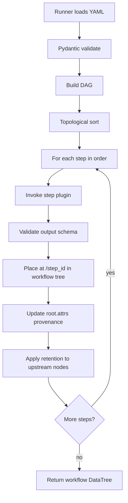
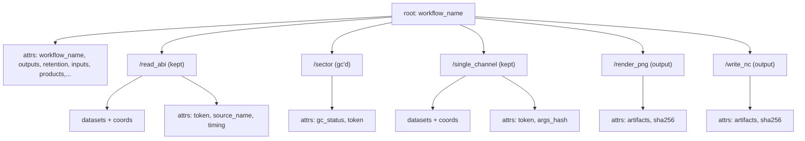
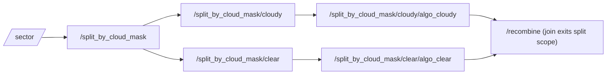
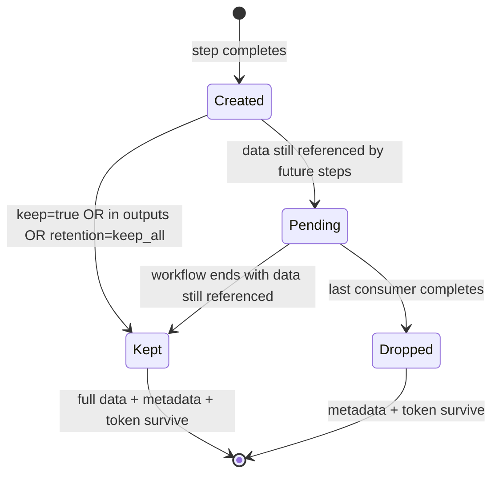
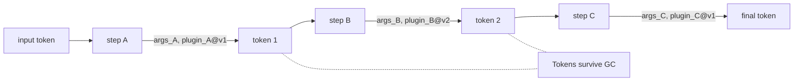

## Abstract

Every step in a workflow takes a `DataTree` and returns a `DataTree`. The workflow itself is a `DataTree` whose children are the per-step DataTrees. Provenance (processing history, tokens, quality flags, input manifests, product artifacts) is stored as native xarray attributes (`attrs`) on the DataTree and its step nodes. Workflows are themselves callable as steps — the `Workflow` class IS a `Plugin`, implementing the Composite pattern. Steps are required to be deterministic, (ideally) side-effect-free with respect to global state, declaratively composed via YAML, validated by Pydantic schemas, and hashable via `dask.base.tokenize`. Tokenization enables content-addressable caching, fast regression tests, and a straightforward path to auto-parallel execution via `split`/`join` operators and declared `depends_on` edges. In other words..... DataTrees, DataTrees, DataTrees!! All the way down!!!

---

## Table of Contents

[toc]

## 1. Motivation, Goals, and Non-Goals

### 1.1 Problem

Pre-OBP procflows have accumulated two kinds of implicit complexity:

- **Container polymorphism.** Algorithms consume a "family" (numpy arrays, xarray datasets, datatrees, custom dicts) and must branch on the type.
- **Ad-hoc orchestration.** Driver scripts hard-code a plinko-like step order.

### 1.2 Goals

- **G1: Declarative workflows.** Workflows are YAML files, validated by Pydantic, and runnable.
- **G2: Multi-input, multi-output workflows.** Workflows accept multiple input sources and declare multiple outputs; one workflow can produce lots (10+) products.
- **G3: One container.** Every step's input and output is an `xarray.DataTree`.
- **G4: Each step is a node.** A workflow is a `DataTree` whose children are the per-step DataTrees. You can drop intermediate data and keep only metadata.
- **G5: Functional steps.** Steps are pure-ish functions `DataTree → DataTree`, with all configuration supplied explicitly via kwargs.
- **G6: Tokenizable.** Inputs, outputs, and step invocations (the calling arguments for each step — its input DataTree plus its configuration kwargs) are hashable via `dask.base.tokenize`, enabling content-addressable caching and fast regression tests.
- **G7: Parallel-ready.** `split`/`join` operators and `depends_on` edges define a DAG that a scheduler can (theoretically, in the future) execute in parallel.
- **G8: Testable first.** Every step should ship with unit tests built on synthetic `DataTree` fixtures and be able to participate in token-based integration tests.
- **G9: Rich, machine-readable provenance.** Every output `DataTree` carries enough metadata to reproduce itself, even if intermediate data has been garbage collected (GC'd).

## 2. Normative Language & Terminology

### 2.1 RFC 2119 Keywords

The words **MUST**, **MUST NOT**, **SHOULD**, **SHOULD NOT**, **MAY**, and **REQUIRED** are used per [RFC 2119](https://www.rfc-editor.org/rfc/rfc2119).

### 2.2 Glossary

| Term | Definition |
| --- | --- |
| **DataTree** | An `xarray.DataTree` instance; the sole inter-step data container. |
| **Step** | Any GeoIPS `Plugin` participating in a workflow. Each step is resolved via the Plugin Registry by `kind` and `name`. The step's calling arguments (input DataTree plus kwargs) are referred to as its **step invocation**. |
| **Workflow (spec)** | A YAML document defining steps in dependency order. Validated by `WorkflowPluginModel`. Registered under the `workflows` interface. |
| **Workflow (runtime)** | An instance of the `Workflow(Plugin)` class — a Composite-pattern Plugin that IS a Step and HAS child Plugin instances. Callable as `DataTree → DataTree`. |
| **Plugin** | An instance of a class-based plugin (e.g., reader, algorithm, colormapper). Every Plugin may be a step in a workflow. The `data_tree` flag discriminates whether the plugin natively consumes/produces DataTree. |
| **Step node** | The child `DataTree` containing one step's output located at `/<step_id>` within a parent Workflow DataTree. |
| **Operator** | A special step kind (`split`, `join`) that changes the _shape_ of the DAG rather than transforming data. |
| **Branch** | A named child `DataTree` inside a `split` step's node. |
| **Output** | A step id named in the workflow's top-level `outputs:` list; survives GC unconditionally. **Default:** the last step id in `spec.steps` (Python 3.7+ dict insertion order). |
| **Token** | The output of `dask.base.tokenize(obj)` — a deterministic tokenization (hash-like output) of an object's content. Tokens enable content-addressable caching (skip recomputation when inputs haven't changed) and fast regression tests (compare output token instead of pixel-by-pixel diffing). Tokens are stored in each step node's `attrs`. |
| **Provenance** | The structured record of what software, steps, arguments, and inputs produced a `DataTree`. |
| **Boundary step** | A step at the workflow's I/O edge (reader, output_formatter) that is explicitly permitted controlled side effects. |
| **Retention** | The policy that decides whether step data variables are kept after downstream steps consume them. Applies to data variables only; metadata (including tokens) always survives. |
| **Garbage Collected (GC'd) node** | A step node whose data variables have been dropped; its `attrs` (including its token) are preserved. |
| **Step invocation** | The fully resolved calling arguments for a step — the input DataTree plus the plugin's configuration kwargs from the workflow YAML. |
| **OrderBased** | A subclass of `BaseProcflowPlugin` that loads a `WorkflowPluginModel`, constructs a `Workflow`, and invokes it with input filenames. Replaces the legacy module-level `call()` function. |

### 2.3 YAML to Runtime Resolution

The path from a YAML file on disk to an executing workflow:

1. **Plugin Load** — A YAML file in `geoips/plugins/yaml/workflows/` is loaded by `PluginRegistry` and validated against `WorkflowPluginModel` (pydantic). The model carries a `spec: WorkflowSpecModel` containing `steps: Dict[PythonIdentifier, WorkflowStepDefinitionModel]`.

2. **WorkflowPluginModel → dict** — The model's `.model_dump()` produces a dictionary matching the GeoIPS v1 workflow plugin format: `{apiVersion, interface, family, name, docstring, package, spec: {steps: {step_id: {kind, name, arguments}}}}`.

3. **Workflow Construction** — `OrderBased.call()` (or equivalent) reads the dict, iterates `spec.steps`, and for each step calls `PluginRegistry.get_plugin(kind, name)` to obtain a `Plugin` instance. These are stored in `Workflow.steps: Dict[str, Plugin]`. **No wrapper class** is needed — Plugins ARE steps.

4. **Topological Sort** — `Workflow.call()` validates the `depends_on` DAG for cycles (raising `DependencyCycleError` if found). For v1 linear workflows, execution follows dict insertion order by default. Topological sort is retained as a DAG-integrity check.

5. **Invocation** — Each child's `_invoke(data_tree, **arguments)` is called. `_invoke()` checks the `data_tree` flag: if `True` (Workflow, colormapper), passes DataTree through transparently via `DataTreeDitto`; if `False` (legacy plugins), unwraps via `_pre_call()` and re-wraps via `_post_call()` using `DataTreeDitto`'s converter registry.

6. **Retention** — After each step, the runner applies retention policy to upstream step nodes. Steps marked `keep: true` or listed in `outputs` are exempt from garbage collection.

7. **Return** — The final `DataTree` is the workflow output, with child nodes at `/<step_id>` for every step. Provenance is carried in native xarray attrs at each step node.

---

## 3. Quick Example: End-to-End Workflow

A complete workflow with a reader, an algorithm, a colormapper, and two output formatters.

### 3.1 Workflow YAML

```yaml
apiVersion: geoips/v1
interface: workflows
family: order_based
name: abi_infrared_multi
docstring: ABI ch.14 infrared, both annotated PNG and clean netCDF outputs.
# Specification for how to test the workflow specified in the `spec` section. This will
# supplement the generalized `spec` section when this workflow is called using
# `geoips test abi_infrared_multi`.
test:
  # The input file list to be used
  fnames: !ENV ${GEOIPS_TESTDATA_DIR}/test_data_abi/data/goes16_20200918_1950/*
  outputs:
    abi:Infrared:
      policy: on_failure # can also be "always"
      compare_path: !ENV ${GEOIPS_PACKAGES_DIR}/geoips/tests/outputs/abi.static.Infrared.imagery_clean/20200918.195020.goes-16.abi.Infrared.test_goes16_eqc_3km_day_20200918T1950Z.100p00.noaa.3p0.png
  # The test.steps section allows overriding steps in the spec section at test time.
  # This can override any part of a step except its step_id including its kind, name,
  # arguments, and any other fields.
  steps:
    # Override the variable read by the read_abi step from B14BT to B15BT
    read_abi:
      arguments:
        variables: ["B15BT"]
    # Override the output_data_range from single_channel to [-100.0, 30.0]
    single_channel:
      arguments:
        output_data_range: [-100.0, 30.0]
  # The test.kinds section allows overriding arguments for any steps that call a plugin
  # of the named kind.
  kinds:
    # Override the satellite_zenith_angle_cutoff for all steps of kind `reader`.
    readers:
      satellite_zenith_angle_cutoff: 80
  # The test.globals section allows overriding arguments set in spec.globals.
  globals:
    sector_list: global_cylindrical
    logging_level: debug
spec:
  # Globals are made available to all plugins in the workflow.
  globals:
    window_start_time: null
    window_end_time: null
    product_name: null
    reader_defined_area_def: false
    no_presectoring: true
    product_db: false
    product_db_writer: null
  # The steps to execute when running the workflow.
  steps:
    read_abi:
      kind: reader
      name: abi_netcdf
      arguments:
        variables: ["B14BT"]
      keep: true
    sector:
      kind: sectorizer
      name: area_definition
      arguments:
        area: "global_2km"
    single_channel:
      kind: algorithm
      name: single_channel
      depends_on: [sector]
      arguments:
        variable: "B14BT"
        output_data_range: [-90.0, 30.0]
        satellite_zenith_angle_cutoff: 75.0
    colorize:
      kind: colormapper
      name: Infrared
      depends_on: [single_channel]
      arguments:
        cmap: "Greys_r"
    render_png:
      kind: output_formatter
      name: imagery_annotated
      depends_on: [colorize]
      arguments:
        output_dir: "out/"
        filename_pattern: "abi_infrared.png"
    write_nc:
      kind: output_formatter
      name: netcdf_writer
      depends_on: [single_channel]
      arguments:
        output_dir: "out/"
        filename_pattern: "abi_infrared.nc"
```

### 3.2 Resulting Workflow DataTree

When executed using `geoips run`, the workflow described in section 3.1 would result in the following DataTree.

```
<xarray.DataTree: abi_infrared_multi>
├── attrs: { workflow_name: "abi_infrared_multi",
│            outputs: ["render_png", "write_nc"],
│            retention_policy: "keep_referenced",
│            workflow_spec_yaml: <str>,
│            geoips_version: "1.19.0",
│            api_version: "geoips/v1" }
├── /read_abi              (kept: keep=true)
│     ├── B14BT(xr.Dataset)
│     │   └── B14BT (data_var)
│     ├── coords: latitude, longitude, time
│     └── attrs: { source_name: "abi", platform_name: "goes-16",
│                  wavelength: 11.2, output_token: "blake2b:1a2b...",
│                  start_time: <datetime>, end_time: <datetime>,
│                  plugin_name: "abi_netcdf", plugin_version: "1.0.0" }
├── /sector                (GC'd: data dropped, attrs kept)
│     └── attrs: { gc_status: "data_dropped",
│                  output_token: "blake2b:3c4d..." }
├── /single_channel        (kept: write_nc still consumes it)
│     ├── B14BT_clipped (data_var)
│     └── attrs: { output_token: "blake2b:5e6f...",
│                  arguments_hash: "..." }
├── /colorize              (GC'd)
│     └── attrs: { gc_status: "data_dropped",
│                  output_token: "blake2b:7a8b..." }
├── /render_png            (kept: declared output)
│     └── attrs: { artifacts: ["out/abi_infrared.png"],
│                  sha256: "0a1b2c..." }
└── /write_nc              (kept: declared output)
      └── attrs: { artifacts: ["out/abi_infrared.nc"],
                   sha256: "f8e7d6..." }
```

Note: GC'd nodes still carry their tokens (computed before GC). The workflow's overall token is unchanged whether intermediates were GC'd or kept. Tokens are stored in each step node's `attrs`, not at the workflow root.

> **Annotation Note:** `source_name`, `platform_name`, and `data_provider` are per-step attributes populated by reader plugins. They live in the reader step node's `attrs`. Processed intermediates (algorithms, colormappers) also carry tokens, hashes, and timing in their step-node `attrs`.

---

## 4. Workflow YAML Specification

### 4.1 File Structure

A workflow YAML file **MUST** use the GeoIPS v1 plugin format. It is validated by `WorkflowPluginModel` (pydantic) in `geoips/pydantic_models/v1/workflows.py`.

| Key | Required | Purpose |
| --- | --- | --- |
| `apiVersion` | MUST | GeoIPS API version, e.g., `geoips/v1` |
| `interface` | MUST | Always `workflows` |
| `family` | MUST | Always `order_based` |
| `name` | MUST | Unique workflow identifier |
| `docstring` | MUST | Human-readable description of the workflow |
| `package` | MUST | Plugin package name, e.g., `geoips` |
| `spec.steps` | MUST | Dict of step definitions, keyed by step id |
| `spec.outputs` | MAY | List of step ids constituting workflow outputs. **Default:** last step id in `spec.steps` (Python 3.7+ dict insertion order) |
| `spec.retention` | MAY | `keep_all` \| `keep_referenced` (default) \| `keep_outputs_only` |
| `spec.defaults` | MAY | Argument defaults applied to every step of a given `kind` |
| `test` | MAY | Self-contained end-to-end test configuration |

> **Proposed fields (not yet in pydantic models):**
>
> - `spec.retention_by_kind` — per-kind retention overrides (v2 feature)
> - `spec.version` — author-assigned semver or date tag

**`outputs` is an optional field.** A workflow without `outputs` defaults to the last step id in `spec.steps`, relying on Python 3.7+ dict insertion ordering. This is guaranteed behavior tested in GeoIPS CI (Python >=3.11).

> **Dependency Note:** The test section format described here aligns with `WorkflowTestModel` from the `geoips-obp-cli-updates` branch. If that branch has not merged, the `test:` field accepts `Dict[str, Any]` as a fallback.

> **Interface Note:** The `workflows` interface is class-based. Workflow YAML files are data artifacts validated by `WorkflowPluginModel`; at runtime, they are resolved to `Workflow` class instances via the Plugin Registry.

> **Future Note:** There will be a GeoIPS Plugin API v2. We will make GeoIPS capable of reading and handling both formats, but v2 will provide additional functionality.

### 4.2 Metadata Header

```yaml
apiVersion: geoips/v1
interface: workflows
family: order_based
name: abi_infrared_multi
docstring: ABI ch.14 infrared with PNG and netCDF outputs.
package: geoips
```

These fields propagate into the output Workflow-level `DataTree`'s root attrs. In v2 (`apiVersion: geoips/v2`), the format will change to use `kind: Workflow` with `metadata:` and `spec:` blocks.

### 4.3 Test Section

The `test` block is the workflow's executable specification. Running `geoips test <workflow.yaml>` **MUST** execute the workflow against this block. The `test` block is used to define a repeatable configuration for the workflow that can be run as an integration test. This helps protect against regressions. This block is only used when a workflow is run using `geoips test <workflow_name>`.

When `geoips test <workflow_name>` is called, the test section is applied to the spec section. In practice, this means that:

- an `OutputChecker` is created for each section under the `outputs` field.
- any overrides specified in the `steps` section are applied to their respective steps.
- overrides specified in the `kinds` section are applied to the arguments sections of all steps that call a plugin of the specified `kind`.
- overrides specified in the `globals` section override their respective fields in the `globals` section.

> **Dependency Note:** The format below reflects the `WorkflowTestModel` from the `geoips-obp-cli-updates` branch. If that branch has not merged, the `test:` field accepts `Dict[str, Any]` as a fallback.

```yaml
# Specification for how to test the workflow specified in the `spec` section. This will
# supplement the generalized `spec` section when this workflow is called using
# `geoips test abi_infrared_multi`.
test:
  # The input file list to be used
  fnames: !ENV ${GEOIPS_TESTDATA_DIR}/test_data_abi/data/goes16_20200918_1950/*
  outputs:
    abi:Infrared:
      policy: on_failure # can also be "always"
      compare_path: !ENV ${GEOIPS_PACKAGES_DIR}/geoips/tests/outputs/abi.static.Infrared.imagery_clean/20200918.195020.goes-16.abi.Infrared.test_goes16_eqc_3km_day_20200918T1950Z.100p00.noaa.3p0.png
  # The test.steps section allows overriding steps in the spec section at test time.
  # This can override any part of a step except its step_id including its kind, name,
  # arguments, and any other fields.
  steps:
    # Override the variable read by the read_abi step from B14BT to B15BT
    read_abi:
      arguments:
        variables: ["B15BT"]
    # Override the output_data_range from single_channel to [-100.0, 30.0]
    single_channel:
      arguments:
        output_data_range: [-100.0, 30.0]
  # The test.kinds section allows overriding arguments for any steps that call a plugin
  # of the named kind.
  kinds:
    # Override the satellite_zenith_angle_cutoff for all steps of kind `reader`.
    readers:
      satellite_zenith_angle_cutoff: 80
  # The test.globals section allows overriding arguments set in spec.globals.
  globals:
    sector_list: global_cylindrical
    logging_level: debug
```

Three independent checks exist, each optional: (a) dask token for strict regression, (b) per-artifact sha256 for output files, and (c) tolerance-based numerical comparison.

> **Implementation Note:** Artifact sha256 hashes are **optional** and are computed by the **OBP test runner**, not by individual plugins. If omitted, the test runner only checks file existence. The `sha256` field exists for CI-level strict validation.

### 4.4 Steps Section

Each step is a dict entry in `spec.steps`. The **dict key** is the step id (must be a valid `PythonIdentifier`), used for `depends_on` references and as the step's DataTree node name.

| Key | Required | Type | Notes |
| --- | --- | --- | --- |
| `kind` | MUST | plugin kind | `reader`, `algorithm`, `interpolator`, `colormapper`, `output_formatter`, `sectorizer`, `coverage_checker`, `filename_formatter`, `split`, `join`, `workflow` |
| `name` | MUST | plugin ref | Resolved via the GeoIPS Plugin Registry by `kind` and `name` |
| `arguments` | SHOULD | mapping | Validated against the plugin's Pydantic argument model |
| `depends_on` | SHOULD | list[str] | Other step ids. **If omitted, defaults to the immediately preceding step in dict iteration order.** |
| `keep` | MAY | bool | If `true`, this step's data survives GC regardless of `retention`. **Default: `false` for all step kinds.** |
| `scope` | MAY | str | For steps following a `split`: which branch to operate on (§4.5). |
| `when` | MAY | expression | Skip step if expression is false. Expressions must be pandas-style filter expressions, not arbitrary Python code (e.g., `when: "{{ config.has_zenith }}"`). |

> **Model Note:** `depends_on` and `keep` are **not yet** fields on `WorkflowStepDefinitionModel`. They will be added during implementation. Until then, the workflow runner uses positional ordering and no per-step retention override is validated.

Step `name` values match the `PluginModel.name` field of the registered plugin. For `kind: workflow` steps, the Plugin Registry returns a `Workflow` instance (Composite pattern — workflows nest arbitrarily).

### 4.5 Split / Join Operators

Parallel branches are introduced by a `split` operator and closed by a `join` operator. A `split` step's node has named children — one per branch. Steps with `scope: <branch>` produce nodes nested under the corresponding branch path: `/<split_id>/<branch>/<step_id>`. The `DataTree` thus **mirrors** the **execution structure** all the way down.

```yaml
split_by_cloud_mask:
  kind: split
  name: split_by_data
  depends_on: [sector]
  arguments:
    on: "/sector/cloud_mask"
    branches:
      cloudy: "cloud_mask == 1"
      clear: "cloud_mask == 0"
  scope: null
algo_cloudy:
  kind: algorithm
  name: cloud_top_height
  depends_on: [split_by_cloud_mask]
  scope: cloudy # output node: /split_by_cloud_mask/cloudy/algo_cloudy
algo_clear:
  kind: algorithm
  name: sst
  depends_on: [split_by_cloud_mask]
  scope: clear # output node: /split_by_cloud_mask/clear/algo_clear
recombine:
  kind: join
  name: merge_by_mask
  depends_on: [algo_cloudy, algo_clear]
  arguments:
    strategy: "merge_by_mask"
    conflict:
      "error" # error | last_wins | first_wins | explicit_map
      # output node: /recombine (exits the split scope)
```

Resulting tree:

```
<root>
├── /sector
├── /split_by_cloud_mask
│     ├── attrs: { operator: "split", split_on: "cloud_mask" }
│     ├── /cloudy
│     │     ├── (subset where cloud_mask == 1)
│     │     └── /algo_cloudy
│     │           └── (cloud_top_height output)
│     └── /clear
│           ├── (subset where cloud_mask == 0)
│           └── /algo_clear
│                 └── (sst output)
├── /recombine                  # join exits the split, lands at root
└── root.attrs: { processing_history: [...], ... }
```

A `depends_on` reference still uses step ids, not paths — the runner translates ids to paths internally. So `depends_on: [algo_cloudy]` is correct even though the node lives at `/split_by_cloud_mask/cloudy/algo_cloudy`.

`join` defaults `conflict: error`. Silent overwrites... are bad!

### 4.6 Workflows as Steps (Sub-Workflows)

A step with `kind: workflow` invokes another workflow as a single step.

```yaml
steps:
  preprocessing:
    kind: workflow
    name: preprocess_l1b
    arguments:
      target_area: "global_2km"
```

The nested workflow's `test` block is **not** executed during the parent run.

An embedded workflow is just another type of step and behaves the same as any other step. As with any other step, the child workflow is represented as a DataTree within the root DataTree. Likewise, it will contain attributes describing what happened when the step was executed.

The only difference between the DataTree resulting from an embedded workflow and any other kind of step is that the embedded workflow's DataTree will, itself, contain DataTrees representing each of its contained steps.

For a child workflow `preprocess_l1b` with steps `read_l1b`, `sector`, `calibrate`, `mask`, and `outputs: [calibrated, masked]`, the parent's tree looks like:

```
<root>
├── /preprocessing                        # the entire child workflow's DataTree
|   ├── attrs: { workflow_name: "preprocess_l1b", ... }
|   ├── /read_l1b                          # child's reader step
|   ├── /sector                            # child's sector step
|   ├── /calibrate                         # also reachable as the "calibrated" output
|   └── /mask                              # also reachable as the "masked" output
└── root.attrs: { processing_history: [...], ... }
```

As another example, many sensors are capable of producing the same products. For example, both ABI and AHI (and others) are able to produce an infrared product. To avoid duplication, we would define a general "Infrared" product, then reuse it in workflows specific to ABI and AHI. For example:

```yaml
# A general Infared algorithm
apiVersion: geoips/v1
interface: workflows
family: order_based
name: Infrared
docstring: Workflow-stub for producing a general Infrared product
spec:
  apply_sector:
    kind: sector
    name: conus
  interp_data:
    kind: interpolator
    name: nearest_neighbor
  create_infrared_image:
    kind: algorithm
    name: single_channel
    arguments:
      output_data_range: [-90.0, 30.0]
      input_units: Kelvin
      output_units: celsius
      min_outbounds: crop
      max_outbounds: crop
      norm: false
      inverse: false
  apply_colormap:
    kind: colormapper
    name: infrared
    arguments:
      data_range: [-90.0, 30.0]
```

```yaml
apiVersion: geoips/v1
interface: workflows
family: order_based
name: ABI-Infrared
docstring: ABI CH-14 infrared PNG
spec:
  read_abi:
    kind: reader
    name: abi_netcdf
    arguments:
      variables: [B14BT]
  infrared:
    kind: workflow
    name: Infrared
  write_png:
    kind: output_formatter
    name: imagery_clean
```

The same Workflow for AHI would look identical except that `variables` would be set to `[B13BT]` instead of `[B14BT]`.

The child's `outputs:` declaration is a _product manifest_, not a visibility boundary:

- It guarantees those step nodes survive the child's GC regardless of retention policy.
- It drives what's recorded in the child's root `attrs["products"]`.
- It documents the workflow's user-facing results.

It does **not** restrict what a parent can address. A parent step may reference `"/preprocessing/sector"` even though `sector` isn't a declared output — it just inherits whatever retention left there (which may be metadata only).

### 4.7 Plugin Class Hierarchy

Every step resolves to a class-based plugin instance via the GeoIPS Plugin Registry. The class hierarchy that governs step execution is:

```
BaseClassPlugin(ABC)                # geoips/interfaces/class_based_plugin.py
├── data_tree: bool = False         # discriminator: True = DataTree-native
├── call(*args, **kwargs)           # abstract; plugin's core logic
├── _pre_call(data, *args, **kwargs)  # hook: convert TO DataTree
├── _post_call(data, *args, **kwargs) # hook: convert FROM DataTree
├── _invoke(data=None, *args, **kwargs)  # orchestrator:
│   └── if data is None → call(*args, **kwargs)
│   └── if data is not None → _pre_call → call → _post_call
├── __call__()  # Dynamically added. Errors if overridden.
|   └── _invoke(data=None, *args, **kwargs)
│
├── BaseAlgorithmPlugin            # data_tree=False (legacy)
├── BaseInterpolatorPlugin         # data_tree=False (legacy)
├── BaseOutputFormatterPlugin      # data_tree=False (legacy)
├── BaseCoverageCheckerPlugin      # data_tree=False (legacy)
├── BaseFilenameFormatterPlugin    # data_tree=False (legacy)
├── BaseOutputCheckerPlugin        # data_tree=False (legacy)
├── BaseTitleFormatterPlugin       # data_tree=False (legacy)
├── BaseReaderPlugin               # data_tree=False (legacy)
├── BaseSectorAdjusterPlugin       # data_tree=False (legacy)
├── BaseSectorSpecGeneratorPlugin  # data_tree=False (legacy)
├── BaseSectorMetadataGeneratorPlugin # data_tree=False (legacy)
├── BaseDatabasePlugin             # data_tree=False (legacy)
├── BaseColormapperPlugin          # data_tree=True  (metadata-only DT)
│
├── BaseProcflowPlugin             # abstract; data_tree=True (to be deprecated)
│   └── OrderBased                  # concrete procflow; produces DataTree (when procflows are deprecated, this will become the core of GeoIPS)
│
└── Workflow(Plugin)                # composite; IS a step, HAS steps
    ├── interface = "workflows"
    ├── data_tree = True
    ├── steps: Dict[str, Plugin]    # resolved child plugin instances
    ├── call(workflow_tree: DataTree) → DataTree
    └── DataTree output: /<step_id> per step with provenance in attrs
```

**Rationale:** `Workflow` IS-A `Plugin` (can be nested) and HAS-A collection of `Plugin` instances (children). This is the Composite pattern. The `data_tree` flag discriminates which path `_invoke()` takes: DataTree-native plugins skip conversion; legacy plugins convert to/from DataTree via `_pre_call`/`_post_call` and `DataTreeDitto`.

### 4.8 DataTree Wrapping in `_invoke()`

The `_invoke()` method on `BaseClassPlugin` orchestrates DataTree conversion based on the `data_tree` class attribute. The current implementation branches only on `data is None`. It is extended with `data_tree`-aware wrapping that uses `DataTreeDitto` for round-trip type conversion.

```
_invoke(data=None, *args, **kwargs):
    if data is None:                         # Reader path (no upstream DT)
        result = self.call(*args, **kwargs)
        if not self.data_tree:
            result = _ensure_datatree(result)  # wrap legacy output via DataTreeDitto
        return result
    else:                                    # Non-reader path
        if not self.data_tree:
            data = _unwrap_datatree(data)     # DT → legacy format via DataTreeDitto
        data = self._pre_call(data, ...)
        data = self.call(data, ...)
        data = self._post_call(data, ...)
        if not self.data_tree:
            data = _ensure_datatree(data)     # legacy → DT via DataTreeDitto
        return data
```

**`_unwrap_datatree(tree: DataTree) -> Any`:** Extracts the legacy format (xr.Dataset, np.ndarray, dict, etc.) from a DataTree. Uses `DataTreeDitto.get_original()` for registered converters. This is a **hard requirement** — `DataTreeDitto` from the `datatree-ditto` branch must be available.

**`_ensure_datatree(result: Any) -> DataTree`:** Wraps a non-DataTree plugin output into a DataTree. Uses `DataTreeDitto`'s converter registry for types that have registered converters (numpy arrays, dicts, DataArrays, Datasets). The `data_tree = True` flag is the migration path: plugins set it to `True` when they are natively DataTree-aware; the wrapper is then skipped.

### 4.9 Step Execution Pattern

```python
# In Workflow.call():
for step_id in self._topological_order():
    step_def = self.spec.steps[step_id]
    plugin = self.steps[step_id]

    if step_def.kind == "reader":
        # Readers have no upstream data — call(*args, fnames, **arguments)
        step_result = plugin._invoke(
            data=None, fnames=fnames, **step_def.arguments
        )
    else:
        # Non-readers receive upstream DataTree
        upstream = self._collect_upstream_data(tree, step_def.depends_on)
        step_result = plugin._invoke(
            data=upstream, **step_def.arguments
        )

    tree[step_id] = step_result
    self._apply_retention(tree, step_id)
```

---

## 5. DataTree Structure Specification

### 5.1 Canonical Anatomy

A workflow's output is a single `DataTree` shaped as:

```
<xarray.DataTree root>          # name = workflow.name
├── attrs                        # workflow/global metadata (§5.2)
├── /<step_id_1>                 # one node per step in the workflow
│     ├── data.                  # this step's output data as datasets
│     ├── coords                 # step's coordinates
│     └── attrs                  # per-step provenance: token, timing, source info (§5.4)
├── /<step_id_2>
│     └── ...
├── ...
└── /<step_id_N>
```

Key invariants:

- The root `DataTree` is named after the workflow.
- Every step **MUST** produce a child node at `/<step_id>` — even boundary steps.
- A step node **MUST** carry its own per-step provenance in `attrs` (output token, execution timing, source info, arguments hash, gc_status).
- Workflow-level provenance (inputs manifest, product artifacts, quality flags) is stored in `root.attrs` as simple scalars and lists. Tabular aggregate data (processing history) is stored as a dict-of-dicts in `root.attrs["processing_history"]`.

**Rationale for attrs-based provenance:** xarray `attrs` serialize cleanly to netCDF, Zarr, and JSON. Scalar provenance (tokens, hashes, timestamps) fits naturally in attrs. For tabular provenance (the processing history row-per-step), a list-of-dicts in `root.attrs["processing_history"]` is serializable and queryable without requiring a separate child subtree. This keeps the DataTree structure clean: step nodes for data, attrs for provenance.

Step nodes are named by step id (the dict key), not by `kind` or `name`. Ids are guaranteed unique within a workflow (Pydantic validates this); `kind`/`name` are not (you may run two readers). And ids are the same names used in `depends_on`.

### 5.2 Root-Level Attributes (`root.attrs`)

| Key | Req. | Type | Notes |
| --- | --- | --- | --- |
| `start_datetime` | MUST | ISO-8601 / np.datetime64 | Earliest input timestamp |
| `end_datetime` | MUST | ISO-8601 / np.datetime64 | Latest input timestamp |
| `sample_distance_km` | SHOULD | float | Post-sector resolution |
| `interpolation_radius_of_influence` | MAY | float (m) | If resampled |
| `area_definition` | SHOULD | str or null | Sector pydantic model reference |
| `registered_dataset` | MUST | bool | True iff on a registered area grid |
| `minimum_coverage` | SHOULD | float [0, 100] | Acceptance threshold |
| `data_attribution` | MUST | object `{short, title, long}` | For display and ingest |
| `workflow_name` | MUST | str | Mirrors `workflow.name` |
| `workflow_version` | SHOULD | str | Author-assigned version |
| `outputs` | MUST | list[str] | Mirrors `workflow.outputs` |
| `retention_policy` | MUST | str | The retention policy actually applied |
| `geoips_version` | MUST | str | Recorded by runner, not plugin |
| `api_version` | MUST | str | OBP API version |

> **Moved from root:** `source_name`, `platform_name`, and `data_provider` are per-step attributes populated by reader plugins via `get_source_names()`. They live in the reader step node's attrs, not the workflow root attrs. This enables multi-source workflows where different readers contribute different source/platform combinations.

`area_definition` is stored as a pydantic model reference string, resolved at runtime.

### 5.3 Workflow-Level Provenance (`root.attrs`)

Workflow-level provenance is stored in `root.attrs` as scalars, lists, and dicts. The runner populates these automatically.

| Attr | Type | Notes |
| --- | --- | --- |
| `workflow_spec_yaml` | str | Full original YAML text |
| `workflow_spec_sha256` | str | Hash of canonical JSON form |
| `processing_history` | list[dict] | One entry per step: `{step_id, plugin_name, plugin_version, kind, start_time, end_time, input_tokens_json, output_token, arguments_json, gc_status}` |
| `quality` | list[dict] | Per-output quality: `{output_id, percent_unmasked, coverage_passed, checker_plugin}` |
| `inputs` | list[dict] | Source-file manifest from readers: `{reader_step_id, path, sha256, size_bytes, mtime}` |
| `products` | list[dict] | Output formatter artifacts: `{formatter_step_id, path, sha256, size_bytes, mime_type}` |

`root.attrs["workflow_spec_yaml"]` holds the full workflow definition that produced this DataTree. The `workflow_spec_sha256` is a canonical hash for tokenization.

`root.attrs["processing_history"]` is a list-of-dicts, one entry per executed step. This can be converted to a pandas DataFrame for querying: `pd.DataFrame(root.attrs["processing_history"])`.

### 5.4 Per-Step Provenance (`/<step_id>.attrs`)

Each step node **SHOULD** carry provenance in its `attrs`. The runner populates this automatically; plugins should not need to write to it.

```
/<step_id>.attrs:
      step_id           (str)
      plugin_name       (str)
      plugin_version    (str)
      source_name       (str)   # populated by reader steps via get_source_names()
      platform_name     (str)   # populated by reader steps
      data_provider     (str)   # populated by reader steps
      input_tokens      (dict)  # {dep_id: token}
      output_token      (str)
      arguments_hash    (str)
      start_time        (str)   # ISO-8601
      end_time          (str)   # ISO-8601
      gc_status         (str)   # "kept" | "data_dropped"
```

This lets a step's node be inspected in isolation — just read `tree["/<step_id>"].attrs`. `source_name`, `platform_name`, and `data_provider` are populated by reader steps only; non-reader steps leave them as `None`.

### 5.5 Variable-Level Metadata

Every `DataArray` in a step node that holds primary geophysical data **MUST** set:

```python
da.attrs = {
    "long_name":     "11.2 µm Brightness Temperature",
    "units":         "K",                                # UDUNITS-2 preferred
    "standard_name": "toa_brightness_temperature",       # CF or GeoIPS extension
}
```

Optional (SHOULD for channel data):

```python
"wavelength":         11.2,        # µm
"channel_number":     14,
"bandwidth":          0.6,         # µm
"spectral_response":  <DataFrame, URL or DOI>,
"coverage_checker":   "masked_arrays",
"minimum_coverage":   10.0,
```

### 5.6 Coordinate Conventions

Use the full, CF-aligned names — **not** abbreviations. Readers of legacy sensor files **MUST** rename short coords on read.

| Coord name             | Units          | Notes                          |
| ---------------------- | -------------- | ------------------------------ |
| `latitude`             | degrees_north  | Per CF-1.10                    |
| `longitude`            | degrees_east   | Per CF-1.10                    |
| `time`                 | datetime64[ns] | Per CF; no float seconds-since |
| `solar_zenith_angle`   | degrees        | 0 = sun overhead               |
| `sensor_zenith_angle`  | degrees        | 0 = nadir                      |
| `sensor_azimuth_angle` | degrees        | Clockwise from north           |

### 5.7 Parallel Branches

A `split` step's node contains **named child branches**, each itself a valid `DataTree`. Steps with `scope: <branch>` produce their output nodes **nested inside that branch**:

```
/split_by_cloud_mask
├── attrs: { operator: "split", split_on: "/sector/cloud_mask" }
├── /cloudy                            # branch 1 — a DataTree
│     ├── (subset where cloud_mask == 1: data_vars, coords)
│     └── /algo_cloudy                  # step with scope: cloudy nests here
│           └── (cloud_top_height output)
└── /clear                             # branch 2 — a DataTree
      ├── (subset where cloud_mask == 0)
      └── /algo_clear                   # step with scope: clear
            └── (sst output)
```

Downstream steps with `scope: cloudy` receive `tree["/split_by_cloud_mask/cloudy"]` as their primary input. Their output node lands at `/split_by_cloud_mask/cloudy/<step_id>`.

A `join` step exits the split scope; its output node is created at the level _above_ the split (typically the workflow root). After join, branch identity is gone — the resulting node is just a normal step node.

Branch identity is propagated via each branch's `attrs["branch"] = "<name>"` so the `join` operator can find them by walking the split's children.

---

## 6. Step Contract (Functional Paradigm)

### 6.1 Step Execution via `_invoke()`

Every step in a Workflow is a `Plugin` instance. The runner calls `plugin._invoke(data, **arguments)`. Based on the plugin's `data_tree` class flag:

- `data_tree=True` (Workflow, colormapper): DataTree passes through transparently.
- `data_tree=False` (algorithms, output_formatters, etc.): DataTree is unwrapped before `call()` and the result is re-wrapped after.

See §4.7 for the full `_invoke()` flow diagram.

### 6.2 What the input `tree` Contains

The input `tree` to a step is itself a `DataTree`. The number of dependencies determines its shape:

**Zero `depends_on` (typically a `kind: reader`):** `tree` is passed from the runner; the reader produces all data from its `arguments` (file paths) and returns its output `DataTree`.

**One `depends_on`:** `tree` is the parent step's `DataTree` directly. So if `single_channel` depends on `sector`, then inside `single_channel`, `tree` is the sector's DataTree.

**Multiple `depends_on`:** `tree` is a single `DataTree` whose children are the parent step nodes, indexed by step `id`. So if `colocate` depends on `read_abi` and `read_atms`, then inside `colocate`:

```python
abi  = tree["/read_abi"]    # the read_abi step's DataTree
atms = tree["/read_atms"]   # the read_atms step's DataTree
```

This keeps the step signature uniform (always one `DataTree → DataTree`) and makes input access predictable (always by step id, never by position).

**Note:** The runner **MUST** only expose parents that are explicitly listed in `depends_on`. A step cannot reach further upstream by walking the workflow tree.

### 6.3 Purity Rules (core steps)

A non-boundary step **MUST**:

1. **Not** read from disk, network, env vars (directly), or system clock.
   - Use `geoips.paths` for any reference paths it needs.
   - `time.now()` should be forbidden; timestamps come from the runner.
2. **Not** write to disk, stdout (use logging, not `print`), or any mutable global.
3. **Not** rely on process-wide random state; if randomness is needed, accept a `seed` argument.
4. Produce output that is **deterministic** given inputs and arguments, within documented floating-point tolerance.

A step **MAY** use dask-backed arrays freely; dask scheduling is not a side effect.

**Exception:** A non-boundary step **MAY** write cache files (e.g., precomputed lookup tables) that do not change determinism — i.e., the step would produce the same output without them, just slower.

A non-boundary step **SHOULD**:

1. Not mutate its input `DataTree` (treat input as immutable).
2. Avoid expensive computation in module-level code.

### 6.4 I/O Boundaries: Readers and Output Formatters

Boundary steps (`kind: reader`, `kind: output_formatter`) are explicitly permitted to perform file I/O. They **MUST** capture the I/O into the `DataTree`:

- Readers record input files (path, sha256, size, mtime) into `root.attrs["inputs"]`. The runner appends entries; the reader returns the data.
- Output formatters record written-artifact paths and checksums into `root.attrs["products"]`.

Boundary steps **SHOULD** be deterministic given their arguments (same file contents + arguments → same output `DataTree`).

### 6.5 Output Formatter Step Nodes

An `output_formatter` step's node **SHOULD NOT** duplicate the data it wrote. Its node typically contains only `attrs` describing what was written (paths, checksums, dimensions). The actual file artifacts are tracked in `root.attrs["products"]`.

```
/render_png
└── attrs:
      kind: output_formatter
      artifacts: ["out/abi_infrared.png"]
      sha256: ["0a1b2c..."]
      mime_type: ["image/png"]
```

### 6.6 Logging and Errors

- **Use** `LOG = logging.getLogger("geoips." + __name__)`; never `print`.
- Structured log extras **SHOULD** include `step_id`, `workflow_name`, and the first 6 chars of `input_token` (for grepping a log against a specific run).
- On failure, raise a typed exception from `geoips.errors` (§12); do not return a partial `DataTree`.

---

## 7. Dask Tokenization (For Testing & Reproducibility)

### 7.1 Why Tokenize

Given `token = dask.base.tokenize(obj)`, two objects with the same token are interchangeable. OBP uses tokens to compare a workflow's output against a golden value (instead of pixel-by-pixel diffing) and to verify reproducibility in `root.attrs["processing_history"]`.

### 7.2 What Must Be Tokenizable

| Object | Tokenization status | Requirement |
| --- | --- | --- |
| `xarray.DataArray` | Native via dask | Given |
| `xarray.Dataset` | Native | Given |
| `xarray.DataTree` | Native | Given |
| Step argument dicts | MUST be JSON-serializable (scalars, lists, dicts, strings) | Pydantic enforces |
| Step callable | Tokenized via module path + version (not source bytes) | §7.3 |
| Other objects | **NOT** tokenizable by default | **MUST** register `__dask_tokenize__` or convert to canonical dict |

### 7.3 Token Stability Rules

A step's output token **MUST** change when any of these change:

1. The plugin's `name` or `version`.
2. Any argument's canonical JSON value.
3. The input `DataTree`'s token.

A step's token **MUST NOT** change when only:

- The plugin's source formatting changes (no semantic diff).
- Log messages change.
- Runner scheduling changes (single- vs. multi-worker).

### 7.4 Tokens Survive Garbage Collection

**GC'd step nodes still carry their output token** in `/<step_id>.attrs["output_token"]`. This means:

- The workflow-level token is stable regardless of retention policy.
- A workflow run with `keep_outputs_only` produces the same workflow-level token as a run with `keep_all`, given the same inputs and code.
- Reproducibility attestation does not require keeping intermediate data.

### 7.5 Token-Based Integration Tests

When tests fail, they emit a per-step token diff so the failing step is localized.

---

## 8. Dependencies & Parallelization

### 8.1 `depends_on`

Explicit dependency edges in dict format:

```yaml
steps:
  read_abi:
    kind: reader
    name: abi_netcdf
    arguments: { ... }
  colorize:
    kind: colormapper
    name: Infrared
    depends_on: [single_channel]
```

If omitted, `depends_on` defaults to the immediately preceding step in the YAML dict (Python 3.7+ insertion order). The first step's default is an empty list (no dependencies).

### 8.2 Topological Execution

The runner:

1. Parses the YAML → `WorkflowPluginModel` (Pydantic validation).
2. Builds a DAG from `depends_on` edges.
3. Validates: no cycles, no dangling `depends_on` ids, all plugins resolvable.
4. Topologically sorts; concurrent levels are eligible for parallel execution.
5. Executes with a scheduler (initially serial; future parallelization based on the DAG topology).
6. After each step completes, applies retention policy.

> **v1 Note:** Since `spec.steps` is a Python `dict` (insertion-ordered since Python 3.7), and most v1 workflows are linear pipelines, iterating steps in dict order is sufficient for sequential execution. The topological sort validates DAG integrity — no cycles and no dangling `depends_on` references — and identifies concurrent levels for future parallel execution.

### 8.3 Split / Join Operator Semantics

A `split` operator takes one `DataTree` and returns one `DataTree` with named branch children (§5.7). Steps with `scope: <branch>` produce nodes nested at `/<split_id>/<branch>/<step_id>` — the DataTree mirrors the execution structure all the way down.

A `join` operator takes a `DataTree` containing multiple branches (e.g. multiple readers, a `Split` operator, etc.), and returns a single merged `DataTree`. The join's output node lives one level _outside_ its source split (typically the workflow root), reflecting that the join exits the branch scope. Strategies:

| `strategy`      | Behavior                                           |
| --------------- | -------------------------------------------------- |
| `merge_by_mask` | Element-wise combine using the original split mask |
| `concat`        | xarray `concat` along a new or existing dimension  |
| `first_wins`    | Right-to-left merge, first occurrence kept         |
| `last_wins`     | Right-to-left merge, last occurrence kept          |
| `explicit_map`  | User provides a variable-name → branch mapping     |

Nested splits work recursively: an inner split inside `cloudy` produces `/split_outer/cloudy/split_inner/...`; the inner join's output lands at `/split_outer/cloudy/<join_id>` (the inner split's level).

---

## 9. Multi-Output Workflows

### 9.1 Declaring Outputs

Every workflow **MAY** declare `outputs:` — a list of step ids whose nodes are the user-facing results. Outputs may be of any `kind`. If nothing is specified by `outputs`, the last step id in `spec.steps` (Python 3.7+ dict insertion order) is assumed to be the output. Outputs are exempt from garbage collection.

> **Python ordering note:** The default `outputs: [<last_step_id>]` relies on Python 3.7+ dict insertion ordering. This is guaranteed behavior tested in GeoIPS CI (Python >=3.11).

```yaml
spec:
  outputs:
    - render_png_low_res
    - render_png_high_res
    - write_nc
    - write_geotiff
  steps:
    read_abi:
      kind: reader
      name: abi_netcdf
      arguments: { ... }
    render_png_low_res:
      kind: output_formatter
      name: imagery_annotated
      depends_on: [read_abi]
      arguments: { ... }
    ...
```

### 9.2 Multiple Inputs

Multiple inputs are simply multiple `kind: reader` (or `kind: workflow`) steps. Examples:

**Two satellites colocated:**

```yaml
steps:
  read_abi:
    kind: reader
    name: abi_netcdf
    arguments: { ... }
  read_atms:
    kind: reader
    name: atms_netcdf
    arguments: { ... }
  colocate:
    kind: algorithm
    name: nearest_colocate
    depends_on: [read_abi, read_atms]
```

**Imagery + ancillary data:**

```yaml
steps:
  read_abi:
    kind: reader
    name: abi_netcdf
    arguments: { ... }
  read_dem:
    kind: reader
    name: dem_geotiff
    arguments: { ... }
  read_landmask:
    kind: reader
    name: land_mask
    arguments: { ... }
  terrain_correct:
    kind: algorithm
    name: terrain_correction
    depends_on: [read_abi, read_dem, read_landmask]
```

### 9.3 Workflows-as-Steps with Multi-Output

When a workflow with multiple outputs is invoked as a `kind: workflow` step, the parent's step node contains the entire child workflow's tree.

```yaml
steps:
  preproc:
    kind: workflow
    name: preprocess_l1b
    arguments:
      target_area: "global_2km"
  use_calibrated:
    kind: algorithm
    name: foo
    depends_on: [preproc]
    # Accesses /preproc/calibrated — a declared output, guaranteed to have data
```

Consuming a declared output is the safe path: outputs are guaranteed to retain data. Consuming an intermediate is allowed but the parent step **MUST** handle the case where the node has been GC'd to metadata-only.

---

## 10. Data Retention & Garbage Collection

### 10.1 The Problem

A workflow with 12 steps over a 10 GB dataset risks holding 120 GB in memory if every step's full DataTree survives. The solution: optionally drop (garbage collect) **data variables** when no longer needed while **always preserving metadata**.

### 10.2 Retention Policies (Workflow-Level)

| Policy | Behavior | Use case |
| --- | --- | --- |
| `keep_all` | Every step node retains its full data. Nothing is GC'd. | Debugging, integration tests |
| `keep_referenced` | A step's data is dropped once all its downstream consumers have run. Outputs always kept. | Default; production |
| `keep_outputs_only` | All intermediates are dropped as soon as their last consumer completes. | Production at scale |

### 10.3 Precedence Order

For each step S, the runner applies the **first** rule that matches:

1. If S.id is in `workflow.outputs` → **always kept** (forced).
2. If `S.keep == True` → **always kept** (forced).
3. Otherwise → use the workflow-level `retention` policy.

Per-step `keep` and declared `outputs` are not overridable.

### 10.4 What Is GC'd, What Survives

When a step node is GC'd:

- **Dropped:** all `data_vars` and non-coordinate variables.
- **Survives:** the node itself, the step's `attrs`, and dimension coordinates.
- **Recorded:** `attrs["gc_status"] = "data_dropped"` on the GC'd node.

A GC'd node is _transparent_:

- Its output token is preserved.
- Its provenance row in `processing_history` is preserved.
- Tokenizing the workflow tree yields the same workflow-level token whether the node was GC'd or kept (§7.4).

### 10.5 GC Algorithm

```
For each step S after it completes:
    For each predecessor P of S:
        If P is in workflow.outputs: continue       # always kept (rule 1)
        If P.keep is True:           continue       # author override (rule 2)
        If all of P's downstream consumers have completed:
            drop_data(tree, P)                      # null out data_vars
            mark_gc(tree, P)
```

### 10.6 Per-Step `keep`

```yaml
steps:
  read_abi:
    kind: reader
    name: abi_netcdf
    arguments: { ... }
    keep: true # this reader's full data survives any policy
```

Use cases: inspecting raw reader output for QA, retaining small-but-valuable intermediates, debugging. **Default: `false` for all step kinds.**

### 10.7 GC Visibility in Provenance

```python
import pandas as pd
hist = pd.DataFrame(root.attrs["processing_history"])
print(hist[["step_id", "gc_status", "output_token"]])
#       step_id        gc_status     output_token
# 0   read_abi              kept     blake2b:1a2b...
# 1     sector      data_dropped     blake2b:3c4d...
# 2  single_channel          kept     blake2b:5e6f...
# 3   colorize       data_dropped     blake2b:7a8b...
# 4 render_png              kept     blake2b:9c0d...
```

Tokens for dropped nodes remain valid as they were computed before the GC drop.

---

## 11. Testability

### 11.1 Unit Tests (Synthetic DataTrees)

Every plugin **SHOULD** ship unit tests using synthetic `DataTree` fixtures:

```python
from geoips_plugin.testing.synthetic_fixture import infrared_datatree

def test_single_channel_clips_range():
    tree_in = infrared_datatree(shape=(256, 256), seed=0)
    plugin = geoips.algorithm.get_plugin("single_channel")
    tree_out = plugin(tree_in, variable="B14BT", output_data_range=[-90.0, 30.0])
    assert tree_out.B14BT.max().item() <= 30.0
    assert tree_out.B14BT.min().item() >= -90.0
```

Fixtures **SHOULD**:

- Be deterministic (seeded).
- Be small (< 50 MB uncompressed default).
- Carry full metadata (synthetic trees pass the same schema validation as real outputs).

### 11.2 Integration Tests (Token-Based)

Each workflow's `test` block is itself an integration test. CI **MUST** run `geoips test workflows/**.yaml` before each merge to `main`.

### 11.3 Tolerance-Based Numerical Tests

Workflows can produce a `reference_datatree` for numerical tolerance comparison under declared tolerances. These catch "correct but drifted" cases that token-only tests flag as failures.

### 11.4 Mocking Boundary Steps

Readers can be mocked by substituting a synthetic fixture:

```yaml
# overrides.yaml — passed via `geoips run … --overrides overrides.yaml`
steps:
  read_abi:
    name: synthetic_abi
    arguments: { fixture: infrared_datatree, seed: 0 }
```

This lets CI run the _full_ workflow with no network or test-data-volume dependency.

---

## 12. Validation & Error Handling

### 12.1 Typed Exceptions

All defined in `geoips/errors.py`, inheriting from `GeoipsError`:

| Exception               | Raised when…                                       |
| ----------------------- | -------------------------------------------------- |
| `WorkflowSpecError`     | YAML fails Pydantic validation                     |
| `PluginResolutionError` | `name:` cannot be resolved in the Plugin Registry  |
| `DependencyCycleError`  | `depends_on` graph is cyclic                       |
| `DanglingOutputError`   | A name in `outputs:` is not a defined step id      |
| `DataTreeSchemaError`   | Required attrs or nodes are missing                |
| `CoverageError`         | Product fails `minimum_coverage`                   |
| `TokenMismatchError`    | Integration test token differs from expected       |
| `RetentionConfigError`  | Conflicting retention settings                     |
| `BoundaryIOError`       | Reader/output_formatter failure                    |
| `JoinConflictError`     | `join` strategy hit unresolvable variable conflict |

> **Implementation Note:** These exception classes are defined in `geoips/errors` but are not yet raised by all existing code. They will be wired into the workflow runner and validators during implementation. The base class `GeoipsError` (from the `1309-create-geoipserror-class` branch) is a prerequisite.

Steps **MUST** raise typed exceptions, not return sentinels or partial results.

---

## 13. Versioning & Spec Evolution

Four version numbers travel with a workflow:

| Field              | Meaning                                     |
| ------------------ | ------------------------------------------- |
| `api_version`      | OBP runtime API version (e.g., `geoips/v1`) |
| `geoips_version`   | The runner's package version                |
| `workflow_version` | Author-assigned workflow version            |
| `plugin_version`   | Per-plugin semver                           |

The runner **MUST** refuse (or offer to migrate) workflows whose `api_version` falls outside its supported range.

---

## 14. Diagrams

### 14.1 Step Lifecycle



### 14.2 Workflow DataTree Anatomy



### 14.3 Split / Join Flow



### 14.4 Retention State Diagram



### 14.5 Tokenization Chain



---

## 15. Python API Reference

### 15.1 `BaseClassPlugin._invoke()` (Modified from `class_based_plugin.py`)

```
BaseClassPlugin (geoips/interfaces/class_based_plugin.py):

    data_tree: ClassVar[bool] = False
        When True, the plugin natively works with DataTree. _invoke()
        passes the DataTree through transparently.
        When False (default), _invoke() unwraps the DataTree before call()
        and re-wraps the result afterwards via DataTreeDitto.

    _invoke(self, data=None, *args, **kwargs) -> DataTree
        The central dispatch method.
        If data is None (reader path), calls self.call(*args, **kwargs) directly.
        Otherwise:
        1. self._pre_call(data, *args, **kwargs) — unwrap from DataTree
        2. self.call(data, *args, **kwargs)      — the plugin's work
        3. self._post_call(data, *args, **kwargs) — re-wrap to DataTree

        Plugin outputs are always returned as DataTree via DataTreeDitto
        wrapping when data_tree=False.

    _unwrap(self, data: DataTree) -> Any
        Uses DataTreeDitto.get_original() to convert DataTree back to
        the plugin's native format (xr.Dataset, np.ndarray, dict, etc.).

    _wrap(self, result: Any) -> DataTree
        Uses DataTreeDitto converter registry to wrap any non-DataTree
        output into a DataTree for downstream consumption.
```

### 15.2 `Workflow(Plugin)` (New class)

```
Workflow (geoips/interfaces/class_based/workflow.py):

    A Composite-pattern Plugin. A Workflow IS-A Plugin (callable as
    DataTree → DataTree) and HAS-A collection of child Plugin instances.

    Attributes:
        interface: str = "workflows"
        data_tree: bool = True
        name: str — from the workflow YAML
        spec: WorkflowSpecModel — validated specification
        steps: Dict[str, Plugin] — resolved child plugin instances.
            Each child is loaded via PluginRegistry.get_plugin(kind, name).
            For kind: workflow, returns another Workflow instance.

    call(self, workflow_tree: DataTree | None = None, **kwargs) -> DataTree:
        1. Topological sort by depends_on edges.
        2. For each step in order:
           a. If reader: plugin._invoke(data=None, fnames=fnames, **arguments)
           b. Otherwise: plugin._invoke(data=upstream_tree, **arguments)
           c. Attach output at tree["/<step_id>"]
           d. Apply retention to upstream nodes
        3. Return the workflow DataTree.

    _topological_order() -> List[str]:
        Kahn's algorithm. For v1 linear workflows, returns dict insertion order.
        Raises DependencyCycleError if cycles detected.

    _collect_upstream_data(tree, depends_on) -> DataTree:
        Builds the input DataTree from dependency step nodes.

    _apply_retention(tree, completed_step_id):
        GCs upstream data per retention policy, exempting outputs and keep=True.
```

### 15.3 `OrderBased(BaseProcflowPlugin)` (Replaces `order_based.py` module-level `call()`)

```
OrderBased (geoips/plugins/modules/procflows/order_based.py):

    interface = "procflows"
    family = "standard"
    name = "order_based"
    data_tree = True

    call(self, workflow_spec, fnames=None, command_line_args=None, **kwargs) -> DataTree:
        1. Normalize input to WorkflowSpecModel (accepts dict, WorkflowPluginModel,
           or WorkflowSpecModel).
        2. Construct Workflow(spec, name=workflow_name).
        3. Invoke: workflow._invoke(data=None, fnames=fnames, **kwargs).
        4. Return the resulting DataTree.
```

### 15.4 Error Classes

All in `geoips/errors.py`, inheriting from `GeoipsError`:

```python
class GeoipsError(Exception): pass

class WorkflowSpecError(GeoipsError): pass
class PluginResolutionError(GeoipsError): pass
class DependencyCycleError(GeoipsError): pass
class DanglingOutputError(GeoipsError): pass
class DataTreeSchemaError(GeoipsError): pass
class TokenMismatchError(GeoipsError): pass
class RetentionConfigError(GeoipsError): pass
```

---

### References

- [xarray DataTree docs](https://docs.xarray.dev/en/stable/generated/xarray.DataTree.html)
- [dask.base.tokenize](https://docs.dask.org/en/stable/api.html#dask.base.tokenize)
- [GeoIPS Order-Based Procflow](https://github.com/NRLMMD-GEOIPS)
