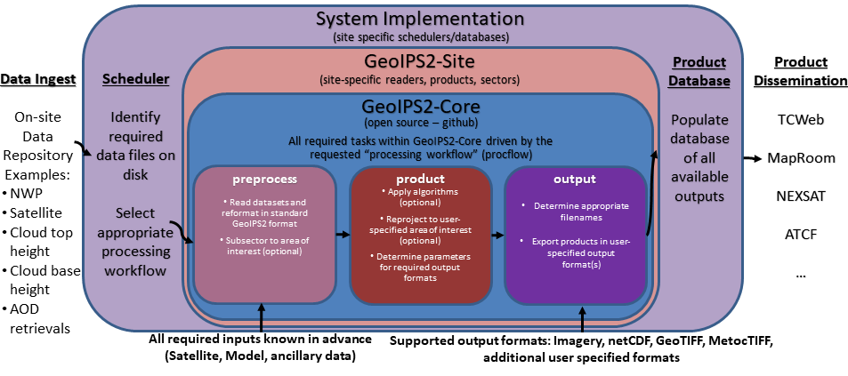

.. dropdown:: Distribution Statement

 | # # # This source code is protected under the license referenced at
 | # # # https://github.com/NRLMMD-GEOIPS.

.. _requirement_spec:

Software Requirements Specification
###################################

For **Geolocated Information Processing System**

 | Version 1.1 approved
 | Prepared by Mindy Surratt and Chris Camacho
 | Naval Research Laboratory Marine Meteorology Division
 | 7 February 2023

Table of Contents
*****************

    * `Revision History`_
    * `1. Introduction`_
        * `1.1 Purpose`_
        * `1.2 Intended Audience and Reading Suggestions`_
        * `1.3 Product Scope`_
        * `1.4 References`_
    * `Overall Description`_
        * `2.1 Product Perspective`_
        * `2.2 Product Functions`_
        * `2.3 User Classes and Characteristics`_
        * `2.4 Operating Environment`_
        * `2.5 Design and Implementation Constraints`_
        * `2.6 User Documentation`_
        * `2.7 Assumptions and Dependencies`_
    * `External Interface Requirements`_
        * `3.1 User Interfaces`_
        * `3.2 Hardware Interfaces`_
        * `3.3 Software Interfaces`_
    * `System Features`_
        * `4.1 Data Fusion Capability`_
        * `4.2 Products Over Various Spatial Domains`_
        * `4.3 Products of Varied Output Formats`_

Revision History
****************
+-------------------+---------------+--------------------------------+-----------+
| Name              | Date          | Reason For Changes             | Version   |
+===================+===============+================================+===========+
| Surratt/Camacho   | 2021-10-20    | Initial version                | 1.0       |
+-------------------+---------------+--------------------------------+-----------+
| Surratt/Camacho   | 2023-02-06    | Google -> NumPy docstrings     | 1.1       |
|                   |               | black/flake8/bandit code checks|           |
+-------------------+---------------+--------------------------------+-----------+

1. Introduction
===============

1.1 Purpose
-----------

The Geolocated Information Processing System (GeoIPS) is a generalized processing system, providing a collection
of **algorithm and product implementations** facilitating **consistent and reliable application** of specific products
across a **variety of sensors and data types**.

GeoIPS acts as a toolbox for internal GeoIPS-based product development
- all modules are expected to have simple inputs and outputs (Python numpy
or dask arrays or xarrays, dictionaries, strings, lists), to enable
portability and simplified interfacing between modules.

Some of the primary benefits / requirements of GeoIPS include:

* Seamless application to proprietary data types and products (no reference to external functionality within the main
  code base)
* Consistent product application across multiple sensors (both open source and proprietary)
* Flexible workflow to allow efficient real-time processing as well as interactive processing
* Modular interfaces to facilitate product development
* Consistent code base for research and development through operational transitions
* Ability to generate log outputs
* Ability to interface with workflow management tools (cylc)
* Ability to interface with databases (postgres)

1.2 Intended Audience and Reading Suggestions
---------------------------------------------

This document is primarily intended for system administrators, users, testers and project managers.

Software developers should consider this required reading prior to working through the documentation.

1.3 Product Scope
-----------------

The GeoIPS® "core" package is responsible for data processing from reading and reformatting the data into the
common internal GeoIPS® internal format, through algorithm and product application, to outputting user
configurable data formats (imagery, NetCDF, etc).

Data collection, data transfers, and product dissemination are all site specific implementations for driving
GeoIPS® processing, and fall outside the scope of the GeoIPS® "core" processing system.

See also :ref:`geoips_scope`

1.4 References
--------------

Software Requirements Specification Template
^^^^^^^^^^^^^^^^^^^^^^^^^^^^^^^^^^^^^^^^^^^^

This Software Requirements Specification Document was developed using the following template:

https://github.com/rick4470/IEEE-SRS-Tempate

Documentation and Style Strategy
^^^^^^^^^^^^^^^^^^^^^^^^^^^^^^^^

GeoIPS uses Sphinx with the Napoleon extension for automated documentation generation.

https://www.sphinx-doc.org/en/master/usage/extensions/napoleon.html

GeoIPS Syntax and Style Checking
^^^^^^^^^^^^^^^^^^^^^^^^^^^^^^^^

GeoIPS uses the NumPy docstring format within the code base for simplicity:

https://numpydoc.readthedocs.io/en/latest/format.html

bandit, flake8, and black are used to enforce appropriate style, security,
and syntax usage.  flake8-rst and flake8-rst-docstring plugins are used to
enforce numpy docstring formatting.

Overall Description
===================

2.1 Product Perspective
-----------------------

The Meteorology and Oceanography (METOC) community has an increasingly large number of disparate
data sources available for advanced environmental exploitation – numerical model outputs, rapid
refresh next generation geostationary weather satellites, polar orbiting microwave imagers and
sounders, radar data, direct observations from ships and weather stations, climatology, elevation
and emissivity databases, and many more data types, both static and dynamic.  Additionally, with
the upcoming launch of countless microsats, an efficient and easy-to-use processing system is
imperative for rapid implementation of these new datasets.

The amount of information that can be gained by combining these datasets in unique ways is far
greater than from any single data type.  GeoIPS® will result in a collaborative, easy-to-use
processing system that can support development efforts integrating these disparate data sources
into unique products, and facilitate streamlined operational transitions.  This common platform
will be used across the METOC community – including basic research, real-time implementation,
and operational processing.

With the plethora of weather satellites coming on line, it is imperative to develop a sustainable,
open source, community supported, efficient, modular processing platform to enable future functionality
and facilitate near real-time operational capability for all new sensors and products.

The GeoIPS® project will deliver a much needed capability for efficient environmental data
processing, benefiting METOC users across the community.  The collaborative nature of GeoIPS®
development will lead to increased efficiency and functionality of the final product.

2.2 Product Functions
---------------------

2.3 User Classes and Characteristics
------------------------------------

There are 4 primary user classes for the GeoIPS® system: researchers, light developers,
expert developers, and operators.

**Researchers** will use the system to generate output products for further analysis,
but will not be implementing major changes to the products or algorithms themselves –
only using the output of GeoIPS® to aid in their research.

**Light developers** will make minor changes to the code base (slight modifications to
basic products, algorithms, sectors, etc), but will not make major changes to the
internals of the GeoIPS® infrastructure.  This allows product customization, without
a deep knowledge of the backend processing architecture.

**Expert developers** will work with the internals of the main GeoIPS-Core code base –
providing new functionality and features that are commonly used by multiple site-specific
implementations.  Expert developers should be intimately familiar with all aspects of
the Software Requirements Specification.

**Operators** will drive GeoIPS® processing via YAML config files, specifying all required
products and sectors.  Operators will implement minimal changes to the GeoIPS® code base,
and will require additional software outside of the GeoIPS® system to drive the real-time
processing (processing workflows, database management systems, data dissemination protocols).

2.4 Operating Environment
-------------------------

GeoIPS® is developed and tested under the GNU/Linux operating system, on 64-bit x86 hardware architecture.

GeoIPS® must be fully functional under RHEL 8.4 with SELinux enabled (including Fortran and C compiled code)

2.5 Design and Implementation Constraints
-----------------------------------------

GeoIPS® is a Python 3 based processing system, with support for Fortran and C routines.

Minimum Base Python package requirements include xarray, scipy, pyresample, and pyyaml,
with additional requirements for specific readers and algorithms.

GeoIPS® requires gfortran and gcc compilers – must support gcc version 8, 9, or 10.

2.6 User Documentation
----------------------

The GEOIPS-Core code base, documentation, and tutorial support are available on github.

Test datasets can be obtained from geoips@nrlmry.navy.mil.

2.7 Assumptions and Dependencies
--------------------------------

Hardware and software requirements stated in this document are pertinent to the GeoIPS-Core
version of the codebase.  Additional site-specific packages and system implementations could
incur additional resource requirements or software dependencies.

External Interface Requirements
===============================

3.1 User Interfaces
-------------------

* Must support Linux-based processing, no GUI requirement.
* Must run via command line interactively, one product at a time.
* Must be able to run via config-based processing to efficiently drive multiple outputs.
* Command line and config-based interfaces must map user requested options to modular software interfaces.
* Must be able to support web-based requests. (Config-based processing supports web-based requests – potentially
  separate application to generate config file to drive processing)
* Must be able to operate via queueing and scheduling systems (covered via config-based processing)
* Must provide feedback throughout processing to monitor progress.

  * Log output (errors, warnings, status)
  * Messages during runtime identifying which part of the processing is currently active

3.2 Hardware Interfaces
-----------------------

GeoIPS® is developed and tested under the GNU/Linux operating system, on 64-bit x86 hardware
architecture.  GeoIPS® must successfully operate under Red Hat Enterprise Linux 8.4 with
SELinux enabled.

Processing medium resolution next generation geostationary satellite data (ABI, AHI) and polar
orbiter satellite data with GeoIPS® requires a minimum of 2 processors with 16GB memory.
High resolution next generation geostationary satellite datasets requires at least 24GB memory.

3.3 Software Interfaces
-----------------------

Requirements:

* **Must allow internal multi-processing**

  * Individual modules are allowed to include multi-threading and multi-processing

    * Dask based processing
  * Managing queues to ensure multi-processing is handled properly is outside the scope of GeoIPS itself.
  * Config-based processing allows driving processing in different configurations to ensure optimal efficient
    processing.

* **Must be able to map each point to**

  * Latitude
  * Longitude
  * vertical position
  * observation time (ie, when the model was run)
  * valid time (ie, observation time + tau)

* **Must store satellite specific attributes**

  * Satellite zenith and azimuth angles
  * Orbital parameters

* **Must be able to ingest geo-located data with temporal and vertical information**

  * LIDAR data, sounder data, model data, and other datasets including vertical coordinates

* **Must store metadata on projections**

* **Must have common backend data format**

  * dictionary of xarray datasets, one for each shape/resolution/attribute set of data.
  * Each individual xarray dataset contains the following variables:

    * 'latitude' - REQUIRED 2d array the same shape as data variables
    * 'longitude' - REQUIRED 2d array the same shape as data variables
    * ‘vertical_position’ – OPTIONAL 2d array the same shape as data variables

      * Required for feature height, volumetric, models, curtain – ie, if heights change
    * 'time' - OPTIONAL 2d array the same shape as data variables

* **Each individual xarray dataset must contain the following metadata attributes**

  * ‘source_name’ – REQUIRED
  * ‘platform_name’ – REQUIRED
  * ‘data_provider’ – REQUIRED
  * 'start_datetime' – REQUIRED
  * 'end_datetime' – REQUIRED
  * ‘interpolation_radius_of_influence – REQUIRED
  * ‘vertical_data_type’

    * Surface
    * Column integrated
    * Feature height (ie, Cloud top, ocean, etc)
    * Volumetric (3d)
    * Curtain (2d)

  * Projection information (how it was, or how it will be mapped onto a grid)

* **Each reader return must contain a ‘METADATA’ dictionary key with only metadata attributes**

  * Must include required metadata fields
  * May include any additional optional desired metadata fields

* **Variables and attributes on xarray datasets will follow CF Standards, with units matching the
  CF canonical units**

  * http://cfconventions.org/Data/cf-standard-names/current/build/cf-standard-name-table.html

* **Model xarray objects are organized with separate datasets for each level type**

  * Mean sea level
  * Pressure
  * Surface
  * Top
  * Zheight

* **Time-series data (model, fire ) is stored in 3 dimensional DataArrays, where the 3rd dimension
  relates to time (tau for model data), with a separate “time” data array**

* **Must have modular capability for different output formats**

  * Request output format modules during run-time (via config files or command line) – no reference
    to specific output formats within code base.

    * Xarray based inputs containing

      * data to plot
      * requested region of interest
      * plotting parameters (optional)
    * Performs actual plotting / output commands

      * Generates output directly within the module
    * Returns list of filenames that were generated

* **Must have modular capability for user-specified output filenames**

  * Request filename module during run-time
  * Xarray based inputs with required metadata to compile filename
  * Returns string of resulting filename

* **Must have modular capability for sector specifications**

  * Request sector specification modules during run-time
  * Xarray based inputs
  * Pyresample area definition based output

* **Must support config-file specified “product” parameters referencing one or more of**

  * Interpolation scheme
  * Colormap
  * Algorithm to apply, and required algorithm arguments
  * Separate mapping of sensor to required variables for each supported product
    (allowing implementation of existing products to proprietary data types)

System Features
===============

4.1 Data Fusion Capability
--------------------------

4.1.1 Description and Priority
^^^^^^^^^^^^^^^^^^^^^^^^^^^^^^

High Priority - Must be able to produce output products from different combinations of input datasets.

4.1.2 Stimulus/Response Sequences
^^^^^^^^^^^^^^^^^^^^^^^^^^^^^^^^^

Required input data sets and desired output products must be specified via a single command line call.

Required data files and product parameters can be specified either via:

* explicit command line options or
* YAML config specifications

4.1.3 Functional Requirements
^^^^^^^^^^^^^^^^^^^^^^^^^^^^^

* **Must be able to produce output products from combinations of**

  * Geostationary satellites
  * Vis/IR Polar orbiters
  * Passive microwave polar orbiters
  * Numerical Weather Prediction model outputs
  * Radar data
  * Sounder data
  * Lidar data
  * Other ancillary datasets (elevation, surface emissivity, etc)

4.2 Products Over Various Spatial Domains
-----------------------------------------

4.2.1 Description and Priority
^^^^^^^^^^^^^^^^^^^^^^^^^^^^^^

High Priority - Must be able to produce output products over a variety of user-specifiable spatial domains.

4.2.2 Stimulus/Response Sequences
^^^^^^^^^^^^^^^^^^^^^^^^^^^^^^^^^

Requested spatial domains (referred to as area definitions or sectors) must be requested via a single
command line call. Sector information can be specified either via:

* explicit command line options or
* YAML config specifications

4.2.3 Functional Requirements
^^^^^^^^^^^^^^^^^^^^^^^^^^^^^

* **Must be able to produce products over various spatial domains for the above datasets**

  * Tropical cyclone centered imagery
  * Static regions of varying spatial resolutions and coverage, at any location on the globe
  * Algorithms applied to raw datasets (original resolution / coverage)
  * 3 and 4 dimensional outputs (model data, sounder data, lidar data, etc)

4.3 Products of Varied Output Formats
-------------------------------------

4.3.1 Description and Priority
^^^^^^^^^^^^^^^^^^^^^^^^^^^^^^

High Priority - Must be able to produce output products of various user-specifiable output formats.

4.3.2 Stimulus/Response Sequences
^^^^^^^^^^^^^^^^^^^^^^^^^^^^^^^^^

Requested output formats must be requested via a single command line call.

Requested output format information can be specified either via:

* explicit command line options or
* YAML config specifications

4.3.3 Functional Requirements
^^^^^^^^^^^^^^^^^^^^^^^^^^^^^

* **Must be able to produce the following output types for any combination of the above datasets and domains**

  * Annotated imagery outputs (titles, coastlines, gridlines)
  * Non-annotated imagery outputs with associated metadata for displaying within external image viewers
  * METOCTIFF quantitative imagery output (for ATCF/JMV/MapRoom viewers)
  * GeoTIFF output
  * GeoJSON output
  * netCDF output with pre-processed data
  * text outputs
