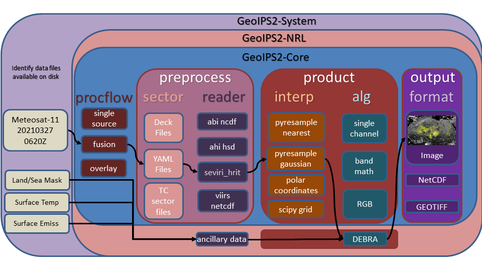

.. dropdown:: Distribution Statement

 | # # # This source code is subject to the license referenced at
 | # # # https://github.com/NRLMMD-GEOIPS.

The Structure of GeoIPS
***********************

Overview of interfaces and plugins
==================================

A primary goal of GeoIPS is to provide seamless integration of external functionality,
with no reference to proprietary algorithms and readers from the base open source
geoips code base.

GeoIPS Interfaces are used to abstract the process of accessing different pieces
of GeoIPS functionality (plugins) in order to support installing GeoIPS Plugins
from external repositories with no reference to those pieces of functionality
from within the main code base.

Example external plugin functionality:

GeoIPS makes use of Python entry points to install external packages within the geoips
namespace, then an internal Application Programming Interface to access specific
modules.

GeoIPS is made up of a collection of plugins of different types, accessed via specific
plugin interfaces.

The primary plugin interfaces include:

* **processing workflows (procflows)** - drive a specific collection of steps for a particular type of processing
* **static sectors** - specifications of domains of interest
* **dynamic sectors** - specifications of dynamic domains of interest
* **readers** - specifications for ingesting a specific data type, and storing in the GeoIPS xarray-based internal
  format
* **products** - overall product specification, including interpolation routine,
  algorithm, colormaps, etc (see YAML-based interfaces)

  * **interpolators** - interpolation routine to apply when reprojecting data
  * **algorithms** - data manipulations to apply to dataset
  * **colormaps** - colormap to apply to resulting product
* **output_formatters** - data format for the resulting output product (ie, netCDF, png, etc)
* **filename_formatters** - full path and file name formatting specification, using attributes within the xarray objects

The primary processing workflows available at this time, which access the
appropriate plugins at the appropriate point in the processing stream using the
appropriate plugin interface, include:

* **single_source** - single input type and single output type
* **config_based** - efficient method for producing all possible outputs for
  a given set of data files.

Example single_source processing workflow:

.. image:: Example_89pct_GEOTIFF_Processing_Workflow.png
   :width: 800

Example of config based processing workflow

.. image:: Example_config_Processing_Workflow.png
   :width: 800