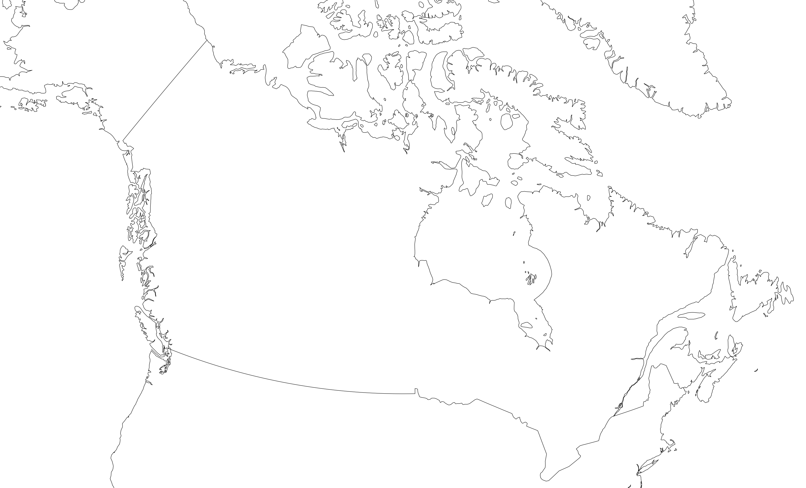

.. dropdown:: Distribution Statement

 | # # # This source code is subject to the license referenced at
 | # # # https://github.com/NRLMMD-GEOIPS.

.. _command_line:

Command Line Interface (CLI)
****************************

.. warning::

    The CLI is currently under development.
    The CLI may change without warning!
    Please consult this documentation for up-to-date info on the CLI.

The CLI can be used to run, configure, and test GeoIPS. It can also print lists or descriptions of available data or
functionality.

CLI commands are split up into two groups by their functionality:

 - `Discovery commands`_ help you discover available GeoIPS functionality
   (e.g. interfaces, plugins, etc.)
 - `Action commands`_ perform actions using GeoIPS functionality (e.g.
   configure GeoIPS, run a procflow, install test datasets, run tests, etc.)

..
    Commenting this out for now until the linked document is corrected.
    You can find the automatically created CLI usage documentation `here <./command_line_autodoc.rst>`_.

.. contents:: Table of Contents
    :local:
    :backlinks: none

Getting Help
============

To retrieve information about the CLI's commands and arguments, use the ``-h/--help`` argument.
For example, each of the following will return different, context dependent, help information:

- ``geoips -h``
- ``geoips list -h``
- ``geoips list algorithms -h``
- ``geoips run -h``

Command Aliases
===============

Many GeoIPS commands and subcommands have aliases for convenience. Common aliases include:

- ``ls`` for ``list``
- ``alg`` or ``algs`` for ``algorithms``
- ``pkg`` or ``pkgs`` for ``packages``
- ``fam`` for ``family``
- ``cfg`` for ``config``
- ``val`` for ``validate``

These aliases can be used interchangeably with their full command names
throughout the CLI and can be seen in the output from ``-h/--help``.

Discovery Commands
==================

The CLI Implements three top-level discovery commands that retrieve information
about GeoIPS artifacts: ``list``, ``describe``, and ``expand``.

list
----

``list`` returns information about a GeoIPS artifact, such as:

 - Lists of existing artifacts
 - Artifact locations
 - Artifact functionality

list interface
^^^^^^^^^^^^^^

``list interfaces`` returns a list of GeoIPS interfaces.

By default it returns the following for native interfaces:

* GeoIPS Package
* Interface Type
* Interface Name
* Supported Families
* Docstring
* Absolute Path

Implemented Mode
""""""""""""""""

The ``list interfaces`` command has an "implemented" mode.

Implemented mode searches for plugins of each
interface which have been created throughout GeoIPS
packages, or a certain package.

When running in implemented mode, it returns:

* GeoIPS Package
* Interface Type
* Interface Name

For example:

.. code-block:: bash

    geoips list interfaces -i

Both the general and implemented outputs can
be filtered by package with ``--package_name`` or ``-p``.

For example:

.. code-block:: bash

    geoips list interfaces

or

.. code-block:: bash

    geoips list interfaces -i --package_name <package_name>

list interface
^^^^^^^^^^^^^^

``list <interface_name>`` returns a list of an interface's plugins with the following plugin information:

* GeoIPS Package
* Interface Name
* Interface Type
* Family
* Plugin Name
* Source Names (if applicable)
* Relative Path

For example:

.. code-block:: bash

    geoips list algorithms

You can also filter by package name with ``--package_name`` or ``-p``. For example:

.. code-block:: bash

    geoips list interfaces --package_name geoips
    geoips list <interface_name> -p <package_name>

list packages
^^^^^^^^^^^^^

``list packages`` returns a list of GeoIPS Packages with the following package information:

* Package Name
* Docstring
* Package Path
* Version Number

For example:

.. code-block:: bash

    geoips list packages

list plugins
^^^^^^^^^^^^

``list plugins`` returns the following information about plugins:

* GeoIPS Package
* Interface Name
* Interface Type
* Family
* Plugin Name
* Source Names
* Relative Path

For example:

.. code-block:: bash

    geoips list plugins

You can filter by package with ``--package-name`` or ``-p``. For example:

.. code-block:: bash

    geoips list plugins -p <package_name>

.. _geoips_list_scripts:

list scripts
^^^^^^^^^^^^

``list scripts`` returns a list of test scripts implemented in GeoIPS plugin packages that are installed in editable
mode.

For each test script, this command returns:

    * GeoIPS Package
    * Filename

.. note::

    For this command to find test scripts,
    they must be `.sh` files located at ``<package_install_location>/tests/scripts/``.

.. note::

    Test scripts can be run with the `run`_ command

For example:

.. code-block:: bash

    geoips list scripts

You can filter by package with ``--package-name`` or ``-p``. For example:

.. code-block:: bash

    geoips list scripts -p <package_name>

.. _geoips_list_registries:

:ref:`geoips list registries <geoips_list_registries>`

``list registries`` lists plugin registries for each package
returns:

    * GeoIPS Package
    * JSON Path
    * YAML Path

This outputs absolute paths by default.
If passed a ``--relpath`` flag it will output relative paths.

By default, this only lists plugin registries for
packages in the ``geoips.plugin_packages`` namespace.
You may pass ``--namespace <different_namespace>``
to list plugin registries in a different namespace.
It is unlikely that you will need to do this.

For example:

.. code-block:: bash

    geoips list registries
    geoips list registries --relpath
    geoips list registries --namespace <different_namespace>

list source-names
^^^^^^^^^^^^^^^^^

``list source-names`` (or ``list src-names``) retrieves a listing of source_names
from all, or a certain GeoIPS Package. For this command to find a listing of
source_names, you must add a module-level ``source_names`` attribute to your reader
plugin. Every core GeoIPS reader plugin has this attribute set. We recommend following
the same method of implementation as core GeoIPS readers, as reader plugins without this
attribute will be deprecated when GeoIPS v2.0.0 is released.

Information included when calling this command is:

* Source Name
* Reader Names

For example:

.. code-block:: bash

    geoips ls source-names
    geoips ls src-names
    geoips list source-names
    geoips list source-names -p <package_name>

list test-datasets
^^^^^^^^^^^^^^^^^^

``list test-datasets`` returns:

* Data Host
* Dataset Name

We require these datasets for testing GeoIPS:

* test_data_amsr2
* test_data_clavrx
* test_data_fusion
* test_data_gpm
* test_data_noaa_aws
* test_data_sar
* test_data_scat
* test_data_smap
* test_data_viirs

For example:

.. code-block:: bash

    geoips list test-datasets

list unit-tests
^^^^^^^^^^^^^^^

``list unit-tests`` returns a list of unit-tests from plugin packages that are installed in editable mode.

For each unit-test, the following information is returned:

* GeoIPS Package
* Unit Test Directory
* Unit Test Name

.. note::
    For this command to find your unit tests, you must
    place the unit tests under ``<package_install_location>/tests/unit_tests/``.

For example:

.. code-block:: bash

    geoips list unit-tests -p <package_name>

The output can be filtered by package with ``--package_name`` or ``-p``.
The specified plugin package(s) must be installed in editable mode.

For example, to display only the ``package`` and ``docstring``
columns from the ``geoips list packages`` command:

.. code-block:: bash

    geoips list packages --columns package docstring

Output Formatting
"""""""""""""""""

The output format can be configured with the following arguments:

 - ``--long`` or ``-l`` (the default format, a long table)
 - ``--columns`` or ``-c`` (pass column(s) to display)

For a list of what columns you can filter by,
pass ``help`` to the ``--columns`` argument.

For example:

.. code-block:: bash

    geoips list <cmd_name> --columns help

describe
--------

``describe`` retrieves detailed information about a single GeoIPS artifact. It can be used to retrieve information about
``interfaces``, ``families``, ``packages``, and ``plugins``. To provide information that is relevant and useful for each
artifact type, the information retrieved differs for different types of artifacts.

describe interface
^^^^^^^^^^^^^^^^^^

``describe <interface_name>`` retrieves information about an interface.
It returns:

* Absolute Path
* Docstring
* Interface
* Interface Type
* Supported Families

For more information about available GeoIPS Interfaces,
see the `list <#list>`_ command.

describe family
^^^^^^^^^^^^^^^

``describe <interface_name> family <family_name>`` (or ``fam``) retrieves information about a family.

It returns the following information about an interface's family:

* Docstring
* Family Name
* Family Path
* Interface Name
* Interface Type
* Required Args / Schema

For example:

.. code-block:: bash

    geoips describe prod-def fam interpolator_algorithm_colormapper

describe package
^^^^^^^^^^^^^^^^

``describe package`` retrieves information about a registered plugin package.
It returns the following information about a Package:

* Docstring
* GeoIPS Package
* Package Path
* Source Code
* Version Number

For example:

.. code-block:: bash

    geoips describe pkg geoips_clavrx

describe plugin
^^^^^^^^^^^^^^^

``describe plugin`` retrieves information about a specific plugin.
It returns the following information about a Plugin:

* Docstring
* Family Name
* Interface Name
* Interface Type
* GeoIPS Package
* Plugin Type
* Product Defaults (if applicable)
* Relative Path
* Signature (if applicable)
* Source Names (if applicable)

For example:

.. code-block:: bash

    geoips describe alg single_channel

expand
------

Expand commands are currently beta and in development. They are targeted towards
workflow plugins and are intended to visualize the order of steps applied for a workflow
plugin via the order based procflow (OBP).

expand workflow
---------------

This command expands a workflow plugin to its full YAML representation. Since workflows
can specify products and/or workflows as steps, it is not easy to see the exact order
of steps that will be applied via the OBP at runtime. For example, a product may
reference an ``algorithm``, ``interpolator``, and ``colormapper`` as its series of
plugin steps, but these are not present in the original workflow file. Same goes for
an embedded workflow as a step.

This command loads the steps of all of the embedded plugins in place and prints them
out in the order that the OBP would receive them. This way a user or developer knows
the exact order of steps that will be applied by running a given workflow.

By default, this command doesn't highlight its output. To see highlighted YAML output,
add the ``--color`` flag. The default format to run this command is as follows:

``geoips expand <workflow_name>``

The following code snippet presents some command examples which currently work in
GeoIPS.

.. code-block:: bash

    geoips expand test_product
    geoips expand test_product --color

Action Commands
===============

The CLI can kick off functionality built into GeoIPS. Below, we describe commands that
do this.

config
------

``geoips config`` (or ``geoips cfg``) makes testing easier by providing easy access to
configuration options.

.. note::

    As we continue to develop the GeoIPS CLI,
    we expect the functionality of this command to grow.

.. _geoips_lint:

lint
----

GeoIPS and GeoIPS Plugin Packages routintely run linters to
confirm functionality, uniform syntax and interoperability.

``geoips lint`` can execute linting services to make your code adhere to commonly
accepted coding practices.

Checking code often is a good practice.

geoips lint
^^^^^^^^^^^

This command runs ``bandit``, ``black``, and ``flake8``.

.. note::

    We may support more linters in the future.

For example:

.. code-block:: bash

    geoips lint # (defaults to 'geoips' package)
    geoips lint <package_name> # only runs tests in provided plugin package

registry
--------

GeoIPS provides two ``registry`` commands which interact with a 3rd party package called
``pluginify`` to create plugin registry files for one or more of your GeoIPS packages
registered under the GeoIPS namespace. These file allow GeoIPS to efficiently locate and
load plugins from various different packages. The following sections will detail the
CLI commands that interact with registry files.

create
^^^^^^

.. _geoips_config_create-registries:

:ref:`geoips config create-registries <geoips_config_create-registries>`

``registry create`` creates plugin registry files.
These files for GeoIPS to locate and use plugins.
You should never edit these files.

This occurs in the ``geoips.plugin_packages`` namespace by default.
It contains all plugin packages registered under GeoIPS.
You may specify a different name space.

You can pass ``--packages`` to limit the plugins processed.

JSON files are output by default.
You may also output yaml files for ease of viewing by passing ``--save-type yaml``.

For example:

::

    geoips registry create
    geoips registry create --packages geoips geoips_clavrx
    geoips registry create --save-type yaml
    geoips registry create --namespace <different_namespace>

delete
^^^^^^

.. _geoips_config_delete-registries:

:ref:`geoips config delete-registries <geoips_config_delete-registries>`

``registry delete`` removes the plugin registry files.
If no registry files are found, nothing occurs. For example:

::

    geoips registry delete
    geoips registry delete --packages geoips geoips_clavrx
    geoips registry delete --namespace <different_namespace>

.. _geoips_run:

run
---

``geoips run`` executes a GeoIPS processing workflow (a "procflow") to produce outputs.

Order-Based Processing (recommended)
^^^^^^^^^^^^^^^^^^^^^^^^^^^^^^^^^^^^^

The recommended procflow in GeoIPS 2.0 is the :ref:`Order-Based Procflow
<order-based-processing>` (OBP). Run a :ref:`workflow <workflows>` by name — or by path to
an unregistered ``.yaml``/``.json`` workflow — passing the input data files:

.. code-block:: bash

    geoips run order_based abi_static_infrared_imagery_clean \
        $GEOIPS_TESTDATA_DIR/test_data_abi/data/goes16_20200918_1950/*

OBP supports step (``-s``/``-S``), kind (``-k``/``-K``), and global (``-g``/``-G``)
overrides, plus output-checker overrides. For the workflow structure and the full override
syntax, see :ref:`running-obp`. To run a workflow's built-in ``test`` section, use
:ref:`geoips test workflow <geoips_test>`.

Legacy procflows (deprecated, still supported)
^^^^^^^^^^^^^^^^^^^^^^^^^^^^^^^^^^^^^^^^^^^^^^^

The ``single_source``, ``config_based``, and ``data_fusion`` procflows still run, but they
are **deprecated** in GeoIPS 2.0 and receive no new features. OBP can produce everything
they can, so prefer OBP for new work.

.. note::

    ``geoips run`` replaces the older ``run_procflow`` / ``data_fusion_procflow`` scripts.
    ``geoips legacy run`` wraps them for backwards compatibility, which may be removed in a
    future release. To migrate a legacy call, replace ``run_procflow`` /
    ``data_fusion_procflow`` with ``geoips run <procflow_name>`` and drop the
    ``--procflow`` argument.

.. code-block:: bash

    geoips run single_source $GEOIPS_TESTDATA_DIR/test_data_noaa_aws/data/goes16/20200918/1950/* \
        --reader_name abi_netcdf \
        --product_name Infrared \
        --compare_path "$GEOIPS_PACKAGES_DIR/geoips/tests/outputs/abi.static.<product>.imagery_annotated" \
        --output_formatter imagery_annotated \
        --filename_formatter geoips_fname \
        --resampled_read \
        --logging_level info \
        --sector_list goes_east

.. _geoips_sector:

sector
------

GeoIPS provides a collection of ``sector`` commands used to display the geospatial
region of a sector plugin as an interactive frame or image saved to disk. This is
useful for the development of sector plugins as these commands visualize the domain in
which a sector plugin actually encapsulates.

display
^^^^^^^

.. note::

    This section has not been implemented yet as the command does not currently exist.
    Please check this documentation at a later date once that command has been
    completed.

plot
^^^^

This command produces a .png image depicting the area of interest covered by the sector
including any coastlines contained in the sector.

For example:

.. code-block:: bash

    geoips sector plot <sector_name>

An additional output directory can be specified with ``--outdir``. For example:
.. code-block:: bash

    geoips sector plot <sector_name> --outdir <output_directory_path>

After creating a new sector plugin, run ``create_plugin_registries``
to add the sector to your registry.

Once added, this command can produce an image to
help confirm the region and resolution of that sector.

You can overlay a sector on the ``global_cylindrical`` grid if desired.
This is useful for small sectors. For example:

.. code-block:: bash

    geoips sector plot canada --overlay

Additionally, you can display latitude / longitude gridlines on the generated sector
image if desired. To add gridlines, add the ``--gridlines`` or ``-g`` flag to your
command. This can be applied with the ``--overlay`` flag as well. For example:

.. code-block:: bash

    geoips sector plot australia --gridlines
    geoips sector plot australia --gridlines --overlay

By default, latitude / longitude labels are added to the sector if gridlines are
requested. To disable this, or change the location of where the labels are added, use
the ``--labels`` or ``-l`` flag. By default, labels are added to the bottom and left
sides of the sector.

You can add a ``--labels`` flag with no arguments to disable labels. Otherwise,
choose one or more of the following options ['left', 'right', 'top', 'bottom'].
For example:

.. code-block:: bash

    geoips sector plot australia --gridlines --labels top right
    geoips sector plot australia --gridlines --labels
    geoips sector plot australia --gridlines --overlay --labels bottom

.. _geoips_test:

test
----

GeoIPS test currently only supports one command, ``geoips test workflow``. This is used
to execute workflows in a reproducible manner for testing purposes. This way, we can
ensure that the output of each step remains consistent with previous versions of GeoIPS
regardless of the changes made between releases.

test workflow
^^^^^^^^^^^^^

This command runs the series of steps in the order specified by a workflow plugin. It
will only work if the referenced workflow plugin has a ``test`` section containing
parameters needed to execute that workflow. No additional arguments can be supplied for
this command.

For example:

.. code-block:: bash

    geoips test workflow <workflow_name>

This command should be used only for testing workflow plugins in a simple, reproducible
manner.

.. _geoips_test-data:

test-data
---------

Since GeoIPS is designed around processing geolocated data, this package will need data
to process on. GeoIPS provides a variety of CLI commands centered around pulling,
updating, and removing test datasets for one or more of your plugin packages.

pull
^^^^

GeoIPS relies on test datasets to test its processing workflows.
Test datasets must be pulled locally before tests can be run.

``test-data pull`` pulls test datasets hosted on CIRA's NextCloud instance for
testing processing workflows.

For example:

.. code-block:: bash

    geoips test-data pulltest_data_clavrx
    geoips test-data pull test_data_clavrx
    geoips test-data pull test_data_clavrx test_data_noaa_aws
    geoips test-data pull all

.. note::

    To list installable test datasets,
    see ``geoips list test-datasets``.

Alternatively, you can pull test datasets from remote GitHub repositories if you have
access to them. This is only used in very specific instances where the test data is
not available to the public. The following section depicts how to pull data from a
remote GitHub repository.

.. code:: bash

    geoips test-data pull <gh_testdata_name> -g

tree
----

Only some GeoIPS CLI commands are exposed via ``geoips -h``.

``geoips tree`` lists all GeoIPS CLI commands in a tree-like fashion.

For example, running ``geoips tree`` returns:

.. code-block:: bash

    geoips tree

    geoips
        geoips config
            geoips config create
            geoips config validate
        geoips describe
            geoips describe algorithms
            geoips describe colormappers
            geoips describe coverage-checkers
            geoips describe databases
            geoips describe feature-annotators
            geoips describe filename-formatters
            geoips describe gridline-annotators
            geoips describe interpolators
            geoips describe output-checkers
            geoips describe output-formatters
            geoips describe package
            geoips describe procflows
            geoips describe product-defaults
            geoips describe products
            geoips describe readers
            geoips describe sector-adjusters
            geoips describe sector-metadata-generators
            geoips describe sector-spec-generators
            geoips describe sectors
            geoips describe title-formatters
            geoips describe validators
            geoips describe workflows
            geoips describe workflows
        geoips expand
        geoips lint
        geoips list
            geoips list algorithms
            geoips list colormappers
            geoips list coverage-checkers
            geoips list databases
            geoips list feature-annotators
            geoips list filename-formatters
            geoips list gridline-annotators
            geoips list interfaces
            geoips list interpolators
            geoips list output-checkers
            geoips list output-formatters
            geoips list packages
            geoips list plugins
            geoips list procflows
            geoips list product-defaults
            geoips list products
            geoips list readers
            geoips list registries
            geoips list registries
            geoips list scripts
            geoips list sector-adjusters
            geoips list sector-metadata-generators
            geoips list sector-spec-generators
            geoips list sectors
            geoips list source-names
            geoips list test-datasets
            geoips list title-formatters
            geoips list unit-tests
            geoips list validators
            geoips list workflows
            geoips list workflows
        geoips registry
            geoips registry create
            geoips registry delete
        geoips run
            geoips run config_based
            geoips run data_fusion
            geoips run order_based
            geoips run single_source
        geoips sector
            geoips sector plot
        geoips test
            geoips test workflow
        geoips test-data
            geoips test-data pull
        geoips tree
        geoips validate

``geoips tree`` provides arguments to filter its output.

* ``--color``: highlights output by depth (Environment variable 'NO_COLOR' must be disabled)

* ``--max-depth``: limits tree levels outputted. Defaults to two levels.

* ``--short-name``: return only literal command names

validate
--------

``validate`` (or ``val``) runs interface defined validation-protocols on plugins.

.. note::
    To list plugins available for validation, see ``geoips list plugins`` above.

A plugin's full location path is needed to validate it.

For example:

.. code-block:: bash

    geoips validate /full/path/to/geoips/geoips/plugins/yaml/products/abi.yaml
    geoips validate /full/path/to/<pkg_name>/<pkg_name>/plugins/<plugin_type>/<interface>/plugin.<ext>
