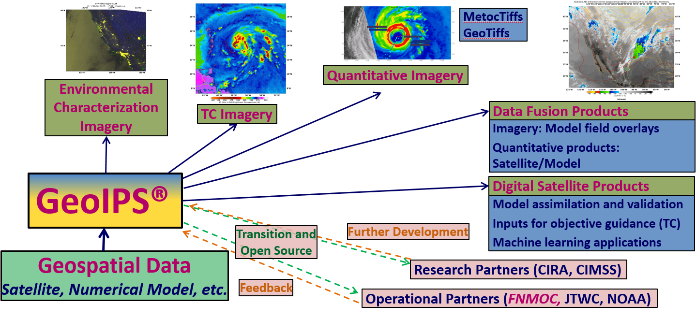
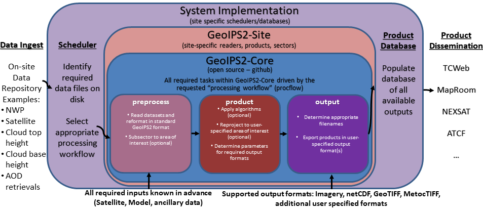
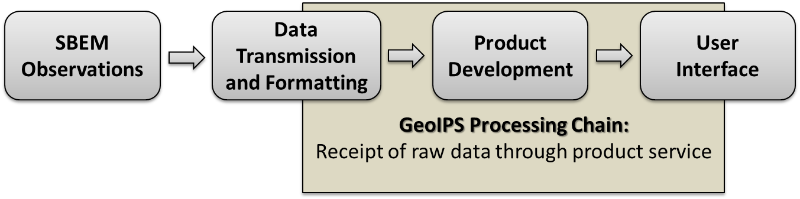

.. dropdown:: Distribution Statement

 | # # # This source code is subject to the license referenced at
 | # # # https://github.com/NRLMMD-GEOIPS.

What is GeoIPS
**************

GeoIPS (Geolocated Information Processing System) is an extensible,
open-source Python framework designed to process any dataset with latitude and
longitude coordinates. It is completely plugin-based to the degree that most
of its functionality is provided by plugins, enabling consistent and reliable
application of specific products across a variety of sensors and data types.

GeoIPS acts as a toolbox for internal GeoIPS-based product development - all modules are expected to
have simple inputs and outputs (Python numpy or dask arrays or xarrays, DataTree, dictionaries, strings, lists), to enable
portability and simplified interfacing between modules.

Some of the primary benefits / requirements of GeoIPS include:
    * Seamless application to proprietary data types and products (no reference to external functionality within the
      main code base)
    * Consistent product application across multiple sensors (both open source and proprietary)
    * Flexible workflow to allow efficient real-time processing as well as interactive processing
    * Modular interfaces to facilitate product development
    * Consistent code base for research and development through operational transitions
    * Ability to generate log outputs
    * Ability to interface with workflow management tools (cylc)
    * Ability to interface with databases (postgres)

.. _geoips_scope:

GeoIPS Scope
============

The GeoIPS® "core" package is responsible for data processing from reading and reformatting the data into the
common internal GeoIPS® internal format, through algorithm and product application, to outputting user
configurable data formats (imagery, NetCDF, etc).

Data collection, data transfers, and product dissemination are all site specific implementations for driving
GeoIPS® processing, and fall outside the scope of the GeoIPS® "core" processing system.

How GeoIPS processes data
=========================

GeoIPS functionality is provided by **plugins** — small, composable units that each do one
job: read a data type, interpolate to a grid, apply an algorithm, colorize a product, or
write an output. Plugins come in two forms: :ref:`class-based (Python) plugins
<writing-class-based-plugins>` and YAML plugins (products, sectors, annotators).

In GeoIPS 2.0, plugins are orchestrated by :ref:`Order-Based Processing (OBP)
<order-based-processing>`. You describe the exact, ordered sequence of plugin steps for a
product in a YAML *workflow*, and GeoIPS runs it — reading data, transforming it, computing
the product, and writing output. The same plugins can also be driven directly from Python
with the :ref:`scripting API <scripting-guide>`.

.. note::

   The GeoIPS 1.x fixed procflows (``single_source``, ``config_based``, ``data_fusion``)
   still run but are deprecated. New processing should use OBP. See
   :ref:`migrating-1x-to-2x`.
