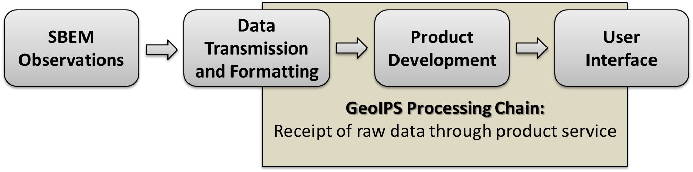

 | # # # Distribution Statement A. Approved for public release. Distribution unlimited.
 | # # #
 | # # # Author:
 | # # # Naval Research Laboratory, Marine Meteorology Division
 | # # #
 | # # # This program is free software: you can redistribute it and/or modify it under
 | # # # the terms of the NRLMMD License included with this program. This program is
 | # # # distributed WITHOUT ANY WARRANTY; without even the implied warranty of
 | # # # MERCHANTABILITY or FITNESS FOR A PARTICULAR PURPOSE. See the included license
 | # # # for more details. If you did not receive the license, for more information see:
 | # # # https://github.com/U-S-NRL-Marine-Meteorology-Division/

*********************
Description of GeoIPS
*********************

GeoIPS Overview
===============

The Geolocated Information Processing System (GeoIPS) is a generalized processing system, providing a collection
of algorithm and product implementations facilitating consistent and reliable application of specific products
across a variety of sensors and data types.

.. image:: ../images/geoips_overview/GeoIPS_Functionality_Overview.png
   :width: 800

GeoIPS acts as a toolbox for internal GeoIPS-based product development - all modules are expected to
have simple inputs and outputs (Python numpy or dask arrays or xarrays, dictionaries, strings, lists), to enable
portability and simplified interfacing between modules.

Some of the primary benefits / requirements of GeoIPS include:
    * Seamless application to proprietary data types and products (no reference to external functionality within the main code base)
    * Consistent product application across multiple sensors (both open source and proprietary)
    * Flexible workflow to allow efficient real-time processing as well as interactive processing
    * Modular interfaces to facilitate product development
    * Consistent code base for research and development through operational transitions
    * Ability to generate log outputs
    * Ability to interface with workflow management tools (cylc)
    * Ability to interface with databases (postgres)

.. image:: ../images/geoips_overview/GeoIPS_Structure_Overview.png
   :width: 800

GeoIPS Scope
============

The GeoIPS® "core" package is responsible for data processing from reading and reformatting the data into the
common internal GeoIPS® internal format, through algorithm and product application, to outputting user
configurable data formats (imagery, NetCDF, etc).

Data collection, data transfers, and product dissemination are all site specific implementations for driving
GeoIPS® processing, and fall outside the scope of the GeoIPS® "core" processing system.

Using GeoIPS for Research
=========================

Using GeoIPS for Operations
===========================

Static sectors
--------------

Dynamic sectors
---------------