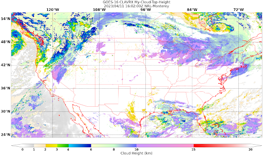
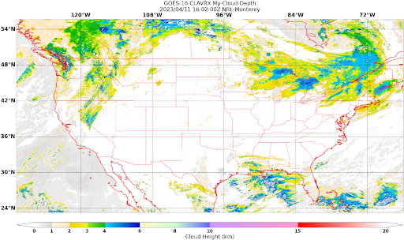

Product Creation by Extending GeoIPS
************************************

This tutorial explains how to create products with GeoIPS. We will create three products using Clouds from the
Advanced Very High Resolution Radiometer (AVHRR) extended version
(`CLAVR-x <https://www.star.nesdis.noaa.gov/portfolio/detail_Clouds.php>`_): **Cloud-Top-Height**,
**Cloud-Base-Height**, and **Cloud-Depth**. Products are the cornerstone plugin for GeoIPS, as they define how to
produce a specific product as a combination of other plugins. Products use other plugins, such as an algorithm,
colormapper, interpolater, etc., to generate the intended output.

GeoIPS is almost entirely composed of plugins and can be extended by developing new plugins in external python
packages. The ability to extend GeoIPS using plugins means that there is no need to edit the main GeoIPS code to add
new functionality.  Most types of functionality in GeoIPS can be extended. If you're facing issues with existing
plugins or integrating your own plugin, please reach out to the GeoIPS team or create an issue on GitHub.

Developing a new plugin for GeoIPS requires developing a new Python package that GeoIPS terms a "plugin package". The
plugin package can contain one or more plugins. It is configured in a special way such that, when it is installed, it
registers itself and its plugins with GeoIPS.

It is recommended to review the definitions of the top level attributes such as ``interface``, ``family``, and
``docstring`` required in any GeoIPS plugin. Click :ref:`plugin-vocabulary` and :ref:`required-attributes` to
view the related documentation.

Product Plugin Development Initial Setup
****************************************

Before creating a new product for CLAVR-x Cloud-Top-Height, let's get the initial setup done:

#. To develop a new GeoIPS plugin, first install :ref:`GeoIPS<linux-installation>` and ensure that the ``geoips``
   Python environment is enabled throughout this tutorial.

   .. code-block:: shell

    # activating Python environment
    mamba activate geoips

   You will know the geoips conda environment is enabled if (geoips) appears before your username in the command prompt.

#. Install GeoIPS CLAVR-x package and verify the installation, as this is essential for developing products with
   GeoIPS CLAVR-x.

   .. code-block:: shell

    # clone the remote repository
    git clone https://github.com/NRLMMD-GEOIPS/geoips_clavrx $GEOIPS_PACKAGES_DIR/geoips_clavrx

    # install geoips_clavrx
    pip install -e $GEOIPS_PACKAGES_DIR/geoips_clavrx

    # download test data for geoips-clavrx
    $GEOIPS_PACKAGES_DIR/geoips/setup/check_system_requirements.sh test_data test_data_clavrx

    # run tests to verify geoips-clavrx installation
    $GEOIPS_PACKAGES_DIR/geoips_clavrx/tests/test_all.sh

#. Set the following additional environment variables which are specific to your product plugin development.

   .. code-block:: shell

      # refer to the note below regarding your package name
      export MY_PKG_NAME=<your package name>

      # your package directory
      export MY_PKG_DIR=$GEOIPS_PACKAGES_DIR/$MY_PKG_NAME

      # your package VCS url
      export MY_PKG_URL=<your package’s URL on version control platform(GitLab)>

   .. note::
      Choose a package name that is all lowercase, begins with a letter, and
      contains only letters, numbers, and underscores.

#. Navigate to your product plugin directory and clone the example repository of customized plugin development,
   `Template Basic Plugin <https://github.com/NRLMMD-GEOIPS/template_basic_plugin/tree/main>`_. This repository serves
   as a base for building a new plugin package that contains one or more custom plugins.

   .. code-block:: shell

      # go to your package directory
      cd $GEOIPS_PACKAGES_DIR
      git clone --no-tags --single-branch $GEOIPS_REPO_URL/template_basic_plugin.git

   .. note::
    If you're not able to move into the directory listed in the above code-block, verify that the environment
    variables are set using the commands shown below. Otherwise, check step three again and seek help if needed.

    .. code-block:: shell

      echo $MY_PKG_NAME :  # should reflect your package name
      echo $MY_PKG_DIR  :  # should reflect merged path of $GEOIPS_PACKAGES_DIR/$MY_PKG_NAME

#.  Take ownership of tutorial template package: change its name, set the git branch to main, change its remote repo
    URL, and push.

    .. code-block:: shell

       mv template_basic_plugin/ $MY_PKG_NAME
       cd $MY_PKG_NAME
       git remote set-url origin $MY_PKG_URL
       git branch -m main
       git push -u origin main

#. Navigate to your plugins directory and explore its contents. Also, change the repository name from ``my_package``
   to your specific package name.

   .. code-block:: shell

      cd $MY_PKG_DIR
      git mv my_package $MY_PKG_NAME

#. Update pertinent files

   #. Installing a Python package requires metadata that describes the package and how to install it. GeoIPS uses
      ``pyproject.toml`` to define this information. Open ``pyproject.toml`` in your ``$MY_PKG_DIR`` and replace the
      following:

      * Update ``@package@`` to your package name.
      * Update ``my_package`` to your package name.

   #. Update README.md

      * Find and replace all occurrences of @package@ with your package name

   #. Add, commit, and push your changes

      .. code-block:: shell

         git add README.md pyproject.toml
         git commit -m "Updated name of template plugin package to mine"
         git push

Plugin Product Custom Definition & Development
**********************************************

This concludes the initial setup. Next, install the bare-bones version of your plugin, followed by development of a
CLAVR-x Cloud-Top-Height product.

   .. code-block:: python

      pip install -e .  # remember there is a period character at the end

#. Copy the template product plugin definition file to a new file to modify:

   .. code-block:: shell

      cd $MY_PKG_DIR/$MY_PKG_NAME/plugins/yaml/products
      cp amsr2_using_product_defaults.yaml my_clavrx_products.yaml

#. Within ``my_clavrx_products.yaml``, optionally remove all lines preceded by "#@".

#. Update ``my_clavrx_products.yaml`` to reflect the following values for the four properties listed below:

   .. code-block:: yaml

      interface: products
      family: list
      name: my_clavrx_products
      docstring: |
           CLAVR-x imagery products

   The code snippet shown above shows properties required in every GeoIPS plugin, YAML-based or Module-based. These
   properties help GeoIPS understand the type of plugin you are developing and also defines the schema your plugin
   will be validated against.

   It is recommended to review the definitions of the top level attributes such as ``interface``, ``family``, and
   ``docstring`` required in any GeoIPS plugin. Click here :ref:`click here <required-attributes>` (page
   scrolls up) to view the related documentation.

Cloud Top Height Product:
-------------------------

Now add the ``spec`` portion to the yaml file created in the last step to support new product plugin. ``spec`` is a
container for the 'specification' of your yaml plugin. In this case, it contains a list of ``products``, as shown
below. As indicated by the ``family: list`` property shown above, this yaml file will contain a list of products,
which can be of length 1 if you so desire.

Append the code below at the end of yaml file, under the docstring you wrote, with no tabs behind it.

  .. code-block:: yaml

    spec:
      products:
        - name: My-Cloud-Top-Height      # name of the product you're defining
          source_names: [clavrx]         # defined as metadata in the corresponding reader
          docstring: |                   # pipe says to YAML this will be a multiline comment
            CLAVR-x Cloud Top Height
          product_defaults: Cloud-Height # see the Product Defaults section for more info
          spec:
            # variables are the required parameters needed for the product generation
            variables: ["cld_height_acha", "latitude", "longitude"]

Script to Visualize Your Product
--------------------------------

GeoIPS is called via a command line interface (CLI). The primary command that you will use is ``run_procflow`` which
will process your data through the selected procflow using the specified plugins. Scripts are stored in your plugin
package's ``tests/`` directory as they can be later used for regression test of package you're developing.

#. To use your product that you just created, you'll need to create a bash script that implements ``run_procflow``
   (run-process-workflow). This script defines the *process-workflow* needed to generate your product. It can be used
   to specify how you want your product to be created, output format, and define the sector you'd like your data to be
   plotted on apart from enlisting comparison of the output product with a validated product(optional).

#. Check if you have the test data for the clavrx within ``$GEOIPS_TESTDATA_DIR`` and if not run the following.
   ::

       $GEOIPS_PACKAGES_DIR/geoips/setup/check_system_requirements.sh test_data test_data_clavrx

#. We'll now create a test script to generate an image for the product you just created. Change directories into your
   scripts directory.

   .. code-block:: bash

        cd $MY_PKG_DIR/tests/scripts

#. Create a bash file called clavrx.conus_annotated.my-cloud-top-height.sh and edit it to include the codeblock
   below.

   .. code-block:: bash

       geoips run single_source \
           $GEOIPS_TESTDATA_DIR/test_data_clavrx/data/goes16_2023101_1600/clavrx_OR_ABI-L1b-RadF-M6C01_G16_s20231011600207.level2.hdf \
           --reader_name clavrx_hdf4 \
           --product_name My-Cloud-Top-Height \
           --output_formatter imagery_annotated \
           --filename_formatter geoips_fname \
           --minimum_coverage 0 \
           --sector_list conus
       ss_retval=$?

   As shown above, you can specify the desired procflow, reader, and product to be displayed. Additionally, you can
   define the output method, filename formatter, and set the minimum coverage percentage required to generate an
   output, and choose the sector for data plotting. Additonal items can be added if desired. For examples, feel free
   to peruse the `GeoIPS Scripts Directory <https://github.com/NRLMMD-GEOIPS/geoips/tree/main/tests/scripts>`_.

#. Run your test script as shown below to produce Cloud Top Height Imagery:
   ::

        $MY_PKG_DIR/tests/scripts/clavrx.conus_annotated.my-cloud-top-height.sh

This will write some log output. If your script succeeded it will end with INTERACTIVE: Return Value 0. To view your
output, look for a line that says SINGLESOURCESUCCESS. Open the PNG file, it should look like the image below.

Okay! you've developed a plugin which produces CLAVR-x Cloud Top Height. This is nice, but what if you want to extend
our plugin to produce Cloud Base Height? What about Cloud Depth? Using the method shown above, you can configure
my_clavrx_products.yaml to produce just that.

Cloud Base Height Product:
--------------------------

Using your definition of My-Cloud-Top-Height as an example, create a product definition for My-Cloud-Base-Height.
::

    cd $MY_PKG_DIR/$MY_PKG_NAME/plugins/yaml/products

Now, edit my_clavrx_products.yaml. Here are some helpful hints:
  * The relevant variable in the CLAVR-x output file (and the equivalent GeoIPS
    reader) is called "cld_height_base"
  * The Cloud-Height product_default can be used to simplify this product
    definition (or you can DIY or override if you'd like!)

The correct products implementation for 'my_clavrx_products.yaml' is shown below. Hopefully, you didn't have to make
any changes after seeing this! Developing products, and other types of plugins should be somewhat intuitive after
completing this tutorial.

.. code-block:: yaml

    interface: products
    family: list
    name: my_clavrx_products
    docstring: |
      CLAVR-x imagery products
    spec:
      products:
        - name: My-Cloud-Top-Height
          source_names: [clavrx]
          docstring: |
            CLAVR-x Cloud Top Height
          product_defaults: Cloud-Height
          spec:
            variables: ["cld_height_acha", "latitude", "longitude"]
        - name: My-Cloud-Base-Height
          source_names: [clavrx]
          docstring: |
            CLAVR-x Cloud Base Height
          product_defaults: Cloud-Height
          spec:
            variables: ["cld_height_base", "latitude", "longitude"]

Cloud Depth Product:
--------------------

Now that you have products for both Cloud Top Height and Cloud Base Height, you can develop a product that produces
Cloud Depth. To do so, use your definitions of My-Cloud-Top-Height and My-Cloud-Base-Height as examples, create a
product definition for My-Cloud-Depth.
::

    cd $MY_PKG_DIR/$MY_PKG_NAME/plugins/yaml/products

Edit my_clavrx_products.yaml. Here is a helpful hint to get you started:
  * We will define Cloud Depth for this tutorial as the difference between CTH and CBH

.. code-block:: yaml

    interface: products
    family: list
    name: my_clavrx_products
    docstring: |
      CLAVR-x imagery products
    spec:
      products:
        - name: My-Cloud-Top-Height
          source_names: [clavrx]
          docstring: |
            CLAVR-x Cloud Top Height
          product_defaults: Cloud-Height
          spec:
            variables: ["cld_height_acha", "latitude", "longitude"]
        - name: My-Cloud-Base-Height
          source_names: [clavrx]
          docstring: |
            CLAVR-x Cloud Base Height
          product_defaults: Cloud-Height
          spec:
            variables: ["cld_height_base", "latitude", "longitude"]
        - name: My-Cloud-Depth
          source_names: [clavrx]
          docstring: |
            CLAVR-x Cloud Depth
          product_defaults: Cloud-Height
          spec:
            variables: ["cld_height_acha", "cld_height_base", "latitude", "longitude"]

You now have two variables, but if you examine the `Cloud-Height Product Defaults
<https://github.com/NRLMMD-GEOIPS/geoips_clavrx/blob/main/geoips_clavrx/plugins/yaml/product_defaults/Cloud-Height.yaml>`_
you will see that it uses the ``single_channel`` algorithm. This doesn't work for this use case, since the
``single_channel`` algorithm just manipulates a single data variable and plots it. Therefore, you need a new
algorithm! See the :ref:`Algorithms Section<add-an-algorithm>` to keep moving forward with this tutorial.

Using Your Cloud Depth Product
------------------------------

Note: Before moving forward in this section, make sure you've completed
:ref:`creating a new algorithm<add-an-algorithm>`. Next, modify the Cloud Depth product to utilize the newly created
algorithm.

To integrate the newly created cloud depth algorithm into Cloud Depth product, modify the ``My-Cloud-Depth `` entry in
your my_clavrx_products.yaml file. As detailed in the :ref:`Product Defaults Section<create-product-defaults>`, you
can override the default product settings to align with your specific requirements. Update the ``My-Cloud-Depth``
product configuration in my_clavrx_products.yaml as shown below:

.. code-block:: yaml

  interface: products
    family: list
    name: my_clavrx_products
    docstring: |
      CLAVR-x imagery products
    spec:
      products:
        - name: My-Cloud-Top-Height
          source_names: [clavrx]
          docstring: |
            CLAVR-x Cloud Top Height
          product_defaults: Cloud-Height
          spec:
            variables: ["cld_height_acha", "latitude", "longitude"]
        - name: My-Cloud-Base-Height
          source_names: [clavrx]
          docstring: |
            CLAVR-x Cloud Base Height
          product_defaults: Cloud-Height
          spec:
            variables: ["cld_height_base", "latitude", "longitude"]
        - name: My-Cloud-Depth
          source_names: [clavrx]
          docstring: |
            CLAVR-x Cloud Depth
          product_defaults: Cloud-Height
          spec:
            variables: ["cld_height_acha", "cld_height_base", "latitude", "longitude"]
            algorithm:
              plugin:
                name: my_cloud_depth
                arguments:
                  output_data_range: [0, 20]
                  scale_factor: 0.001

The changes shown above modify My-Cloud-Depth to the newly created ``my_cloud_depth`` algorithm. If you leave this
portion unchanged, My-Cloud-Depth would use the ``single_channel`` algorithm, which is unfit for intended purposes.
Additionally, two other arguments, ``output_data_range`` and ``scale_factor`` override the Cloud-Height product
defaults arguments. Output data range of [0, 20] states that the data will be in the range of zero to twenty, and the
scale factor specifies data scaling to be in kilometers.

Create a new test script to validate the My-Cloud-Depth product.
::

    cd $MY_PKG_DIR/tests/scripts
    cp clavrx.conus_annotated.my-cloud-top-height.sh clavrx.conus_annotated.my-cloud-depth.sh

Edit ``clavrx.conus_annotated.my-cloud-depth.sh`` to implement ``My-Cloud-Depth`` rather than ``My-Cloud-Top-Height``.
Your new test script should look like the code shown below.

.. code-block:: bash

  geoips run single_source \
      $GEOIPS_TESTDATA_DIR/test_data_clavrx/data/goes16_2023101_1600/clavrx_OR_ABI-L1b-RadF-M6C01_G16_s20231011600207.level2.hdf \
      --reader_name clavrx_hdf4 \
      --product_name My-Cloud-Depth \
      --output_formatter imagery_annotated \
      --filename_formatter geoips_fname \
      --minimum_coverage 0 \
      --sector_list conus
  ss_retval=$?

Execute the script to display Cloud Depth over the CONUS sector.
::

    $MY_PKG_DIR/tests/scripts/clavrx.conus_annotated.my-cloud-depth.sh

This will output a bunch of log output. If your script succeeded it will end with INFO: Return Value 0. To view your
output, look for a line that says SINGLESOURCESUCCESS. Open the PNG file to view your Cloud Depth Image! It should
look like the image shown below.

