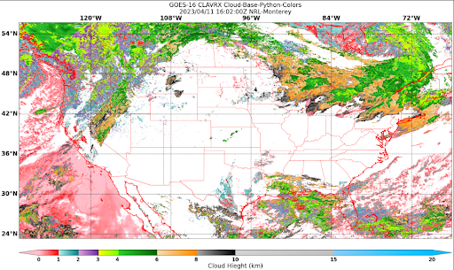

.. dropdown:: Distribution Statement

 | # # # This source code is subject to the license referenced at
 | # # # https://github.com/NRLMMD-GEOIPS.

.. _create-a-colormapper:

Extend GeoIPS with a new Colormapper
************************************

A GeoIPS colormapper defines a method of applying a colormap to imagery. There are
multiple methods to implement this colormap, and we will present those throughout this
section. This section is also largely informational. We will actually implement
colormappers in the :ref:`Create New Colormappers Section<create-colormappers>`

The top level attributes
``interface``, ``family``, and ``docstring``
are required in every GeoIPS plugin.

Please see documentation for
:ref:`additional info on these GeoIPS required attributes<required-attributes>`

Using an ASCII Colormap
-----------------------

The `matplotlib_linear_norm plugin
<https://github.com/NRLMMD-GEOIPS/geoips/blob/main/geoips/plugins/modules/colormappers/matplotlib_linear_norm.py>`_
can also leverage ASCII colormap files installed within GeoIPS, installed within a
plugin package, or stored in an arbitrary location on disk.

To use an ascii colormap, specify:

.. code-block:: yaml

    cmap_source: ascii
    cmap_name: <cmap_name>

Installed ASCII colormaps are stored within a plugin package under
``plugins/txt/ascii_palettes/``. The filename must be of the form ``<cmap_name>.txt``
(this is how geoips finds the given cmap_name). The colors are defined as RGB triplets
ranging from 0 to 256 and should be formatted as three columns of 256 integers.

Commented lines are allowed (prefaced by “#”), to provide additional context relating to
the physical meaning of the colormap (ie, min and max expected values/units,
transition points, etc).

For an example, see the `tpw_purple colormap
<https://github.com/NRLMMD-GEOIPS/geoips/blob/main/geoips/plugins/txt/ascii_palettes/tpw_purple.txt>`_
in the geoips package. If you would like to specify an arbitrary full path on disk
rather than installing your ascii palette within your plugin package, additionally
specify cmap_path. This is most useful for research, development, and testing purposes.

.. code-block:: yaml

    cmap_path: <full_path>/<any_name>.txt

Shown below is a YAML-based product defaults plugin for TPW-PURPLE, which makes use of
ASCII color palettes.

.. code-block:: yaml

    interface: product_defaults
    family: interpolator_algorithm_colormapper
    name: TPW-PURPLE
    docstring: |
      The TPW-PURPLE product_defaults configuration.
    spec:
      algorithm:
        plugin:
          name: single_channel
          arguments:
            output_data_range: [5.0, 65.0]
            min_outbounds: mask
            max_outbounds: crop
            norm: null
            inverse: null
      colormapper:
        plugin:
          name: matplotlib_linear_norm
          arguments:
            cmap_name: tpw_purple
            cmap_source: ascii
            data_range: [5, 65]
            cbar_ticks: [5, 15, 25, 35, 45, 55, 65]
            cbar_label: TPW (mm)
            cbar_spacing: proportional
            create_colorbar: True
            cbar_full_width: True
      interpolator:
        plugin:
          name: interp_gauss
          arguments:
            sigmaval: 10000

``matplotlib_linear_norm`` provides a number of options that can be used to customize
how the colormap is used and how the colorbar is drawn.

Using a Custom Python-based Colormapper
---------------------------------------

Color information can also be specified via a python-based GeoIPS “colormapper” plugin,
allowing customization using specific matplotlib commands and utilities. This is the
most flexible method, and is used largely throughout GeoIPS products. For many examples
of colormappers that make use of the python-based method, see this `link
<https://github.com/NRLMMD-GEOIPS/geoips/tree/main/geoips/plugins/modules/colormappers>`_.

We will now step through a sample colormapper used for ``pmw_89pct``. As with every
module-based plugin, it's required to have a ``call`` function, as well as those top
level properites mentioned previously.

.. code-block:: python

    """Module containing colormap for 89 pct product."""

    import logging  # optional... but be kind to everyone and provide some logging info please

    LOG = logging.getLogger(__name)__

    interface = "colormappers"
    family = "matplotlib"
    name = "pmw_89pct"

    # Paremeters are optional... but are useful for setting defaults!
    def call(data_range=[105, 280], cbar_label="TB (K)"):
        """Colormap for displaying ~89GHz PMW data for weak TCs."""

        """Here you set the values at which you want the colors to transition, as well
        as the colors each transition should be associated with. Gradient creation
        will be handled by GeoIPS."""
        transition_vals = [
            (data_range[0], 125),
            (125, 150),
            (150, 175),
            (175, 212),
            (212, 230),
            (230, 250),
            (250, 265),
            (265, data_range[1]),
        ]
        transition_colors = [
            ("orange", "chocolate"),
            ("chocolate", "indianred"),
            ("idianred", "firebrick"),
            ("firebrick", "red"),
            ("gold", "yellow"),
            ("lime", "limegreen"),
            ("deepskyblue", "blue"),
            ("navy", "slateblue"),
        ]
        ticks = [int(xx[0]) for xx in transition_vals]

        min_tb = transiton_vals[0][0]  # You can define these parameters in a number of
        max_tb = transiton_vals[-1][1] # ways – either in the call function, as values here,
        tickts = ticks + [int(max_tb)] # or even in the mpl_colors_info section.

        LOG.info("Setting cmap")  # Lines below are where gradients are created
        from geoips.image_utils.colormap_utils import create_linear_segmented_colormap
        mpl_cmap = create_linear_segmented_colormap(
            "89pct_cmap", min_tb, max_tb, transiton_vals, transition_colors
        )

        LOG.info("Setting norm")
        from matplotlib.colors import Normalize  # Optional. You can import any mpl manipulations you want!
        mpl_norm = Normalize(vmin=data_range[0], vmax=data_range[1])

        cbar_spacing = "proportional"
        mpl_tick_labels = None
        mpl_boundaries = None

        mpl_colors_info = {
            "cmap": mpl_cmap,
            "norm": mpl_norm,  # Scales your values so the colorbar covers the specified range; Optional.
            "cbar_ticks": ticks,
            "cbar_tick_labels": mpl_tick_labels,  # Accepts a list of strings as labels.
            "cbar_label": cbar_label,
            "boundaries": mpl_boundaries,
            "cbar_spacing": cbar_spacing,
            "colorbar": True,
            "cbar_full_width": True,
        }
        return mpl_colors_info

The ``mpl_colors_info`` dictionary is what GeoIPS uses within the matplotlib-based
utilities and output formatters in order to ensure consistent application of colors, in
both the imagery and the colorbars. Further on, we will walk you through creating both
GeoIPS Python-based colormapper, as well as ASCII-palette based matplotlib_linear_norm
products.

.. _create-colormappers:

Creating New Colormappers
-------------------------

We will now go hands on in creating a custom python-based colormapper. This will be
similar to the module shown above, but to your own specifications.

First off, lets create a new colormappers directory and activate it.
::

    mkdir -pv $MY_PKG_DIR/$MY_PKG_NAME/plugins/modules/colormappers
    touch $MY_PKG_DIR/$MY_PKG_NAME/plugins/modules/colormappers/__init__.py
    cd $MY_PKG_DIR/$MY_PKG_NAME/plugins/modules/colormappers

Now that we have that directory activated, let's create a file called
``colorful_cloud_height.py``. Once you have that created, copy and paste the code below
into your colormapper python file. Feel free to adjust any of the colors/parameters to
what you need for your own colormap.

.. code-block:: python

    """Module containing colormap for colorful cloud height products."""
    import logging

    LOG = logging.getLogger(__name__)

    interface = "colormappers"
    family = "matplotlib"
    name = "colorful_cloud_height"

    def call(data_range=[0, 20]):
        """Colorful cloud height colormap."""

        transiton_vals = [
            (data_range[0], 1),
            (1, 2),
            (2, 3),
            (3, 4),
            (4, 6),
            (6, 8),
            (8, 10),
            (10, 15),
            (15, data_range[1]),
        ]
         transition_colors = [
            ("pink", "red"),
            ("paleturquoise", "teal"),
            ("plum", "rebeccapurple"),
            ("yellow", "chartreuse"),
            ("limegreen", "darkgreen"),
            ("wheat", "darkorange"),
            ("darkgray", "black"),
            ("lightgray", "silver"),
            ("lightskyblue", "deepskyblue"),
        ]

        ticks = [int(xx[0]) for xx in transition_vals]
        tickts = ticks + [int(data_range[1])]

        LOG.info("Setting cmap")
        from geoips.image_utils.colormap_utils import create_linear_segmented_colormap
        mpl_cmap = create_linear_segmented_colormap(
            "89pct_cmap", data_range[0], data_range[1], transiton_vals, transition_colors
        )

        LOG.info("Setting norm")
        from matplotlib.colors import Normalize
        mpl_norm = Normalize(vmin=data_range[0], vmax=data_range[1])

        cbar_spacing = "proportional"
        mpl_tick_labels = None
        mpl_boundaries = None

        mpl_colors_info = {
            "cmap": mpl_cmap,
            "norm": mpl_norm,
            "cbar_ticks": ticks,
            "cbar_tick_labels": mpl_tick_labels,
            "cbar_label": cbar_label,
            "boundaries": mpl_boundaries,
            "cbar_spacing": cbar_spacing,
            "colorbar": True,
            "cbar_full_width": True,
        }
        return mpl_colors_info

Now that you've properly created your module-based colormapper, we need to add it to
``pyproject.toml``. Modify your this file (found in the top level of your package
directory) to include the code listed below. Note: if you named your package something
other than ``cool_plugins``, replace that with your package name.
::

    [project.entry-points."geoips.colormappers"]
    colorful_cloud_height = "cool_plugins".plugins.modules.colormappers.colorful_cloud_height"

Once you've done that, you'll have to reinstall your package since you modified
``pyproject.toml``. If you don't reinstall, GeoIPS won't find your new colormapper in
its namespace.
::

    pip install -e $MY_PKG_DIR

Using Your Custom Python-based Colomapper in a Product
------------------------------------------------------

Note, this section assumes you've already created the ``my_clavrx_products.yaml`` file.
If you haven't yet, please visit the :ref:`Products Section<create-a-product>` to create
that file first.

Let's begin by adding a new product to your ``my_clavrx_products.yaml`` file, called
``Cloud-Base-Python-Colors``. This file can be found in your products directory.

Copy and paste the code below into your products file, under the ``products`` section.

.. code-block:: yaml

    - name: Cloud-Base-Python-Colors
      source_names: [clavrx]
      docstring: |
        CLAVR-x Colorful Cloud Base Height,
        using a python-based custom colormapper.
      product_defaults: Cloud-Height
      spec:
        variables: ["cld_height_base", "latitude", "longitude"]
        colormapper:
          plugin:
            name: colorful_cloud_height
            arguments: {}

Create a Script to Visualize Your New Colormapper
-------------------------------------------------

Now that we have a product that implements our new colormapper, we should create a
script that visualizes it. Change directories into your /tests/scripts directory, and
create a file called clavrx.conus_annotated.cloud-base-python-colors.sh . Once you've
done that, copy and paste the code below into that file.

.. code-block:: bash

    geoips run single_source \
        $GEOIPS_TESTDATA_DIR/test_data_clavrx/data/goes16_2023101_1600/clavrx_OR_ABI-L1b-RadF-M6C01_G16_s20231011600207.level2.hdf \
        --reader_name clavrx_hdf4 \
        --product_name "Cloud-Base-Python-Colors" \
        --output_formatter imagery_annotated \
        --filename_formatter geoips_fname \
        --minimum_coverage 0 \
        --sector_list conus
    ss_retval=$?

Once you've added that code to that file, you can run the script with the command listed
below.
::

    $MY_PKG_DIR/tests/scripts/clavrx.conus_annotated.cloud-base-python-colors.sh

This will write some log output. If your script succeeded it will end with INTERACTIVE:
Return Value 0. To view your output, look for a line that says SINGLESOURCESUCCESS. Open
the PNG file, it should look like the image below.

