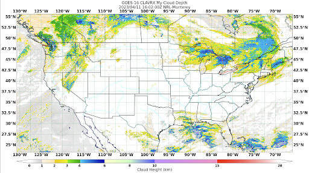

.. dropdown:: Distribution Statement

 | # # # This source code is protected under the license referenced at
 | # # # https://github.com/NRLMMD-GEOIPS.

.. _create-feature-annotator:

Extend GeoIPS with a New Feature Annotator
******************************************

GeoIPS Feature Annotators describe the format of the features shown in your imagery.
Currently, all of the images you have created use the default GeoIPS feature annotator.
While that's nice and all, we want users to have flexibility to change this in their
own imagery. To do so, you have to create a YAML-based feature annotator plugin.

These plugins can control:
    * Coastlines
    * Borders
    * States
    * Rivers

All of which have the same parameters:
    * Whether or not they are ``enabled``
    * The ``color`` of the feature
    * The ``linewidth`` of the feature displayed

The top level attributes
``interface``, ``family``, and ``docstring``
are required in every GeoIPS plugin.

Please see documentation for
:ref:`additional info on these GeoIPS required attributes<required-attributes>`

Shown below, is the default feature annotator plugin that you have been using when
producing your own imagery.

.. code-block:: yaml

    interface: feature_annotators
    name: default
    family: cartopy
    docstring: |
      The default feature_annotators plugin. All line types enabled. All colored red.
      2px coastlines, 1px countries, 0.5px states borders, and 0px rivers.
    spec:
      coastline:
        enabled: true
        edgecolor: red
        linewidth: 2
      borders:
        enabled: true
        edgecolor: red
        linewidth: 1
      states:
        enabled: true
        edgecolor: red
        linewidth: 0.5
      rivers:
        enabled: false

Notice the ``family: cartopy`` property in the yaml file shown above. This is the only
family available for both gridline annotators and feature annotators, as the backend of
GeoIPS makes use of cartopy functions to create your gridlines and features shown in
your imagery.

Creating a New Feature Annotator
--------------------------------

Now that we're familiar with the structure of feature annotator plugins, let's create
one of our own. Feel free to get creative here, feel no need to copy this verbatim. This
is your feature annotator, and you get to make the choices! Just make sure that your
edgecolor is a matplotlib named color or a hexidecimal string.

Run the series of commands shown below to create a directory for your feature annotators.
These commands will also copy over a template feature annotator for you to modify.

::

    mkdir -pv $MY_PKG_DIR/$MY_PKG_NAME/plugins/yaml/feature_annotators
    cd $MY_PKG_DIR/$MY_PKG_NAME/plugins/yaml/feature_annotators

Create a file called ``tutorial.yaml`` in that directory, which we'll update with our
own specifications. Here is an example of a new Feature Annotator:

.. code-block:: yaml

    interface: feature_annotators
    family: cartopy
    name: tutorial
    docstring: |
      The tutorial feature_annotators configuration. All gridline line types enabled.
      All colored [midnightblue, red, darkslategray, cyan]. 2px coastlines, 2px borders,
      2px states, 1px rivers.
    spec:
      coastline:
        enabled: true
        edgecolor: midnightblue
        linewidth: 2
      borders:
        enabled: true
        edgecolor: red
        linewidth: 2
      states:
        enabled: true
        edgecolor: darkslategray
        linewidth: 2
      rivers:
        enabled: true
        edgecolor: cyan
        linewidth: 1

Creating a Script to Visualize our New Feature Annotator
--------------------------------------------------------

Now that we have a custom feature annotator, we can use our test script created in the
:ref:`Products/Cloud-Depth Section<cloud-depth-product>` to visualize our data with our
new feature annotator. Follow the series of commands to appropriately edit that test
script to employ your new feature annotator.

::

    cd $MY_PKG_DIR/tests/scripts

Create a file called ``clavrx.conus_annotated_features_gridlines.my-cloud-depth.sh``.
Copy and paste the code below into that file, which will now make use of our new feature
annotator

.. code-block:: bash

  run_procflow \
      $GEOIPS_TESTDATA_DIR/test_data_clavrx/data/goes16_2023101_1600/clavrx_OR_ABI-L1b-RadF-M6C01_G16_s20231011600207.level2.hdf \
      --procflow single_source \
      --reader_name clavrx_hdf4 \
      --product_name My-Cloud-Depth \
      --output_formatter imagery_annotated \
      --filename_formatter geoips_fname \
      --minimum_coverage 0 \
      --feature_annotator tutorial \
      --sector_list conus
  ss_retval=$?

If you named your feature annotator with a different name, please replace ``tutorial``
with your plugin name.

To produce imagery using your new feature annotator, run the command below.

::

    $MY_PKG_DIR/tests/scripts/clavrx.conus_annotated_features_gridlines.my-cloud-depth.sh

This will output a series of log output. If your script succeeded it will end with INFO:
Return Value 0. To view your output, look for a line that says SINGLESOURCESUCCESS. Open
the PNG file to view your Cloud Depth Image! It should look like the image shown below.

Note: The image shown below also makes use of the custom Gridline Annotator created in
the :ref:`Gridline Annotator Section<create-gridline-annotator>`. Feel free to complete
that if you would like, however you still will be able to notice the changes from your
new Feature Annotator.

