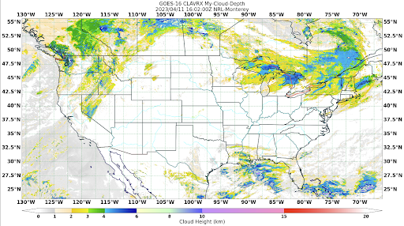

.. dropdown:: Distribution Statement

 | # # # This source code is protected under the license referenced at
 | # # # https://github.com/NRLMMD-GEOIPS.

.. _create-gridline-annotator:

Extend GeoIPS with a New Gridline Annotator
*******************************************

GeoIPS Gridline Annotators describe the format of the grd lines shown in your imagery.
Every image you've created using GeoIPS so far has employed the default GeoIPS Gridline
Annotator. This serves well for tutorial purposes, but may be mundane for your own
purposes. For that reason, we allow users to create their own custom YAML-based
Gridline Annotator Plugins, which we'll show you how to do that here.

Gridline Annotators control the following properties of your imagery:
    * ``labels`` and which to display
    * ``'ines``, such as their ``color``, ``linestyle``, and ``linewidth``
    * ``spacing``, such as the distance between ``latitude`` and ``longitude`` labels,
      and the gridlines that represent them.

The top level attributes
``interface``, ``family``, and ``docstring``
are required in every GeoIPS plugin.

Please see documentation for
:ref:`additional info on these GeoIPS required attributes<required-attributes>`

An Example Gridline Annotator
-----------------------------

Shown below, is the default gridline annotator plugin that you have been using when
producing your own imagery.

.. code-block:: yaml

    interface: gridline_annotators
    family: cartopy
    name: default
    docstring: |
      The default gridline_annotators plugin. Top and left gridline labels,
      latitude and longitude lines colored black, auto spacing, 1px linewidth, and
      [4, 2] linestyle.
    spec:
      labels:
        top: true
        bottom: false
        left: true
        right: false
      lines:
        color: black
        linestyle: [4, 2]
        linewidth: 1
      spacing:  # can also be a float
        latitude: auto
        longitude: auto

Notice the ``family: cartopy`` property in the yaml file shown above. This is the only
family available for both gridline annotators and feature annotators, as the backend of
GeoIPS makes use of cartopy functions to create your gridlines and features shown in
your imagery.

Creating a New Gridline Annotator
---------------------------------

Now that we're familiar with the structure of gridline annotator plugins, let's create
one of our own. Feel free to get creative here, feel no need to copy this verbatim. This
is your gridline annotator, and you get to make the choices! Just make sure that your
color is a matplotlib named color or a hexidecimal string.

Run the series of commands shown below to create a directory for your gridline annotators.

::

    mkdir -pv $MY_PKG_DIR/$MY_PKG_NAME/plugins/yaml/gridline_annotators
    cd $MY_PKG_DIR/$MY_PKG_NAME/plugins/yaml/gridline_annotators

Now, create a file called ``tutorial.yaml`` in that directory, which
we will update to our own specifications. Here is an example of a new Gridline Annotator:

.. code-block:: yaml

    interface: gridline_annotators
    family: cartopy
    name: tutorial
    docstring: |
      The tutorial gridline_annotators configuration. All gridline labels enabled,
      latitude and longitude lines colored mediumseagreen, 2.5 degree spacing, 1px
      linewidth, and  [5, 3] linestyle
    spec:
      labels:
        top: true
        bottom: true
        left: true
        right: true
      lines:
        color: mediumseagreen
        linestyle: [5, 3]  # Refers to [dash_width_px, dash_spacing_px]
        linewidth: 1
      spacing:
        latitude: 2.5
        longitude: 2.5

Creating a Script to Visualize our Gridline Annotator
-----------------------------------------------------

Now that we have a custom gridline annotator, we can use our test script created in the
:ref:`Products/Cloud-Depth Section<cloud-depth-product>` to visualize our data with our
new gridline annotator. Follow the series of commands to appropriately edit that test
script to employ your new gridline annotator.

::

    cd $MY_PKG_DIR/tests/scripts

Create a script called ``clavrx.conus_annotated_features_gridlines.my-cloud-depth.sh``.w
Copy and paste the code below into that file, which will use our new gridline annotator.

.. code-block:: bash

  run_procflow \
      GEOIPS_TESTDATA_DIR/test_data_clavrx/data/goes16_2023101_1600/clavrx_OR_ABI-L1b-RadF-M6C01_G16_s20231011600207.level2.hdf \
      --procflow single_source \
      --reader_name clavrx_hdf4 \
      --product_name My-Cloud-Depth \
      --output_formatter imagery_annotated \
      --filename_formatter geoips_fname \
      --minimum_coverage 0 \
      --gridline_annotator tutorial \
      --sector_list conus
  ss_retval=$?

If you named your gridline annotator with a different name, please replace ``tutorial``
with your plugin name.

To produce imagery using your new gridline annotator, run the command below.

::

    $MY_PKG_DIR/tests/scripts/clavrx.conus_annotated_features_gridlines.my-cloud-depth.sh

This will output a series of log output. If your script succeeded it will end with INFO:
Return Value 0. To view your output, look for a line that says SINGLESOURCESUCCESS. Open
the PNG file to view your Cloud Depth Image! It should look like the image shown below.

Note: The image shown below also makes use of the custom Feature Annotator created in
the :ref:`Feature Annotator Section<create-feature-annotator>`. Feel free to complete
that if you would like, however you still will be able to notice the changes from your
new Gridline Annotator.

