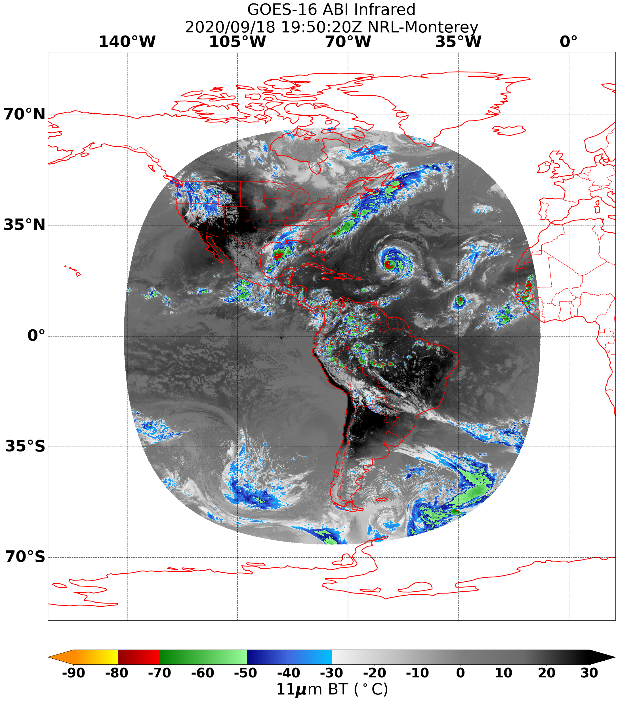

.. dropdown:: Distribution Statement

   | # # # Distribution Statement A. Approved for public release. Distribution unlimited.
   | # # #
   | # # # Author:
   | # # # Naval Research Laboratory, Marine Meteorology Division
   | # # #
   | # # # This program is free software: you can redistribute it and/or modify it under
   | # # # the terms of the NRLMMD License included with this program. This program is
   | # # # distributed WITHOUT ANY WARRANTY; without even the implied warranty of
   | # # # MERCHANTABILITY or FITNESS FOR A PARTICULAR PURPOSE. See the included license
   | # # # for more details. If you did not receive the license, for more information see:
   | # # # https://github.com/U-S-NRL-Marine-Meteorology-Division/

.. _understanding-process-workflows:

*****************************************************
Learn More about GeoIPS Process Workflows (Procflows)
*****************************************************

GeoIPS Process Workflows (procflows) are module-based plugins which lay out the
execution order of producing GeoIPS Products. These products can be a wide variety of
outputs (image, NetCDF file, metadata file, geotiff, etc.), provided there are
suitable plugins which can be used to create such outputs. A procflow makes use of some,
if not all, plugin types in order to produce these plugins.

Procflows are defined via a series of commandline arguments. At it's core, a procflow
contains an argument parser with a wide variety of optional arguments. There is only one
required argument, which is the filenames that you will be processing in some fashion.
A user can then specify a particular subset of these optional arguments to define the
steps in which the procflow will execute to create your specified output.

Generally, a procflow is defined by a series of plugins. This usually includes the
product in which you want to produce (:ref:`product plugin<create-a-product>`), how it
will be outputted (:ref:`output formatter plugin<create-output-formatter>`), what will
be used to read it (:ref:`reader plugin<describe-readers>`), and the geospatial region
in which your product will cover (:ref:`sector plugin<create-a-static_sector>`). Given
the huge quantity of optional arguments available to apply to your procflow, there are a
plethora of ways to define how your output will be produced.

Breaking Down a Procflow Definition
-----------------------------------

.. _breaking-down-a-procflow-definition:

Shown below is an example of procflow definition which will produce an Infrared GOES16
ABI Full Disk image:

.. code-block:: bash

    run_procflow $GEOIPS_TESTDATA_DIR/test_data_noaa_aws/data/goes16/20200918/1950/* \
             --procflow single_source \
             --reader_name abi_netcdf \
             --product_name Infrared \
             --compare_path "$GEOIPS_PACKAGES_DIR/geoips/tests/outputs/abi.static.<product>.imagery_annotated" \
             --output_formatter imagery_annotated \
             --filename_formatter geoips_fname \
             --resampled_read \
             --logging_level info \
             --sector_list goes_east

Now that we've seen an example of a procflow definition, let's dive into it to explain
what each procflow argument does.

#. ``run_procflow``

   a. This is a commandline script which points to
      ``geoips.commandline.run_procflow:main``. This is the entrypoint of executing a
      procflow. It retrieves the arguments provided and passes them through to the
      corresponding procflow plugin.

#. ``$GEOIPS_TESTDATA_DIR/test_data_noaa_aws/data/goes16/20200918/1950/*``

   a. ``filenames`` *required* argument. This is the only required argument to execute
      a procflow, and specifies which files will be processed to produce your output.

#. ``--procflow``

   a. As specified previously, a procflow definition is comprised largely of different
      types of plugins. In this case, we are specifying which procflow plugin we will
      be using to perform our process workflow. For this example, we have selected the
      ``single_source`` procflow plugin to create our specified output. The
      ``single_source`` procflow takes in data from a *single source*, and produces a
      single output.

#. ``--reader_name``

   a. This is reader plugin we will be using to load in the necessary data to process.
      In this example, we have selected the ``abi_netcdf`` reader to load in our data.
      We've selected this reader because we will be processing data which comes from
      GOES16 ABI NetCDF files.

#. ``product_name``

   a. This portion defines the product in which we want to produce. A product is
      selected via a combination of the source in which the product is derived from,
      and the actual definition of the steps needed to produce this product. In this
      case, we've selected the ``Infrared`` product.
   b. Internally, GeoIPS needs to know which source this product is coming from. This
      specified in the product definition under the ``source_names`` property, though,
      in practice the names added to that ``source_names`` property are somewhat
      buried. Currently in GeoIPS, these source names are defined in the reader used to
      load in the data used to produce that product. So in this case, the ``Infrared``
      product we will be using will come from reader ``abi_netcdf:source_name``, which
      is ``abi``. Therefore, we will be using the ``("abi", "Infrared")`` product for
      this procflow.

#. ``--compare_path``

   a. This is a testing argument used to compare the output of the procflow to a static
      output which we know is correct. This comparison is done via an
      ``output_checker`` plugin, and since we are producing imagery in this case, we
      will be comparing the image specified via ``compare_path`` to the output of the
      procflow with the ``image`` output checker. This will ensure that the output is
      pixel-by-pixel equal to the specified image at ``compare_path``.

#. ``--output_formatter``

   a. This is the output formatter plugin we will be using to produce our procflow
      output. For this example, we have selected ``imagery_annotated``, which as the
      name suggests, will produce annotated imagery of our selected product. Here is
      what the procflow definition above will :ref:`produce<abi-infrared>`.

#. ``--filename_formatter``

   a. This is the filename formatter plugin which we will be applying to our output. In
      this example, we've used the ``geoips_fname`` filename formatter plugin, which
      will use the information from our procflow definition and product plugin to
      produce a filename which describes the data, time period, product type, etc. used
      to produce the specified output.

#. ``--resampled_read``

   a. This is a flag which specifies that GeoIPS should resample the data to specified
      area_defs (defined in a sector plugin) during reading (ie. do not read all data
      into memory in advance). This is required only for some geostationary readers.

#. ``--logging_level``

   a. GeoIPS implements logging functionality to trace the execution of processes
      occurring within this package. This logging functionality has different log
      levels, filter what type of log output will be sent to the terminal during
      execution. Depending on the log level, some logs will be outputted whereas other
      logs will be omitted. To see a list of log levels, see `log levels <https://docs.python.org/3/library/logging.html>`_.
   b. In this example, we have used the ``info`` log level, which will output info logs
      and any other logs which supersede that level. If ``--logging_level`` is not
      specified, the ``log.INTERACTIVE`` level will be used, which supersedes
      ``log.INFO``.

#. ``--sector_list``

   a. This flag specifies the sector plugin we will be using for our procflow. This
      determines which geospatial area our output will comprise, and also determines
      the subset of data we will need for further processing. In this example, we've
      selected the ``goes_east`` (GOES16) geostationary sector to process on.

.. _abi-infrared:

The above example is one, of many thousands of argument combinations that can be
used to produce a certain output. To see more examples of different types of procflow
definitions, please see ``geoips/tests/scripts``. For more information about what
procflow arguments exist and what they do, see below.

.. admonition:: Usage: run_procflow

    .. autoprogram:: geoips.commandline.args:get_argparser()
        :prog: run_procflow

Tracking data though a procflow
-------------------------------
.. _tracking-procflow-data:

The data provided by the ``filenames`` argument undergoes a series of transformations
applied by the corresponding procflow. We currently are making a large effort as
developers for GeoIPS to improve our ability to trace where the data goes, what
modifications are applied to it, and in what order this happens. Currently, GeoIPS has
two separate procflow plugins, ``single_soruce`` and ``config_based``. Both of these
plugin modules are *gigantic*, which creates some barriers for us as developers to
properly track what is happening to the data.

Currently, both single_source and config_based apply the processses defined in the
procflow definition via an almalgamation of conditionals that check the family types of
each plugin. For example, 'if product_family == x and output_formatter family == y',
then perform some data manipulation. Otherwise, check for other family types and
continue this process until some condition is met. This makes it extremely difficult
to track the flow of the data based on these nested conditionals, and we need to largely
refactor these procflow plugins to remove this problem.

To alleviate this issue, instead of refactoring the existing procflow plugins, we have
decided to create a completely new ``order_based`` procflow which will
replace any and all procflow plugins with a single module. This achieves two things. It
improves the tracability of data flow throughout the procflow execution, and removes the
need to create custom procflow plugins that serve different purposes. This is going to
be implemented by defining the process workflow directly within a product plugin, which
can then be used by the order_based procflow to iterate over and apply each step defined
in the product.

By implementing the procflow definition as an order of steps in the product, we can
easily tell, what, when, and how procflow outputs are being produced.

Currently, a product plugin looks like this in GeoIPS. The order of execution within a
procflow is tied to the products family, which we want to remove in the future, as this
is what's causing the almalgamation of conditionals in our procflows. In the case shown
below ``family: interpolator_algorithm_colormapper``, a procflow *should* perform these
processes in the order of:

#. Interpolate the data using gaussian interpolation ``(interp_gauss)``.
#. Apply the ``single_channel`` algorithm to the interpolated data
#. Apply the ``pm_37H`` colormapper to the data coming from the algorithm

.. code-block:: yaml

   interface: product_defaults
   family: interpolator_algorithm_colormapper
   name: 19H
   docstring: |
      The 19H product defaults configuration.
   spec:
      interpolator:
         plugin:
            name: interp_gauss
            arguments:
            sigmaval: 25000
      algorithm:
         plugin:
            name: single_channel
            arguments:
            output_data_range: [125, 300]
            min_outbounds: crop
            max_outbounds: crop
            norm: null
            inverse: null
      mtif_type: pmw
      colormapper:
         plugin:
            name: pmw_37H
            arguments:
            data_range: [125, 300]

While the above method works, there is some question as to whether or not the steps
actually occur in that order as the conditionals are very messy and hard to track what
happens when. With the new order_based procflow, which implements a sequence of steps
rather than the famliy method, the order based procflow can loop over and apply each
step in the order specified. The new order based product architecture will implement
the code structure shown below.

.. code-block:: yaml

   interface: product_defaults
   family: order_based
   name: 19H
   docstring: |
      The 19H product defaults configuration.
      spec:
   mtif_type: pmw  # Need to figure out how this will tie into things
   steps:
      - interpolator:
         plugin:
            name: interp_gauss
            arguments:
               sigmaval: 25000
      - algorithm:
         plugin:
            name: single_channel
            arguments:
               output_data_range: [125, 300]
               min_outbounds: crop
               max_outbounds: crop
               norm: null
               inverse: null
      - colormapper:
         plugin:
            name: pmw_37H
            arguments:
               data_range: [125, 300]

The order based module would take on something similar to what is shown below.

.. code-block:: python

   from geoips import interfaces

   def call(product_name, args):
      """Run the current process workflow (procflow) to create a specified output."""
      yaml_prod = interfaces.products.get_plugin(product_name)
      for step, plugin_type in enumerate(yaml_prod["steps"]):
         # retrieve the corresponding plugin name from the current step to apply
         plugin_name = yaml_prod["steps"][step]["plugin"]["name"]
         # get the plugin using the retrieved name
         plugin = getattr(interfaces, plugin_type).get_plugin(plugin_name)
         # call the plugin with its corresponding arguments
         plugin(args[plugin_name])
