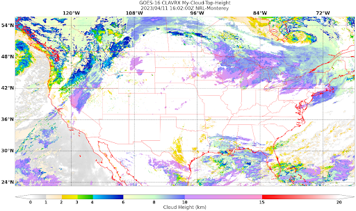
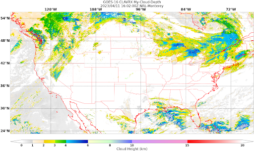

.. dropdown:: Distribution Statement

 | # # # This source code is subject to the license referenced at
 | # # # https://github.com/NRLMMD-GEOIPS.

.. _create-a-product:

Extend GeoIPS with new Products
*******************************

This section discusses how to create multiple products for CLAVR-x data, specifically
Cloud-Top-Height, Cloud-Base-Height, and Cloud-Depth. Products are the cornerstone
plugin for GeoIPS, as they define how to produce a specific product as a combination of
other plugins. Products use other plugins, such as an algorithm, colormapper,
interpolater, etc. to generate the correct result.

We will now go hands on in creating a product for CLAVR-x Cloud-Top-Height.

#. First off, change directories to your product plugins directory.
   ::

        cd $MY_PKG_DIR/$MY_PKG_NAME/plugins/yaml/products

#. Now, create a file called ``my_clavrx_products.yaml``, which we'll fill in soon.
   Before we add any code let's discuss some of the top level attributes that are
   required in any GeoIPS plugin:
   ``interface``, ``family``, and ``docstring``.

Please see documentation for
:ref:`additional info on these GeoIPS required attributes<required-attributes>`

Creating a GeoIPS Product Plugin
--------------------------------

The code snippet shown below shows properties required in every GeoIPS plugin, YAML or
Class-based. These properties help GeoIPS define what type of plugin you are developing
and also defines what schema your plugin will be validated against.

Copy and paste the code shown below into my_clavrx_products.yaml.

.. code-block:: yaml

    interface: products
    family: list
    name: my_clavrx_products
    docstring: |
      CLAVR-x imagery products

Now we'll update the ``spec`` portion of the yaml file to support our new product plugin.
``spec`` is a container for the 'specification' of your yaml plugin. In this case, it
contains a list of ``products``, as shown below. Denoted by the ``family: list``
property shown above, this yaml file will contain a list of products, which can be of
length 1 if you so desire.

Copy and paste the code block below under your to the end of your file. spec should be
right under the docstring you wrote, with no tabs behind it. YAML is a whitespace-based
coding language, similar to Python in that aspect. Feel free to remove the comments, as
they just describe what each property does.

.. code-block:: yaml

    spec:
      products:
        - name: My-Cloud-Top-Height # The name of the product you're defining (can be anything)
          source_names: [clavrx] # Defined as metadata in the corresponding reader
          docstring: | # Pipe says to YAML this will be a multiline comment, can be anything
            CLAVR-x Cloud Top Height
          product_defaults: Cloud-Height # See the Product Defaults section for more info
          spec: # Variables are the necessary variables which are needed to produce your product
            variables: ["cld_height_acha", "latitude", "longitude"]

To use the product you just created, run it through an :ref:`Order-Based Processing
workflow <order-based-processing>`. A workflow is a YAML plugin that lists the ordered
steps needed to produce output. You reference your product as a ``product`` step, and OBP
expands it into the interpolator/algorithm/colormapper steps its family defines. Workflows
live in your package's ``plugins/yaml/workflows/`` directory, and — when they include a
``test`` section — double as regression tests.

Creating a Workflow to Visualize Your Product
---------------------------------------------

We'll now create a workflow that reads your data and runs your product.

#. Change directories into your workflows directory.
   ::

        cd $MY_PKG_DIR/$MY_PKG_NAME/plugins/yaml/workflows

#. Create a file called ``my_cloud_top_height.yaml`` and edit it to include the code block
   below (replace ``<your_package>`` with your package name).

.. code-block:: yaml

    apiVersion: geoips/v1
    interface: workflows
    family: order_based
    name: my_cloud_top_height
    docstring: CLAVR-x Cloud Top Height over CONUS.
    package: <your_package>
    spec:
      globals:
        product_name: My-Cloud-Top-Height
      steps:
        sector:
          kind: sector
          name: conus
        reader:
          kind: reader
          name: clavrx_hdf4
          depends_on: [sector]
        clavrx_My_Cloud_Top_Height:
          kind: product
          name: [clavrx, My-Cloud-Top-Height]
          depends_on: [reader, sector]
        filename_formatter:
          kind: filename_formatter
          name: geoips_fname
          depends_on: [clavrx_My_Cloud_Top_Height.algorithm, sector]
          arguments:
            product_name: My-Cloud-Top-Height
        output_formatter:
          kind: output_formatter
          name: imagery_annotated
          depends_on:
            - clavrx_My_Cloud_Top_Height.algorithm
            - clavrx_My_Cloud_Top_Height.colormapper
            - filename_formatter
            - sector

The ``product`` step references your product by ``[source_name, product_name]``. OBP loads
the product and expands it into the ordered steps its family defines. The ``sector`` step
selects the region to plot on; ``depends_on`` wires each step to the output it consumes.
See :ref:`workflows` for the full reference.

Rebuild the plugin registries and run your workflow:

.. code-block:: bash

    geoips config create-registries
    geoips run order_based my_cloud_top_height \
        $GEOIPS_TESTDATA_DIR/test_data_clavrx/data/goes16_2023101_1600/*.hdf

This will write some log output. If it succeeded it ends with a ``Return Value 0``. Open
the resulting PNG file; it should look like the image below.

Okay! We've developed a plugin which produces CLAVR-x Cloud Top Height. This is nice,
but what if we want to extend our plugin to produce Cloud Base Height? What about Cloud
Depth? Using the method shown above, we're going to extend our my_clavrx_products.yaml
to produce just that.

Using your definition of My-Cloud-Top-Height as an example, create a product definition
for My-Cloud-Base-Height.
::

    cd $MY_PKG_DIR/$MY_PKG_NAME/plugins/yaml/products

Now, edit my_clavrx_products.yaml. Here are some helpful hints:
  * The relevant variable in the CLAVR-x output file (and the equivalent GeoIPS reader) is called "cld_height_base"
  * The Cloud-Height product_default can be used to simplify this product definition (or you can DIY or override if
    you'd like!)

The correct products implementation for 'my_clavrx_products.yaml' is shown below.
Hopefully, you didn't have to make any changes after seeing this! Developing products,
and other types of plugins should be somewhat intuitive after completing this tutorial.

.. code-block:: yaml

    interface: products
    family: list
    name: my_clavrx_products
    docstring: |
      CLAVR-x imagery products
    spec:
      products:
        - name: My-Cloud-Top-Height
          source_names: [clavrx]
          docstring: |
            CLAVR-x Cloud Top Height
          product_defaults: Cloud-Height
          spec:
            variables: ["cld_height_acha", "latitude", "longitude"]
        - name: My-Cloud-Base-Height
          source_names: [clavrx]
          docstring: |
            CLAVR-x Cloud Base Height
          product_defaults: Cloud-Height
          spec:
            variables: ["cld_height_base", "latitude", "longitude"]

Now that we have products for both Cloud Top Height and Cloud Base Height, we can
develop a product that produces Cloud Depth. To do so, use your definitions of
My-Cloud-Top-Height and My-Cloud-Base-Height as examples, create a product definition
for My-Cloud-Depth.
::

    cd $MY_PKG_DIR/$MY_PKG_NAME/plugins/yaml/products

Edit my_clavrx_products.yaml. Here is a helful hint to get you started:
  * We will define Cloud Depth for this tutorial as the difference between CTH and CBH

.. code-block:: yaml

    interface: products
    family: list
    name: my_clavrx_products
    docstring: |
      CLAVR-x imagery products
    spec:
      products:
        - name: My-Cloud-Top-Height
          source_names: [clavrx]
          docstring: |
            CLAVR-x Cloud Top Height
          product_defaults: Cloud-Height
          spec:
            variables: ["cld_height_acha", "latitude", "longitude"]
        - name: My-Cloud-Base-Height
          source_names: [clavrx]
          docstring: |
            CLAVR-x Cloud Base Height
          product_defaults: Cloud-Height
          spec:
            variables: ["cld_height_base", "latitude", "longitude"]
        - name: My-Cloud-Depth
          source_names: [clavrx]
          docstring: |
            CLAVR-x Cloud Depth
          product_defaults: Cloud-Height
          spec:
            variables: ["cld_height_acha", "cld_height_base", "latitude", "longitude"]

We now have two variables, but if we examine the `Cloud-Height Product Defaults
<https://github.com/NRLMMD-GEOIPS/geoips_clavrx/blob/main/geoips_clavrx/plugins/yaml/product_defaults/Cloud-Height.yaml>`_
we see that it uses the ``single_channel`` algorithm. This doesn't work for our use case,
since the ``single_channel`` algorithm just manipulates a single data variable and
plots it. Therefore, we need a new algorithm! See the
:ref:`Algorithms Section<add-an-algorithm>` to keep moving forward with this turorial.

.. _cloud-depth-product:

Using Your Cloud Depth Product
------------------------------

Note: Before moving forward in this section, make sure you've completed
:ref:`creating a new algorithm<add-an-algorithm>`. We are going to modify our Cloud
Depth product to use the algorithm we just created.

Now that we've created our cloud depth algorithm, we need to implement it in our cloud
depth product. As shown in the :ref:`Product Defaults Section<create-product-defaults>`,
we can override the product defaults specified to our own specification. To do so,
modify ``My-Cloud-Depth`` product in my_clavrx_products.yaml to the code block shown
below.

.. code-block:: yaml

  interface: products
    family: list
    name: my_clavrx_products
    docstring: |
      CLAVR-x imagery products
    spec:
      products:
        - name: My-Cloud-Top-Height
          source_names: [clavrx]
          docstring: |
            CLAVR-x Cloud Top Height
          product_defaults: Cloud-Height
          spec:
            variables: ["cld_height_acha", "latitude", "longitude"]
        - name: My-Cloud-Base-Height
          source_names: [clavrx]
          docstring: |
            CLAVR-x Cloud Base Height
          product_defaults: Cloud-Height
          spec:
            variables: ["cld_height_base", "latitude", "longitude"]
        - name: My-Cloud-Depth
          source_names: [clavrx]
          docstring: |
            CLAVR-x Cloud Depth
          product_defaults: Cloud-Height
          spec:
            variables: ["cld_height_acha", "cld_height_base", "latitude", "longitude"]
            algorithm:
              plugin:
                name: my_cloud_depth
                arguments:
                  output_data_range: [0, 20]
                  scale_factor: 0.001

The changes shown above modify My-Cloud-Depth to use our ``my_cloud_depth`` algorithm
that we created. If we left this portion unchanged, My-Cloud-Depth would use the
``single_channel`` algorithm, which is unfit for our purposes. We also added two other
arguments, ``output_data_range`` ands ``scale_factor``, which override the Cloud-Height
product defaults arguments for those two variables. Output data range of [0, 20] states
that our data will be in the range of zero to twenty, and the scale factor says that we
are scaling our data to be in kilometers.

To use this modified My-Cloud-Depth product, follow the series of commands. We will be
creating a new test script which implements our new changes.
::

    cd $MY_PKG_DIR/tests/scripts
    cp clavrx.conus_annotated.my-cloud-top-height.sh clavrx.conus_annotated.my-cloud-depth.sh

Now create a workflow for ``My-Cloud-Depth`` just like the ``my_cloud_top_height``
workflow above — copy it to ``my_cloud_depth.yaml``, change ``name`` to ``my_cloud_depth``,
and change ``product_name`` and the product step to ``My-Cloud-Depth``. Then run it:

.. code-block:: bash

    geoips run order_based my_cloud_depth \
        $GEOIPS_TESTDATA_DIR/test_data_clavrx/data/goes16_2023101_1600/*.hdf

This will display Cloud Depth over the CONUS sector.

This will output a bunch of log output. If your script succeeded it will end with INFO:
Return Value 0. To view your output, look for the output image path printed in the log. Open
the PNG file to view your Cloud Depth Image! It should look like the image shown below.

