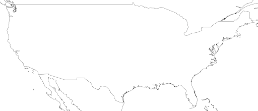
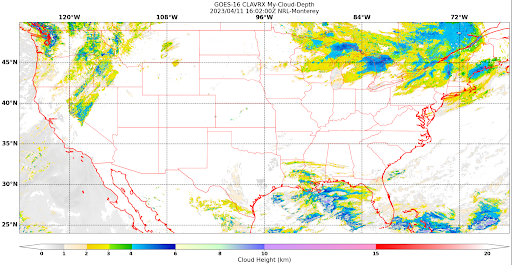

.. dropdown:: Distribution Statement

 | # # # This source code is subject to the license referenced at
 | # # # https://github.com/NRLMMD-GEOIPS.

.. _create-a-static_sector:

Extend GeoIPS with a new Static Sector
**************************************

Static Sectors are plugins which tell GeoIPS where the data will be plotted. Static
Sectors, as their name implies, define a single area and are not generated during
runtime. Componets like resolution, sector pixel shape, projection, and metadata can 
all be defined at the user level, providing fine grained control. Both the units and 
projection type are based off of PROJ definitions, defined here: 
`projection types <https://proj.org/en/9.3/operations/projections/index.html>`_

In this section, we will be creating a custom static sector that overlays the
Continental United States (CONUS). To start off, run the following commands, which
create a new folder for your static sectors.
::

    mkdir -pv $MY_PKG_DIR/$MY_PKG_NAME/plugins/yaml/sectors/static
    cd $MY_PKG_DIR/$MY_PKG_NAME/plugins/yaml/sectors/static

Once you've created the folder, you are able to create your custom CONUS static sector.
Copy and paste the code block below into my_conus_sector.yaml. Feel free to remove the
comments, as they just descibe what each property does.

Creating Your Static Sector
---------------------------

.. code-block:: yaml

    interface: sectors
    family: area_definition_static
    name: my_conus_sector
    docstring: "My CONUS Sector"
    metadata:
      region:
        continent: NorthAmerica
        country: UnitedStates
        area: x
        subarea: x
        state: x
        city: x
    spec:
      area_id: my_conus_sector
      description: CONUS
      projection:
        a: 6371228.0  # The average radius of the Earth in Meters
        lat_0: 37.0  # The center latitude point
        lon_0: -96.0  # The center longitude point
        proj: eqc # Describes the Projection Type (from PROJ Projections)
        units: m
      resolution:
        - 3000 # The resolution of each pixel in meters (x, y)
        - 3000
      shape:
        height: 1000  # The height of your sector in pixels
        width: 2200  # The width of your sector in pixels
      center: [0, 0]  # The center x/y point of your sector. Almost always [0, 0]

If this is your first time creating a plugin, it's good to know what the top level
attributes actually do for a plugin.

Please see documentation for
:ref:`additional info on GeoIPS required attributes<required-attributes>`,
``interface``, ``family``, and ``docstring``.

Note: while you can leave the metadata untouched, it is very helpful to
have additional information about the sector being displayed, not only for the backend
of GeoIPS, but also for people using this sector plugin. The metadata also tells the
GeoIPS filename formatters where to place the image, via geographic-labeled
subdirectories, based on the info you provide in the ``region`` object.

Metadata for a static sector can be specified in two formats, legacy or updated. The
only difference between these two formats is that in legacy, we have a top level
``region`` object, whereas in the updated format the remove that object and shift it's
contents one level up. We recommend you use the updated format as legacy will eventually
be removed.

**Legacy**

.. code-block:: yaml

    metadata:
      region:
        continent: NorthAmerica
        country: UnitedStates
        area: x
        subarea: x
        state: x
        city: x

**Updated**

.. code-block:: yaml

    metadata:
      continent: NorthAmerica
      country: UnitedStates
      area: x
      subarea: x
      state: x
      city: x

Once you’ve made the appropriate changes, you will be ready to use your custom sector
plugin with CLAVR-x data.

The commands you ran in the previously create a custom conus sector.
my_conus_sector.yaml will be an example plugin, showing you that you can create
sectors just like `conus.yaml
<https://github.com/NRLMMD-GEOIPS/geoips/blob/main/geoips/plugins/yaml/sectors/static/conus.yaml>`_,
to your own specifications. You can create a sector anywhere on the globe, in the
fashion we just displayed above.

To quickly check whether or not you like the shape and resolution of your custom sector,
you can use the command line function ``geoips test sector``. This will plot and save
images containing the borders and coastlines of the inputted sectors. For example, to
test your custom sector, run the following:
::

    cd $MY_PKG_DIR/$MY_PKG_NAME/
    geoips test sector my_conus_sector

Once completed, open the my_conus_sector.png image to see what your sector will look
like.

Using Your Custom Static Sector
-------------------------------

To use my_conus_sector.yaml in your test script, simply replace ``--sector_list conus``
with ``--sector_list my_conus_sector``. This change means that the script
``clavrx.conus_annotated.my-cloud-top-height.sh`` will use the sector you just
created, rather than the GeoIPS conus sector we’ve been using previously. The commands
below display how to make that change. Note, the vim command was generalized for this
documentation, but feel free to use whatever text editor you prefer.
::

    cd $MY_PKG_DIR/tests/scripts
    cp clavrx.conus_annotated.my-cloud-top-height.sh clavrx.my_conus_sector.my-cloud-top-height.sh
    vim clavrx.my_conus_sector.my-cloud-top-height.sh

Once you've made that change, you can run the command below to generate an
image using your custom CONUS sector!
::

    $MY_PKG_DIR/tests/scripts/clavrx.my_conus_sector.my-cloud-top-height.sh

Output
------

