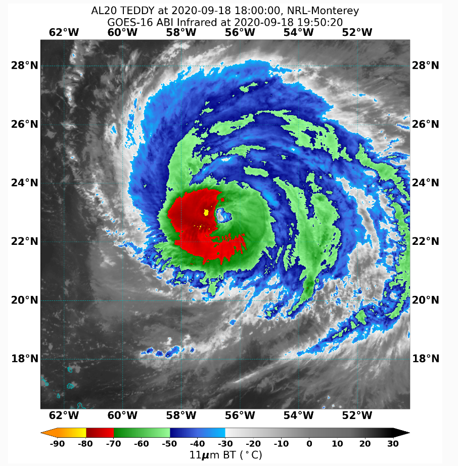
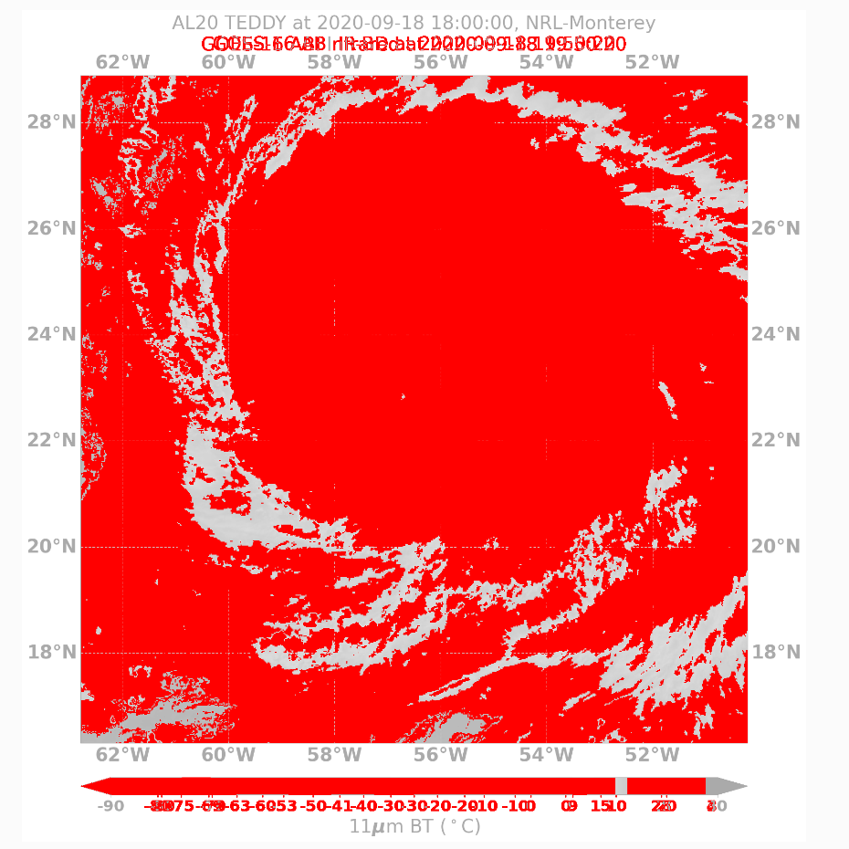

 .. dropdown:: Distribution Statement

   | # # # Distribution Statement A. Approved for public release. Distribution unlimited.
   | # # #
   | # # # Author:
   | # # # Naval Research Laboratory, Marine Meteorology Division
   | # # #
   | # # # This program is free software: you can redistribute it and/or modify it under
   | # # # the terms of the NRLMMD License included with this program. This program is
   | # # # distributed WITHOUT ANY WARRANTY; without even the implied warranty of
   | # # # MERCHANTABILITY or FITNESS FOR A PARTICULAR PURPOSE. See the included license
   | # # # for more details. If you did not receive the license, for more information see:
   | # # # https://github.com/U-S-NRL-Marine-Meteorology-Division/

.. _learn-about-output-checkers:

***************************************
Learn more about GeoIPS Output Checkers
***************************************

Why We Need Output Checkers
---------------------------

GeoIPS, at it's core, is a software package used for ingesting, manipulating, and
outputting geospatial satellite data. These outputs can take on a variety of forms. The
most common include:

#. Imagery
#. NetCDF Files
#. GeoTIFFs
#. Text-based outputs (tropical cyclone (tc) based, etc.)

No matter the type of output that GeoIPS produces, we want to ensure that the output
created is in a correct state. For example, if a NetCDF file was outputted, we'd want to
ensure that this file has the correct data variables, comes from the correct date range,
covers a certain geospatial region, has the expected metadata, etc. For an image, we
could check that each pixel of the image matches a corresponding pixel from an output
that we know is correct. No matter the output, we want to ensure that whatever GeoIPS
produces is correct in its final state.

Defining an Output Checker
--------------------------

To implement the testing process mentioned above, we have created an ``output_checkers``
interface which checks the state of GeoIPS outputs. ``output_checker`` plugins at their
core are testing infrastructure for ensuring that output of a GeoIPS procflow matches
what we expect it to look like. This infrastructure requires two things:

#. A pre-generated output that we know is correct
#. Newly created GeoIPS output that should match that pre-generated output.

This way, we can compare the newly created output to an output that we already know is
completely accurate.

While it's not feasible to have a pre-generated output for everything GeoIPS and its
associated plugin packages can create, we can set up a fairly large suite of
pre-generated outputs to ensure that each type of output is covered by a specific output
checker plugin. Currently, GeoIPS has output_checker plugins for four types of outputs:

#. Imagery
#. NetCDF Files
#. GeoTIFFs
#. Text-based

GeoIPS has the capabilty to produce outputs different from what's listed above, however
currently we only support those types of output checkers, as those outputs cover just
about everything we've implemented in GeoIPS and it's corresponding plugin packages so
far.

The methods in which we check the output of a GeoIPS :ref:`Procflow<understanding-process-workflows>`
depends on the type of output that was produced. For ``geotiff`` and ``text`` outputs,
we run ``diff`` command between the produced geotiff/text file and it's corresponding
pre-generated accurate file. One a line-by-line basis, we check that each line of the
produced output matches that of the pre-generated output.

For image outputs, we use the PIL ``pixelmatch`` library to ensure that the created
image outputs match on a pixel-by-pixel basis to a pre-generated image. For example, say
we have some pre-generated image for a tropcial cyclone (tc) product.

.. image:: ../../images/command_line_examples/pre-generated.png
   :width: 800
   :alt: Pre-generated Image

Now, after running a :ref:`process workflow<breaking-down-a-procflow-definition>` to
produce a new output image, (shown below)

we will use the
`image output checker <https://github.com/NRLMMD-GEOIPS/geoips/blob/main/geoips/plugins/modules/output_checkers/image.py>`_
to compare the ``produced`` against the ``pre-generated`` image on a pixel-by-pixel
basis. The pixels that don't match will be highlighted in red, and the image output
checker will report this appropriately. Shown below is the diff image produced by the
image output checker, which makes use of the ``pixelmatch`` python library.

To compare the contents of a produced NetCDF file versus a pre-generated NetCDF File, we
have a couple of different methods. Two files can be compared within a given tolerance,
or we can compare them to see if they are identical. If comparing within a given
tolerance, this value is usually very small, as we don't want the data contained in the
produced NetCDF file to be largely different. This is mainly used as a safeguard for
comparisons, as determining whether two float values are exactly equal is not a good
practice due to the imprecision of floating-point arithmetic. If comparing whether or
not two NetCDF files are identical, we assure that the metadata of the produced NetCDF
and the data are *exactly* equal to that of the pre-generated NetCDF file.

To see the actual implementation of all of these output checkers, see
`GeoIPS Output Checkers <https://github.com/NRLMMD-GEOIPS/geoips/tree/main/geoips/plugins/modules/output_checkers>`_.

How to use an Output Checker
----------------------------

Now that we've defined ``output_checkers`` and why they're needed, we can lay out how
to use them within GeoIPS. Detailed in
:ref:`Breaking Down a Procflow Definition<breaking-down-a-procflow-definition>`, we
describe what the ``--compare_path`` attribute of the Procflow Definition does.
Internally within GeoIPS, we use this ``--compare_path`` attribute to locate the correct
pre-generated file to use in comparison with the produced output of the procflow. You
don't need to specify what type of output checker you'd like to use for the comparison,
as this is automatically detected within the specified GeoIPS procflow based on the
string provided to the ``--compare_path`` attribute.

So in the example shown below, we would be using an ``image`` output checker, as that is
what would be detected by the ``single_source`` procflow.

.. code-block:: bash

    run_procflow $GEOIPS_TESTDATA_DIR/test_data_noaa_aws/data/goes16/20200918/1950/* \
             --procflow single_source \
             --reader_name abi_netcdf \
             --product_name Infrared \
             --compare_path "$GEOIPS_PACKAGES_DIR/geoips/tests/outputs/abi.static.<product>.imagery_annotated" \
             --output_formatter imagery_annotated \
             --filename_formatter geoips_fname \
             --resampled_read \
             --logging_level info \
             --sector_list goes_east
