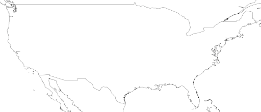
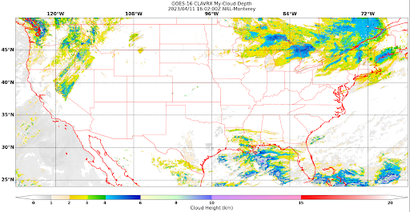

.. _create-a-static_sector:

**************************************
Extend GeoIPS with a new Static Sector
**************************************

Static Sectors are plugins which tell GeoIPS where the data will be plotted. Static
Sectors, as their name implies, define a single area and are not generated during
runtime. They information about their `projection type <https://proj.org/en/9.3/operations/projections/index.html>`_
(Stereographic, Equal Area Cylindrical, etc.), the resolution of the data in meters, the
shape of the sector in pixels, and also include a metadata section which gives users
more information about the sector they are using.

In this section, we will be creating a custom static sector that overlays the
Continental United States (CONUS).

First off, copy this GeoIPS Static Sector YAML File to edit.
::

    mkdir -pv $MY_PKG_DIR/$MY_PKG_NAME/plugins/yaml/sectors/static
    cd $MY_PKG_DIR/$MY_PKG_NAME/plugins/yaml/sectors/static
    cp $GEOIPS_PACKAGES_DIR/geoips/geoips/plugins/yaml/sectors/static/australia.yaml my_conus_sector.yaml
    vim my_conus_sector.yaml

.. code-block:: yaml

    interface: sectors
    family: area_definition_static
    name: australia
    docstring: "Australian Continent"
    metadata:
      region:
        continent: Australia
        country: x
        area: Continental
        subarea: x
        state: x
        city: x
    spec:
      area_id: australia
      description: Australian Continent
      projection:
        a: 6371228.0
        lat_0: -26.5
        lon_0: 134.0
        proj: stere
        units: m
      resolution:
        - 2000
        - 2000
      shape:
        height: 2100
        width: 2400
      center: [0, 0]

Once you've copied the file shown above to the appropriate location, you are able to
create your custom CONUS static sector. Change the file above to the file shown below.

.. code-block:: yaml

    interface: sectors
    family: area_definition_static
    name: my_conus_sector
    docstring: "My CONUS Sector"
    metadata:
      region:
        continent: NorthAmerica
        country: UnitedStates
        area: x
        subarea: x
        state: x
        city: x
    spec:
      area_id: my_conus_sector
      description: CONUS
      projection:
        a: 6371228.0
        lat_0: 37.0
        lon_0: -96.0
        proj: eqc # Describes the Projection Type (from PROJ Projections)
        units: m
      resolution:
        - 3000 # The resolution of each pixel in meters (x, y)
        - 3000
      shape:
        height: 1000
        width: 2200
      center: [0, 0]

Note: while you can leave the metadata untouched, it is very helpful to
have additional information about the sector being displayed, not only for the backend
of GeoIPS, but also for people using this sector plugin. The metadata also tells the
GeoIPS output formatters where to place the image, via geographic-labeled subdirectories.

Once you’ve made the appropriate changes, you will be ready to use your custom sector
plugin with CLAVR-x data.

The commands you ran in the previously create a custom conus sector.
my_conus_sector.yaml will be an example plugin, showing you that you can create
sectors just like conus.yaml, to your own specifications. You can create a sector
anywhere on the globe, in the fashion we just displayed above.

To quickly check whether or not you like the shape and resolution of your custom sector,
you can use the command line function create_sector_image. This will plot and save
images containing the borders and coastlines of the inputted sectors. For example, to
test your custom sector, run the following:
::

    cd $MY_PKG_DIR/$MY_PKG_NAME/
    create_sector_image my_conus_sector

Once completed, open the my_conus_sector.png image to see what your sector will look
like.

Using Your Custom Static Sector
-------------------------------

To use my_conus_sector.yaml in your test script, simply replace ``--sector_list conus``
with ``--sector_list my_conus_sector``. This change means that the script
``clavrx.conus_annotated.my-cloud-top-height.sh`` will use the sector you just
created, rather than the GeoIPS conus sector we’ve been using previously. The commands
below display how to make that change. Note, the vim command was generalized for this
documentation, but feel free to use whatever text editor you prefer.
::

    cd $MY_PKG_DIR/tests/scripts
    cp clavrx.conus_annotated.my-cloud-top-height.sh clavrx.my_conus_sector.my-cloud-top-height.sh
    vim clavrx.my_conus_sector.my-cloud-top-height.sh

Once you've made that change, you can run the command below to generate an
image using your custom CONUS sector!
::

    $MY_PKG_DIR/tests/scripts/clavrx.my_conus_sector.my-cloud-top-height.sh

Output
^^^^^^
